# GRIGRI 3 HUB 先锋绳索独攀系统

- 发布日期：2022 年 8 月 16 日
- 更新日期：2024 年 10 月 20 日
- 作者：SICgrips
- 原文：[SICgrips](https://sicgrips.blogspot.com/2022/08/grigri-3-hub-system-for-lead-rope.html)

> **译注｜重要安全说明：** 本文介绍作者自行改装 GRIGRI、将其用于先锋绳索独攀（lead rope soloing, LRS）的实验性方案。钻孔、停用凸轮弹簧、打磨零件及非标准安装均不属于 Petzl 说明书规定的正常用途；Petzl 明确说明 GRIGRI、GRIGRI + 和 NEOX 不允许用于自我保护攀登。原文还记录了缓慢受力时不锁止、头部朝下坠落可能无法制停、回喂形成危险余绳等故障模式。以下内容是忠实翻译和术语整理，不构成操作建议、厂家认可或安全认证。

## 使 GG3 保持倒置并反向朝后的绳索改装（HUB 系统）

*最新更新见文末。*

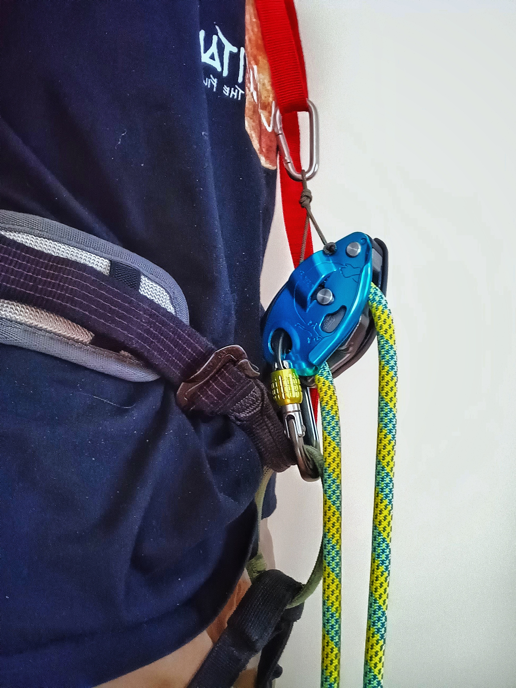

本文详细介绍用于先锋绳索独攀的 HUB 方法。HUB 是 **H**eld **U**pside-down and **B**ackwards 的缩写，意为让 GRIGRI 相对于正常为先锋攀登者保护时连接在保护环上的方位，保持上下颠倒并反向朝后。多年来，人们已经用过多种方法和改装实现这种方位；据作者所知，本文介绍的 HUB Cord 方法是其独创方案。

作者为连接胸式安全带的方案设定了四项设计标准：

1. 改装应易于完成。
2. GRIGRI 上的连接点必须足够牢固，不能由塑料部件承力。
3. 器械悬挂在胸式安全带上的角度必须可调。
4. 绳 cord 必须远离主绳路径和 GRIGRI 手柄，避免干扰锁止。

作者将其与停用凸轮弹簧的 GRIGRI 3，或设为顶绳模式的 GRIGRI + 配合使用。保留弹簧的其他 GRIGRI 或许也能这样使用，但作者没有测试过，并怀疑它们在高位挂绳情形下能否锁止。Brent Barghahn 曾将未改动弹簧的 GRIGRI 3 置于 HUB 方位；据作者称，截至 2023 年 5 月，Brent 已改用顶绳模式的 GRIGRI +。

> **原文重要警告：** Yann Camus 等人的测试表明，GRIGRI + 在顶绳模式和 HUB 方位下，高位挂绳后缓慢承重时可能无法锁止。

作者认为，停用弹簧的 GRIGRI 3 配合 HUB 系统，功能上类似 Rock Exotica Soloist 或 El Mudo，同时还能在不增加或更换器械的情况下较方便地下降或绳降。

## HUB 系统与自由倒置悬挂的 GRIGRI 对比

作者认为，反向朝后自由倒置悬挂的 GRIGRI，以及近几年普及的动态缓存绳环（running cache loop），是 GRIGRI 先锋绳索独攀用法中两项重要创新。哪种方案更合适，取决于攀登者看重的性能和独攀类型。本文旨在介绍 HUB 选项，而不是证明任一方案普遍优于另一方案。

### HUB 系统

*以下比较假定使用无弹簧 GRIGRI，或处于顶绳模式的 GRIGRI +。*

#### 优点

- 高位挂绳时不锁止的可能性较低，锁止更迅速、更明确。
- GRIGRI 保持在较高位置，更便于抽取余绳挂入快挂；对臂展较短的攀登者尤其方便。
- 胸式安全带能降低身体向后翻转的倾向，但不能完全消除这种可能。
- 坠落时器械来回翻动较少，因此坠落距离最多可缩短约 1 英尺（约 30 厘米）。作者认为，这对存在客观坠落危险的垂直或较缓地形很重要。
- 可通过 HUB 绳调节 GRIGRI 的角度，从而改变出绳阻力和回喂程度。

#### 缺点

- 除非有备份，否则它很可能无法制停头部朝下的坠落。作者认为备份不可省略，并承认仍需更多测试。
- 横移时出绳可能不顺畅，需要更多实际测试。
- 需要胸式安全带、肩带或类似系统，架设麻烦且需要细致调节。
- 使用无弹簧 GRIGRI 或 GRIGRI + 时，若为高位挂绳而直接向上抽绳，器械会立即锁止并使攀登者被短绳卡住。作者的方法是先向下抽出一个余绳环，再把余绳向上送入快挂；熟练后，这与为缓存绳环抽取余绳的动作相似。

#### 讨论

作者认为 HUB 系统更适合线路走向较直、垂直或低于垂直，且可能存在客观坠落危险的线路；也较适合反复试攀、器械攀，以及难点靠近地面的线路。

### 反向朝后、自由倒置悬挂的 GRIGRI

#### 优点

- 可能制停倒置坠落。
- 器械自由悬挂，可顺着绳索受力方向自行调整方位，因此在各种方向通常出绳较顺畅。
- 根据绳索与器械的搭配，攀登者可能可以直接向上抽绳挂入快挂。
- 架设更简单，不必改装器械或使用胸式安全带。
- 强凸轮弹簧可能使锁止略柔和。

#### 缺点

- 锁止所需时间更长，因为器械必须旋转 180°，从悬挂位置移动到直立位置。
- 臂展较短的人需要向下伸得更远才能抽取余绳，操作不够方便。
- Yann Camus 的演示和其他人的经历表明，高位挂绳或缓慢坐入绳索时，如果没有明显冲击，器械可能不会锁止。强弹簧需要较明显的坠落或绳索冲击才能触发锁止。
- 根据绳索与器械的搭配，挂绳时也可能意外锁止。

#### 讨论

作者认为，倒置悬挂方案更适合没有客观坠落危险的陡峭或屋檐线路，也适合担心倒置坠落、又不愿增加其他防护措施的人。该系统通常较易架设，但绳索与器械是否匹配，对顺畅出绳和可靠锁止都至关重要。

以上判断都有具体条件，不能简单视为非黑即白。应测试、练习并谨慎操作。与大多数独攀器械一样，器械与绳索的匹配至关重要，并会显著影响性能。

## 作者的 HUB 改装方案

图中的 GRIGRI 3 已由作者停用凸轮弹簧；具体改装见其[上一篇文章](https://sicgrips.blogspot.com/2022/08/deactivating-spring-in-grigri-3-for.html)。多年来，人们曾用各种方式把绳 cord 连接到倒置、反向朝后的 GRIGRI 上，其中有些尚可，有些笨拙，有些危险。作者称自己的方案：

- 只需钻一个孔，并声称不会损害 GRIGRI 的功能或结构完整性；
- 能让器械保持稳定且易于调节的角度；
- 更换器械时，GRIGRI 始终至少有一个连接点；
- 利用连接锁扣的绳 cord，帮助防止 GRIGRI 使锁扣横向受力；
- 改装后仍可将 GRIGRI 用于各种正常用途。

> **译注：** 上述“不影响强度、功能和正常用途”均为作者主张，不能视为 Petzl 的验证结论。对 PPE 钻孔、停用弹簧或打磨零件会偏离制造商说明书，且可能影响检验、质保和可追溯性。

### 制作 GG HUB 改装（后来称为 HUBBY 系统）

HUBBY 是 Held Upside-Down and Backwards Bridle Yoke 的缩写，即“倒置反向悬挂的双臂连接轭”。

1. 在图示位置的活动侧板上钻一个 1/8 英寸（约 3.2 毫米）小孔。作者声称这不会影响 GRIGRI 的强度或功能。
2. 将孔的内外两侧倒角，去除可能磨损绳 cord 的锋利边缘。作者使用较大钻头的尖端和卷成小卷的 220 目砂布处理。
3. 将 2.5 毫米辅绳的一端穿过小孔。作者后来改用 1.8 毫米聚酯包覆 Dyneema 绳，认为它更耐磨，强度相同或更高；见文末 GRIGRI + 的照片。
4. 在绳端打一个单结，再熔化末端形成凸块，作为止脱端头。
5. GRIGRI 活动侧板原本配合较松，已有一定的走绳间隙。作者还打磨了塑料垫片，以增加间隙、避免卡滞或在锐边上摩擦，并让侧板能顺畅开合。
6. 作者最初在锁扣端打 Poacher's knot，即双渔人结的一半；安装锁扣时可将结放松，之后再收紧，使 GRIGRI 居中并限制锁扣横向受力。后来改用绳中段单结环，详见下方增补。
7. 在绳 cord 中部打一个绳中段单结环，作为胸式安全带连接点。结环位置决定 GRIGRI 的悬挂角度，继而影响出绳。合适角度取决于 GRIGRI 型号、绳索和安全带组合，作者要求通过试验确定。

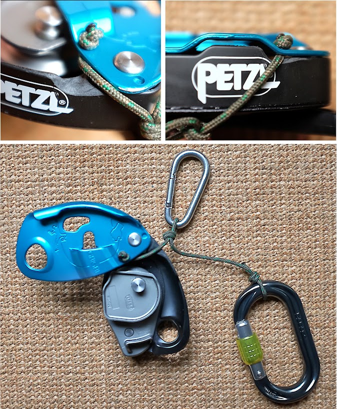

*更新信息见文末。*

对作者使用的无弹簧 GRIGRI 与绳索组合，偏离垂直方向约 30–40° 时出绳和锁止表现最好；对 GRIGRI +，作者认为 40–50° 效果较好。其他组合需要另行试验。

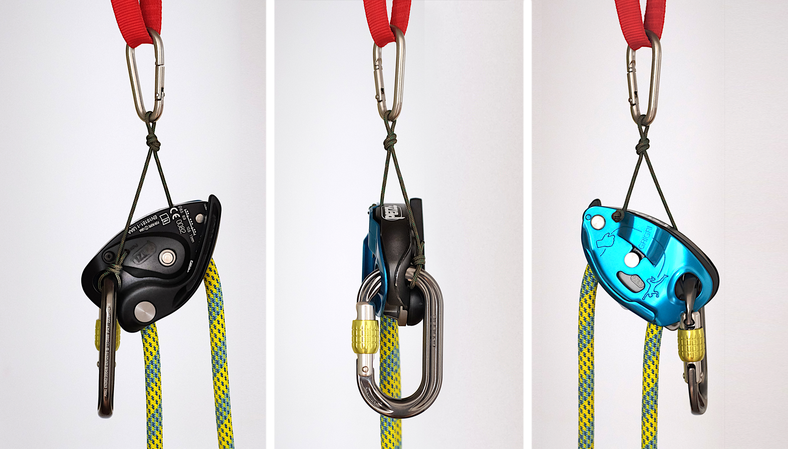

照片中的器械搭配 Maxim Pinnacle 9.5 毫米绳索。

如果 GRIGRI 出绳过于轻松，就会促使承重侧主绳回喂，从缓存绳环中拉出危险余绳。可以移动打结悬挂环来调节出绳阻力：器械越接近垂直，摩擦越大；越接近水平，摩擦越小。作者还推荐 [Arctic Bastard 的 Gromm Hitches](https://youtu.be/otQ2d3PAPBQ) 作为另一种控制回喂的方法。

## 管理 HUB 系统缓存绳环与备份的五种方法

原文认为，为保证性能和安全，缓存绳环和某种形式的备份不可省略，并列出五项完整方法：

1. 采用 [Brent Barghahn](https://www.brentbarghahn.com/climbing-blog/redpoint-rope-soloing-2021) 的方法，预先用丁香结把缓存绳环系在无钩鼻锁扣上，再将锁扣挂入全强度或有备份的装备环；按需释放绳环。
2. 用连接在腰带周围锁扣上的 MICRO TRAXION 管理缓存绳环，并在保护环附近另设扁带环和锁扣。接近难点时，在 MICRO TRAXION 与 GRIGRI 之间打备份结；通过难点后再解开。
3. 在腰带周围设置锁扣，用绕在主绳上的克氏结管理缓存绳环并充当备份。作者称，按这种方法抽绳时需要像使用 El Mudo 一样用牙齿控制绳结。
4. 在缓存绳环之前预打备份活结。活结接近 MICRO TRAXION 时，拉动使其解开。MICRO TRAXION 必须连接在全强度或有备份的装备环上。
5. 背包法：每隔一段距离预打备份活结，再把绳索装入背包。缓存绳环从背包中抽出；每个绳结“出现”时，用嘴咬住，并用空闲手将其拉开。

> **译注：** 原文标题称“五种”，HTML 列表另有一个未写完的第六项。上述五项按原文完整内容整理。“用牙齿控制绳结”等动作会占用口部并增加误操作风险，且装备环是否全强度必须依据具体安全带说明书确认，不能仅凭外观判断。

## 使用无弹簧 GRIGRI 配合 HUB 系统的当前想法与试验

作者仍在试验连接 GRIGRI 与安全带的不同锁扣、防止横向受力的措施，以及胸式安全带与攀登安全带经 GRIGRI 和 HUB 绳连接时应有多松或多紧。目前的做法是尽量让重量由胸式／肩式安全带承担，使器械尽可能自由地悬挂在 HUB 绳上。作者用大型椭圆锁扣连接保护环，使锁扣能在保护环内略微上下移动，帮助器械保持正确角度。

> **警告：** 无弹簧 GRIGRI 如果转到水平位置，就会锁止并阻止攀登者继续向上移动。

**附记：** GRIGRI 与缓存绳环配合使用时，作者把缓存绳环放在攀登者左侧，也就是 GRIGRI 活动侧板和下降用圆滑边缘所在的一侧。如果放在攀登者右侧，缓存绳环可能跨过手柄，使下降时更难触及手柄。

## 增补：GRIGRI + 与单臂 HUB Tow Cord

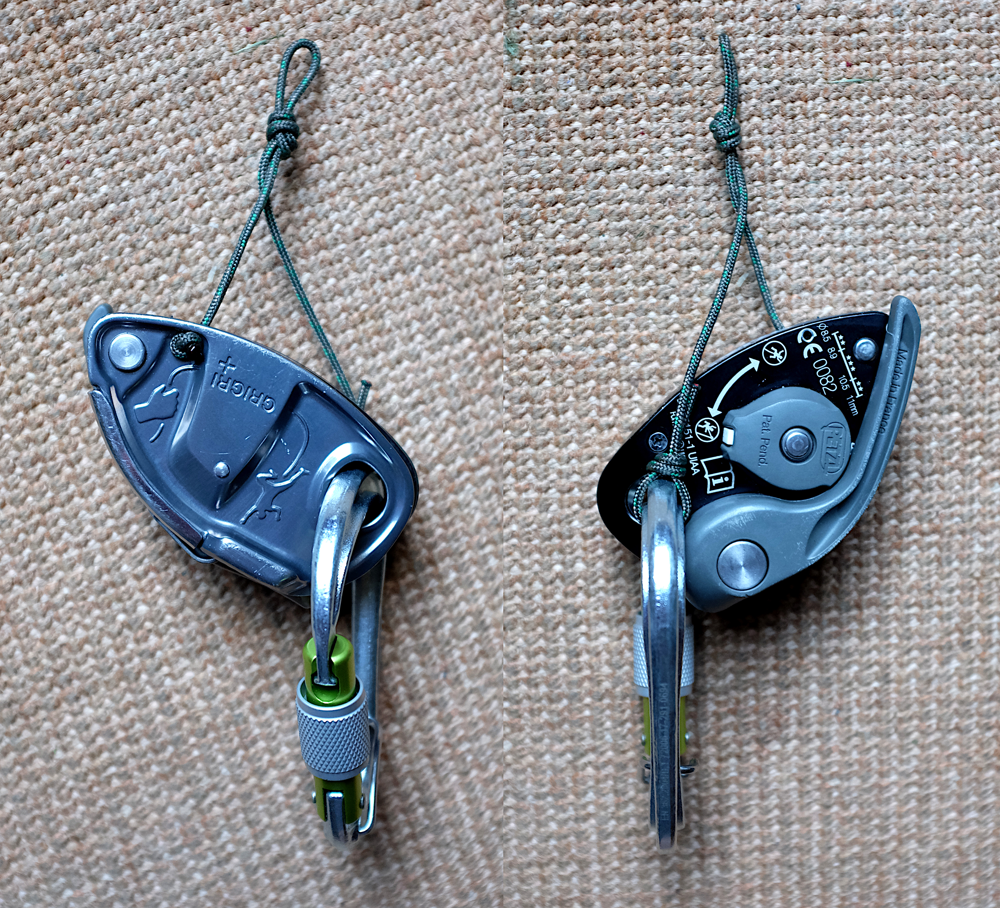

*GRIGRI + 上的 HUB 绳。*

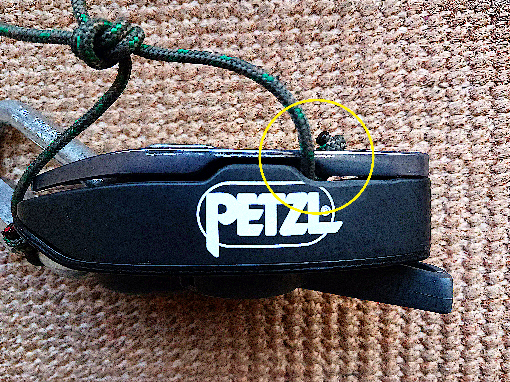

*略微磨削、锉削或打磨塑料垫片，为 2.5 毫米绳增加间隙。*

GRIGRI 3 或 GRIGRI + 还可采用另一种方案：去掉绳 cord 的第二条支臂。这样更简单，但器械会略微横向倾斜，从而增加摩擦。该方案不能通过胸式安全带调节 GRIGRI 的悬挂角度；搭配较细绳索，例如直径小于 9.4 毫米时，出绳可能仍然足够顺畅。简化方案的优点是 HUB 绳和胸式安全带连接点远离手柄。

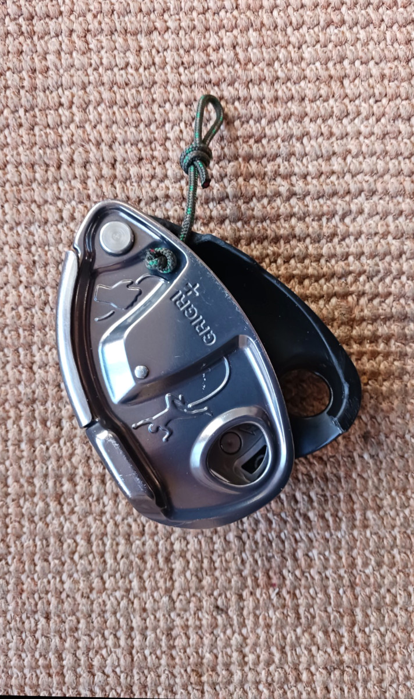

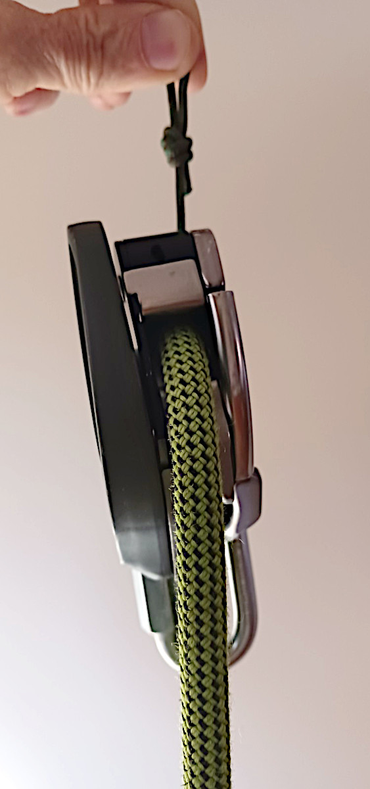

## 增补 2：名称、绳 cord 和绳结的变化

作者把单臂版本命名为 **HUB Tow Cord（HUB 牵引绳）**，把双臂版本命名为 **HUB Bridle（HUB 双臂连接绳）**。

所用绳 cord 从 2.5 毫米辅绳改为 1.8 毫米聚酯／Dyneema 绳；后者更容易穿过活动侧板与器械主体之间的间隙。

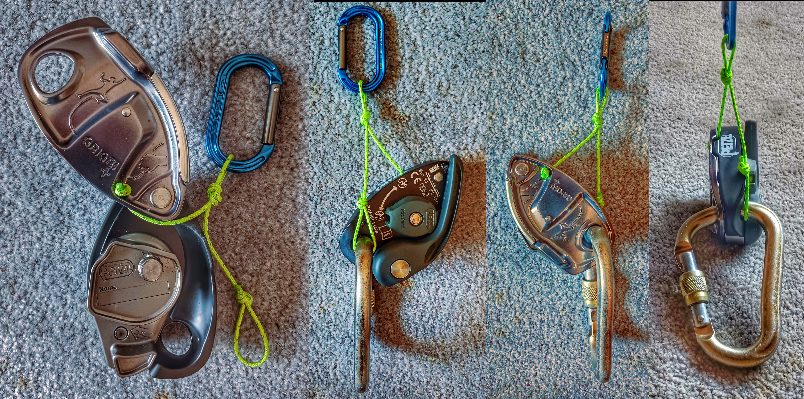

作者还把可在锁扣上收紧的 Scaffold knot 改为绳中段单结环，使安装和拆卸更方便。结环尺寸经过调整，让较大的结体避开 GRIGRI 主体，使牵引环连接点更加居中。

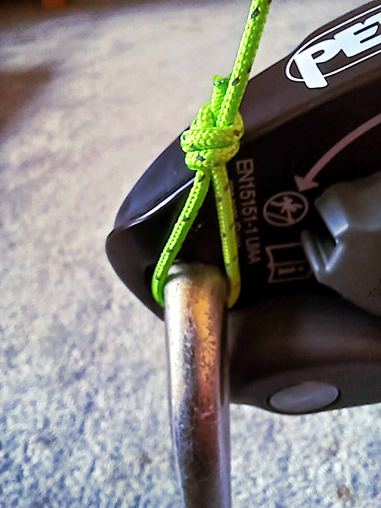

较早的照片没有显示钻孔内侧的倒角。作者用比孔径大数号的钻头轻压孔口，去除锐边并形成浅倒角，以保护绳 cord。

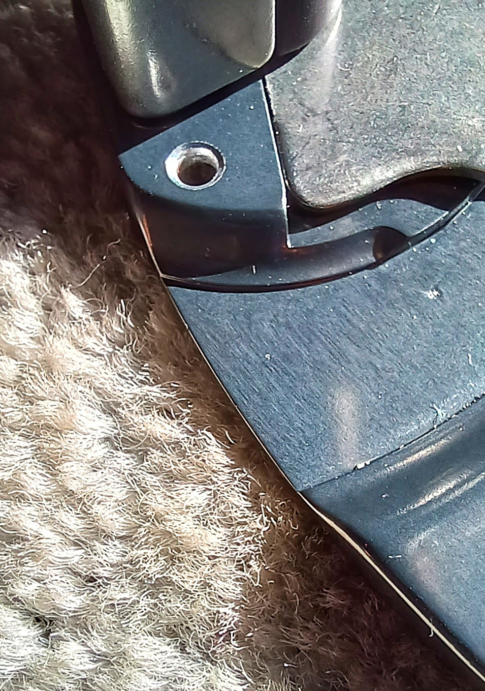

虽然部分照片显示的是铝合金带锁锁扣，但作者通常使用有强度认证的不锈钢梅陇锁、钢制自动锁椭圆锁扣，或钢制对称梨形锁扣。

## 2024 年 10 月更新：无需钻孔的试验方法

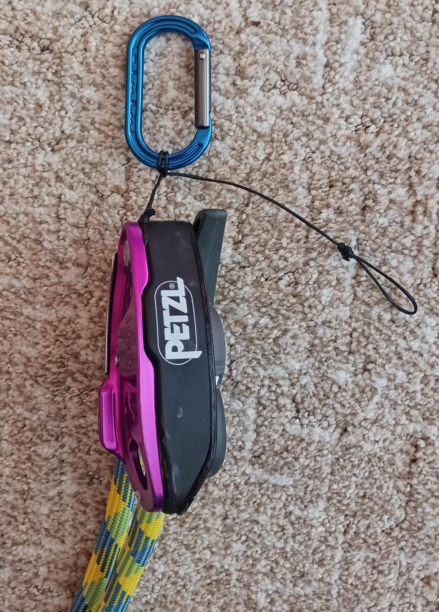

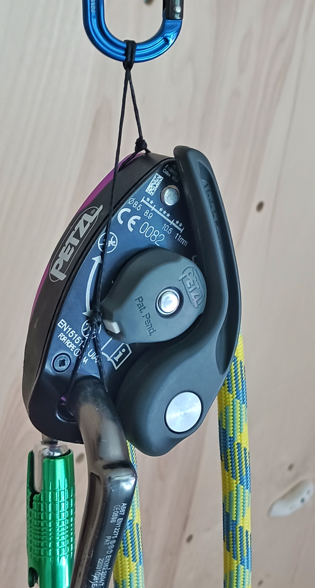

若想在不钻孔的情况下，测试某个 GRIGRI 与绳索组合是否适用于 HUB（此次更新中也写作 HUR）方案，作者建议先取约 3 英尺（约 91 厘米）长、直径 1.0–1.2 毫米的 Dyneema 绳。这个长度远超最终所需，但更方便打结；最后一步可通过绳结调节最终长度。

1. 将绳 cord 绕过活动侧板的转轴，打一个 Scaffold knot。收紧绳结，直到绳 cord 嵌入活动侧板与器械主体之间。根据侧板松紧程度，可能需要用很大的拉力才能把绳勒到转轴周围。
2. 在绳 cord 中部，围绕用于连接胸式安全带的锁扣打丁香结。
3. 在另一端打一个绳中段单结环，用来套在主锁扣上。
4. 整理并收紧结环之前，先将其调到适合连接胸式安全带的悬挂长度。
5. 剪去多余绳端并熔化末端。
6. 松开丁香结，改变双臂连接绳两条支臂的相对长度，即可调节悬挂角度。

作者仍然更喜欢在活动侧板上钻孔，因为绳 cord 能帮助拉住侧板，使其保持闭合。GRIGRI 没有侧板锁定机构，可能在锁扣上晃动；在此方案中，HUB 绳和重力共同帮助侧板维持闭合。

> **译注：** “HUB 绳和重力帮助侧板保持闭合”不能替代制造商设计的闭合检查，也不能证明改装后的侧板在坠落、横向受力或绳索干涉下仍会保持正确位置。
