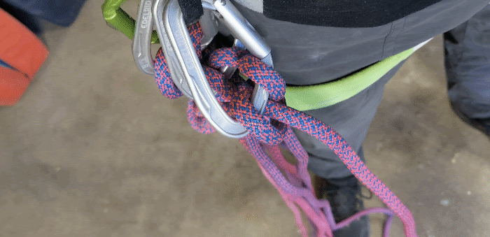
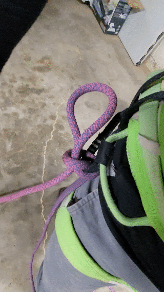
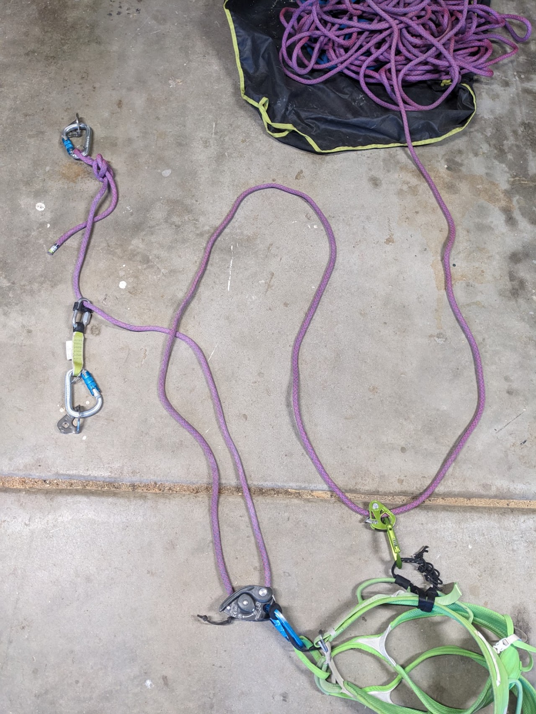
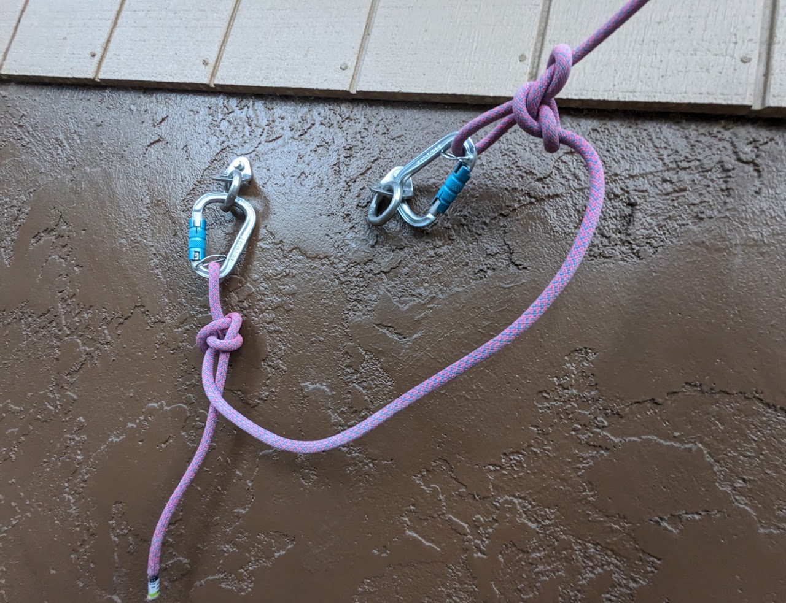
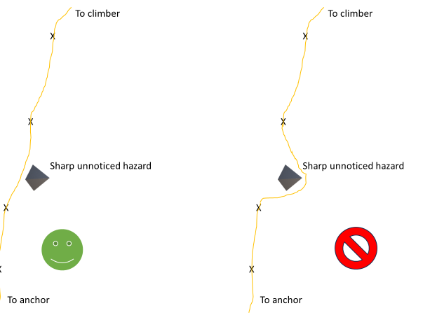
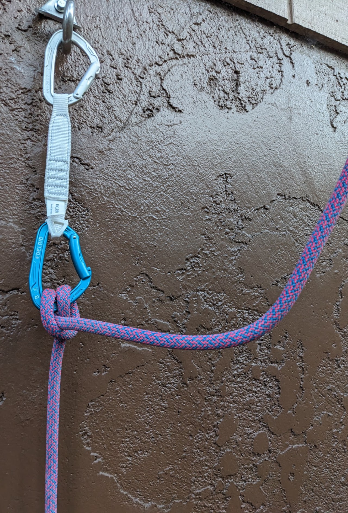
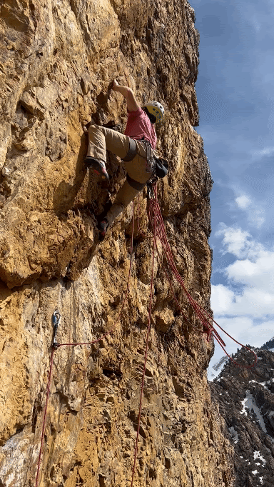
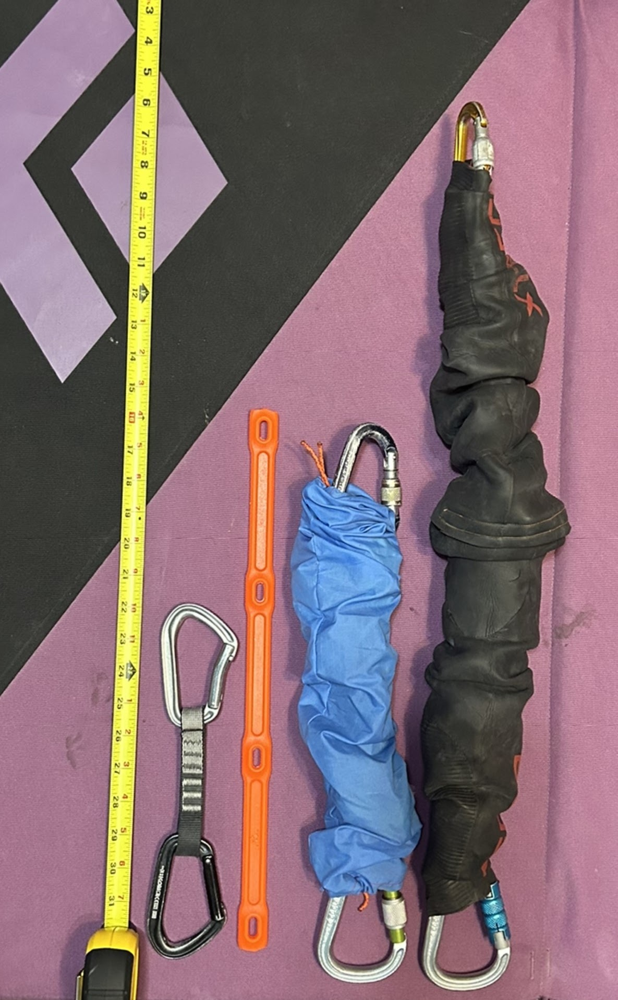
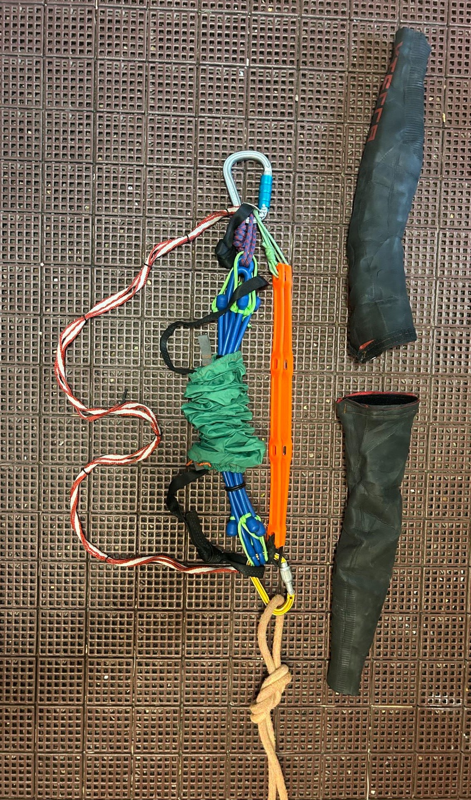

# Redpoint Rope Soloing Revised

A proven method for lead rope soloing near your free climbing limit

###

October 2023

Additional credit to Derek Averill, a collaborator for many of these refinements

Redpoint rope solo accessory products now available on my online store! [www.avantclimbing.com](http://www.avantclimbing.com)

[Shop Lead Rope Solo Gear Now](https://www.google.com/url?q=https%3A%2F%2Favantclimbing.com%2Fcollections%2Flead-rope-solo-solutions&sa=D&sntz=1&usg=AOvVaw2QyHTNV75kMDemPsZtQmlt)

This post is a follow up to my popular [2021 Redpoint Rope Soloing blog post](/climbing-blog/redpoint-rope-soloing-2021). The Lead Rope Solo (LRS) systems presented at that time were newly conceived in isolation and a bit scrapy, but have now evolved through countless pitches and safe falls. With the systems described below, I have reached parity with my most difficult belayed redpoint, as well as having multiple big wall solo free climbing experiences. This is a well proven method for solo “redpointing” specifically, where: all tasks must be done easily with one hand; falls are frequent; and additional motions must be minimized to save energy for the free climbing itself.

Why bother?

Sometimes, a partner just doesn’t line up for your specific objective or time window. Other times, the freedom and self-sufficiency required to go for a big climb alone create its own unique experience. I do spend most of my time climbing with a standard belay, but also find LRS ascents to be rewarding in their own way.

A Disclaimer:

This refined system is a combination of multiple LRS techniques, mostly developed by other climbers. With the numerous and ever changing options shared on the internet, I wish to present a singular refined method that you know has been thoroughly tested. Though, there are plenty of other sources for LRS techniques:

* [LRS Facebook Group](https://www.facebook.com/groups/LeadRopeSolo)

* [A Useful PDF Guide written by Andrea Calligaris](https://app.box.com/s/xe19rd4mymgu63vqaq1owf1doh2na92g)

* [A Book by Andy Kirkpatrick](https://amazon.com/Me-Myself-dark-arts-soloing/dp/1545122253)

* [Pete Whittaker's Methods](https://www.youtube.com/watch?v=KJ9HGuiIc6w&t=112s)

* [In Depth GriGri Mod Details](https://sicgrips.blogspot.com/)

* [Bliss Climbing Course](https://blissclimbing.com/en/courses/lead-rope-solo/)

* [Arctic Bastards, creator of many LRS widget innovations](https://www.instagram.com/arcticbastards/?hl=en)

Hard Free Rope Solo Inspiration:

A handful of by top climbers have sent 5.14 out climbing alone. I've always thought this was incredibly cool, and was motivation to refine my personal techniques to LRS climb closer to my limit. Here are a few notable ascents that I know of:

* Keita Kurakami has climbed cutting edge rope solo ascents using a very similar GriGri+ and cache loop system. Among many impressive ascents, he freed the Nose rope solo style (14a, 3000') and has done up to 14c sport routes out on his own! The hardest free LRS ascents that I know of.

* Fabian Buhl has done a few LRS multipitch first ascents up to 14b in the alps, using a GriGri1 and pre-cache methods. He was the first I saw climbing with multiple loops off his harness. Fabian uses one hand releasable backup knots and a clever full strength sling add on.

* Alex Huber has put up 14- multipitch routes rope solo, ground up. It seems like Alex is likely a predecessor to Fabian in a similar GriGri1 with multiple cache loops method.

* Lukasz Dudek sent a wildly overhanging 14b multipitch in the alps LRS style.

* Pete Whittaker sent the Freerider in a day, rope solo style. An impressive endurance feat considering the rappeling and jug cleaning of each pitch! He used the Silent Partner, though at 13a, this may be the highest level redpointed with that device (at least that I know of).

General Premise:

For any lead rope soloing system, automatic self-feeding comes by managing free side rope weight with a “cache loop”. For a GriGri, this is the "brake" strand of the rope. A cache loop of the free rope hanging down about 15 feet or less will pull smoothly through the device (if the full dangling free rope weights the device, it will lock up in place and prevent movement). The rope is fixed at the lower anchor and the belay device is oriented as if you were rappelling upward with sufficient free rope to reach the next anchor. Gear/bolts are clipped into the "protection strand" of the rope while ascending, allowing a relatively normal lead climbing experience.

For a video demo of the system (though with some slightly dated variations), check out this YouTube video of mine: [Sending 5.13c without a Belayer [How I Climb Alone]](https://youtu.be/oH1Xs0gOpOk?si=pIJQRIz_hE74FZuo)

System Risks:

It is of significance to note - THIS SYSTEM LIKELY WILL NOT CATCH UPSIDE-DOWN FALLS! Always use backup knots. This system also relies on clear misuse of climbing devices, so you must conduct your own personal risk assessment. Always re-check each device and attachment before setting off.

Hard free climbing with a self-belay

A large LRS whip

Solo Lead Belay Device of Choice: GriGri+

GriGri+ Benefits:

GriGri’s are the ubiquitous belay device of choice for any serious sport (read: redpoint) climber. This universal usage makes it the world's most tested belay device, catching falls at all angles, with cross loaded biners, with significant brake slack, and so on. Failure reports are rare, and the failure modes can be managed for LRS usage. (Though again, we are significantly misusing the device)

The same benefits of a GriGri while belaying someone “working a route” come in handy while climbing solo, too. It is relatively easy to yard up the rope after a fall (or add a PCP and winch style ascend if hanging in space). One can work moves, clip up, and generally project routes like normal. There is also risk reduction in being able to immediately lower at the top of the pitch without switching devices. Derek and I have both taken hundreds of falls LRS with this system, some quite large.

Slack for clipping is fed downward through the GriGri, prior to making the clip. A learned motion that comes natural in time. Making a high-clip generally requires 3-5 pumps of rope. It is helpful to count them when climbing hard so you don’t come up short! It’s better to feed out too much slack than to short rope yourself when trying hard. After making a high-clip, one must resist the urge to cinch tight through the GriGri which can cause short, abrupt falls.

The GriGri+ specifically has the benefit of TR Mode: its lower spring preload on the cam causes locking sensitivity to increase. This is great for LRS peace of mind, especially with light skinny ropes! A chest harness or bungee must orient the GriGri upwards for TR Mode to auto-feed at all - feeding downward then works very smoothly to pull slack, but the device is very grabby when the climber strand is pulled upwards (the direction of a LRS regular fall or take). This allows very skinny ropes to be used without concern of slippage, but check the mode dial before every pitch. A modern Generation of the standard GriGri works okay too, but be cognizant of rope diameter selection for a reliable catch with the stiffer cam spring, you may experience delayed catches.

See this video to help visualize the sensitivity required for a no-hands engagement. This failure mode is greatly reduced by GriGri+'s TR Mode:[ The Physics of GriGri | When does No-Hands Belay Fail?](https://www.youtube.com/watch?v=We-nxljgnw4&t=0s)

If you climb LRS style often, consider having a dedicated GriGri+ to maintain a fresh cam surface. The steel cam bump that pinches the rope does wear out from lowering and rappelling. A fresh and dedicated device is a great idea to avoid slippage and longer-than-expected falls.

*Aid Climbing Risk: The GriGri has a downfall for aid soloing - if one is standing in an aid ladder on a piece that is also clipped through the lead rope, and the piece falls, weighting the ladder midair during a fall could hold the GriGri cam down This may prevent cam engagement. This can be prevented by not clipping the rope to a piece of gear until standing in ladders on the next piece.

GriGri+ Held Upwards & Upside-Down:

The stock GriGri+ works really well for Lead Rope Soloing, if Held Upwards and Upside-Down (HUUD) with a chest harness. In this orientation the rope creates a smooth single bend between the protection side and free side of the rope. The smoother the bend, the easier the auto-feeding.

This can be achieved with-out modifying the GriGri by tying small ~2mm cord around the sideplate pivot point and through the body side of the carabiner hole, as shown below. This cord does sit inside the rope path and may wear out, especially while rappelling. Two "light mod" alternatives are: use this same V cord arrangement, but use a small drilled hole in the sideplate instead of the the loop around the side-plate pivot; or, modify the plastic body to hang the device from one strand at the "L" in the Petzl logo, which is on the bottom of the GriGri.

This orientation does risk delayed catch for upside-down falls, but using TR mode can help increase the likelyhood of engagement in this unlikely falling scenario.

The GriGri should be held up relatively tight with the clip in loop described above, as snug as possible without impeding upper body mobility. A rigid chest harness gives a more positive hold for feeding down slack, needing less slack pumps per clip, but some prefer the comfort of a stiff bungee.

Held Upwards & Upside-Down Configuration

No-modification option for attaching the cord for this configuration

Brent's chest harness arrangement

Derek's chest harness arrangement

[Buy the Avant LRS Chest Harness](https://www.google.com/url?q=https%3A%2F%2Favantclimbing.com%2Fproducts%2Flrs-chest-harness&sa=D&sntz=1&usg=AOvVaw0vRzMm2XxM04DMBUkIWYE8)

Brent's adjustable 3/4" webbing chest harness

Derek's chest harness with TPU compliance features

GriGri+ "Death Mod":

The stock GriGri+ in TR Mode works reasonably well for LRS climbing, so modifications are not crucial.

A high risk and high reward auto-feeding improvement is to cut off the metal tab in the rope path next to the handle pivot. This WILL make upside-down falls more risky since it follows the exact same rope path as smooth feeding, beware! And, it also creates a sharp edge under the metal . I won’t go into further details, please do your own research to understand the methods and risks of modifying metal parts of your critical belay device.

Clip Loop Position

Clip Loop Detail

Steel tab ground off

GriGri Carabiner Crossload Protection:

An added risk of the GriGri over other dedicated soloing devices is that it only has room for a single clipping carabiner. This does not seem to be a deal breaker to me, since the same is true with ALL belay devices used in partnered belaying. Though, it is certainly worth a foolproof locking gate such as a triple action twist lock.

The risk of a crossloaded GriGri carabiner exploding can be mitigated by using a modern belay biner with a captive feature (Edelrid FG, BD Gridlock, DMM Ceros, etc). It can be reduced further yet by using rubber rings on either side of the GriGri to keep it on the wide diameter curve of the carabiner (see link below for an Avant brand solution that I sell to solve this issue). With these redundant crossload limiters, I comfortably use an aluminum bodied carabiner. Some climbers use industrial steel carabiners, or steel malions even, for further peace of mind.

[Buy the Avant Flex-Link Crossload Protector](https://www.google.com/url?q=https%3A%2F%2Favantclimbing.com%2Fproducts%2Fflex-link-anti-crossload-protector%3Fpr_prod_strat%3Djac%26pr_rec_id%3Da4a7eec99%26pr_rec_pid%3D8770657026332%26pr_ref_pid%3D8770648178972%26pr_seq%3Duniform&sa=D&sntz=1&usg=AOvVaw29yPMBaEouDVowP7Rop0ZT)

Double crossload protection

Detail of the simple TPU anti-crossload accessory

Why not the elusive Silent Partner?

Back when I worked as an engineer at BD, we had a disassembled Silent Partner and I was able to inspect the internal mechanism. The seat-belt style brake system relies on very small toothed steel gears which swing out with rotational inertia and jam against the inside of the main aluminum housing. These devices seem very robust out of the box as a trustworthy catch, but to me seemed as if the steel to aluminum interface would deteriorate over repeated falls (ie: “working” a difficult pitch), changing the locking characteristics. I did use this device often for fast solo aiding, including a [Solo Nose-in-a-Day](/climbing-blog/sniad-2018), but have since sold mine. I trust the GriGri much more in the redpointing scenario of many falls as there are no crucial metal-on-metal catch surfaces, but this is simply my interpretation of the mechanism. It is also hard to beat the universal track record of the GriGri family, catching innumerable falls, in all sorts of orientations, with minimal failures..

Harness Accessory for Structural Backups

Structural Gear Loop:

A 30cm sling can be hitched around the harness waist band, either in-front of both gear loops, or in between the existing loops, to create a structural racking loop. Velcro, zipties, or One-Wrap cable holders can be used to hold this sling in place against the gear loops, keeping the hitch from cinching awkwardly on the waist band. Some harnesses have structural gear loops integrated (Metolius Safe-Tech harness), but I much prefer this add on method to my comfy and sporty daily harness.

Velcro version of the add-on structural loop

Detail of the velcro wings sewn to the sling

Zip tie version. Tape could also work

Structural Single Point:

A piece of webbing can be looped around the waist band and tied closed with a water knot to create a single structural clip in point. This can be favored for those who prefer a single continuous cache loop, keeping the clip in point in front of the forward gear loop.

Managing the Cache Loop

Knowing that a cache loop is the key for this auto-feeding system to work, let's consider the options of maintaining a properly sized cache loop for a full pitch. This breaks into two categories: pre-cache or continuous-cache.

The Pre-Cache Method:

Stacking the rope into multiple cache loops prior to setting off on the climbing allows the system to auto-feed for the entire pitch, with only the occasional release motion as each loop runs out. I pre-cache the rope in 10-15 foot loops for most LRS free climbing, starting from the free side next to the device, and then create ever larger loops working towards the tail of the rope. The rope weight is on the climber’s harness, and the loops dangle down in a visually goofy manner, but it is less distracting for the climber than it first appears. The rope on the protection side is held by backfeed keepers, negating any rope drag, so the overall perceived weight is not so different than a regular belay. All of my hardest LRS free climbs have used the precache method.

Clove Dump Pre-Cache Option:

The cache loops can be held to the climber’s harness with loose clove hitch loaded onto upside-down, gate in carabiners, with a snag free nose. This creates a releasable knot that is also a full strength backup (if hanging off the structural gear loop). With a one hand motion, the clove hitch of rope is easily dropped off the open carabiner. The last knot holding up your loops can be an overhand on a locker, this one is never released. I popularized this method in my [2021 blog post](/climbing-blog/redpoint-rope-soloing-2021), giving this newly found full-strength backup cache option as my go-to.

Benefits

* Creates a structural backup knot between each loop, in case the GriGri slips, its carabiner explodes, or to stop upside-down falls

* Relatively easy one hand releasing

Downfalls

* Not easily released across body with the opposite side hand

* Clove hitches can induce twists into rope (Alternating clove backup “handedness” left-handed clove vs right-handed clove can help mitigate some rope twist)

* Multiple cache loops can tangle with each other (I make them in slightly increasing lengths to help mitigate this)

* More rope weight is on the harness

* More metal and bulk than other alternatives

* Loops of rope hang down and can snag on rock features for lower angle terrain

Loaded cache cloves

Carabiner orientation prior to loading

Slip Knot Pre-Cache Option:

A slightly less secure, but still releasable backup knot is the slip knot variant, used extensively by Alex Huber and Fabian Buhl. This method creates a knot that holds tight in the direction towards the GriGri, strong enough to block the GriGri against a headfirst fall, but still releasable with a one handed tug on the cache side. Since the knot only holds about 4kN ([Bliss Climbing Test Video](https://www.youtube.com/watch?v=Mlwl49NAEuY)), these can live on a regular gear loop and still function as a blocker knot. The full strength sling holds them out nicely to keep gear space open, but the knot it self is not structural in the same sense as the clove above. To tie, pass a bight of rope through inside of a gear loop, add a full twist, and then pass a seperate bight of rope through this twisted loop from around the outside of the gear loop. Cinch tight with a ~6" captive loop.

Benefits

* Creates a blocker backup knot between each loop, in case the GriGri slips, or to stop upside-down falls

* Relatively easy one hand releasing

* No extra metal gear needed

Downfalls

* Knot will only hold ~4kN, doesn't backup a full GriGri or carabiner failure.

* Knots can release themselves if the cache loops snag on the rock

* Not easily released across body with the opposite side hand

* Significant added bulk from the captive loops

* It can be hard to find the correct cache side strand to pull

* Multiple cache loops can tangle with each other (I make them in slightly increasing lengths to help mitigate this)

* More rope weight is on the harness

* Loops of rope hang down and can snag on rock features for lower angle terrain

A slip knot holding up a cache loop - only one shown to help clarify the rope path inside the knot

Release Ring Pre-Cache Option:

An even easier to release method of holding loops of rope to one’s harness is small ~1cm diameter tied loops of ⅛” shock cord creating a quick release. The bight of rope between loops can be pushed through the shock cord, and then released easily with a quick tug as the loop runs out. These small loops can be tied around and left on the structural add-on gear loop for use when needed, with minimal added bulk.

Benefits

* Easy releasing across body, good for steeper climbing or low to the ground where the backup knot wouldn’t prevent decking anyways

* Very lightweight and compact

Downfalls

* No backup knot for GriGri/biner failure or upside-down falls!

* Multiple cache loops can tangle with each other

* Significant rope weight on the harness

* Bights of rope hang down and can snag on rock features

Multiple Release Rings ready for deployment

Empty Release Rings, I leave these tied onto the add-on gear loop

The Continuous-Cache Method:

A more active cache method is to have a single cache loop that is maintained with a one hand motion, pulling free rope into the cache loop every 5-20 feet of climbing. One must be vigilant to refill the cache loop often, to not run out of rope and pull tight on the GriGri brake strand, which short ropes oneself in place.

Progress Capturing Pulley (PCP) Continuous-Cache Option:

The continuous-cache method usually relies on a PCP (Micro-Traxion, Spoc, etc) on one’s harness. The free rope is stacked on the ground or in a rope bag. This method does not provide ANY backup to the GriGri system at this point! Blocker knots need to be added inline to have a backup, which would jam against the PCP (PCP must be on a structural loop). These knots then negate some benefits of the continuous-cache, causing significant snag risks, and also being difficult to remove one handed mid climb. This system is most advantageous for moving quickly with no backups. The reduced clutter over pre-cache methods is preferred for aid climbing/short fixing, where more things are already hanging off one’s harness, and you can hang at anytime to deal with two handed backup knot releases.

Benefits

* One single cache loop hanging down for less clutter and fewer snags

* Less rope weight on the harness - extra free rope can be fed out of a rope bag below

Downfalls

* Significant added motions to manage the rope mid climb, can add pump to your redpoint!

* Inline backup knots can be used, but are not easily released with one hand, and cause more snag risk than pre-cache loops

Cache Combinations:

The clove dump, release ring, and continuous PCP methods are all useful depending on the situation, even sometimes on the same pitch! Release rings are great right off the ground when cragging, where fighting a loop drop is more likely to cause a fall, and the backup wouldn’t engage before hitting the ground anyways. Clove dumps are a great go-to for mid pitch peace of mind, or when a move has a weird fall risk. A PCP cache then can be good for a rambly top out way up a climb, to save some weight on the harness, or if you don’t know the exact pitch length. These cache loop systems can all live harmoniously on your add-on structural gear loop for clarity of use while climbing.

Rope Choice

Rope Diameter:

Skinnier is generally better if you are in GriGri+ TR Mode, improving feeding and reducing weight of the rope on your harness. The slightly stretchier skinny ropes even make the rope solo falls more comfy as the rope comes tight against a rigid anchor. My go to cragging LRS rope is the [8.6mm Canary](https://www.backcountry.com/edelrid-canary-pro-dry-climbing-rope-8.6mm). For multipitching, I use the [8.9mm Swift Protect](https://www.backcountry.com/edelrid-swift-protect-pro-dry-rope-8.9mm) for its cut resistance. Derek even uses the [8.2mm Protect](https://edelrid.com/us-en/sport/ropes/starling-protect-pro-dry-8-2mm?filter%5Bkategorie_id%5D%5B0%5D=20&filter%5B6%5D%5Bmin%5D=2&filter%5B6%5D%5Bmax%5D=11&filter%5B13%5D%5B0%5D=2090&sort=new_desc&variant=2092937) sheath half rope for moderate mileage - it’s cut resistant sheath tests as high as a standard 9.5mm lead line, but your Gri better be in TR mode!

Rope Sheath Type:

A skinny rope does not cause more risk in a clean fall, but it is more prone to sheath damage, or even rope cuts. Thin ropes simply have less sheath material. LRS climbing is particularly hard on rope sheaths because all edge sawing is stationary, hitting the same wear point for all falls since the protection side of the rope is fixed relative to the wall. Furthermore, most multipitch gear cleaning is done with weighted jugging, being harder on the rope as well than a free climbing follower.

This risk can be compensated with modern sheath technologies. The Beal Unicore tech helps some, but mostly for the case of sheath slippage while jugging. The [EDELRID Protect tech](https://edelrid.com/us-en/knowledge/knowledge-base/cut-resistance-of-ropes) is a massive improvement for reducing sheath damage due to edge wear, giving the same cut resistance as a rope weighing 30% more.

Anchor Considerations

Sport Cragging Anchor:

On a modern tightly bolted sport route, you can stick clip an inline anchor to the first two bolts of the route, from the ground! A Yellow Superclip with a long pole (I use a 320cm Avi-Probe) helps to set burly steel locking carabiner onto the bolts. The first bolt is clipped with rope into a robust steel carabiner (consider the [EDELRID Bruce Steel Triple Twist Lock](https://www.backcountry.com/edelrid-hms-bruce-steel-screw-fg-locking-carabiner)), but the second bolt gets a custom built quickdraw: steel locker on the hanger side, a short dogbone, and a 5/16" steel mallion on the rope side. If the first bolt somehow failed or unclipped, the lower knot jams into the mallion and creates a secondary anchor point. A rope cinch accessory is helpful on the mallion to cinch the first bolt carabiner upwards in a stable position, see the link below for an Avant brand solution I designed to cinch the rope through a quicklink.

[Buy the Avant Slide-Cinch Quicklink Cincher](https://www.google.com/url?q=https%3A%2F%2Favantclimbing.com%2Fproducts%2Fquicklink-slide-cinch-lead-rope-solo-backfeed-preventer&sa=D&sntz=1&usg=AOvVaw2TN7czooSvmOMeoKeF1FAH)

A Neatly cinched two-bolt, inline, cragging anchor

Lower bolt detail

Upper bolt detail, with specialty cinching backup draw

A thrifty TPU quickdraw cincher - a "Perfect Bungee" segment folded over and tapped flat

Trad Cragging Anchor:

For single pitch gear routes, one does not have the convenience of setting a two bolt stick clip anchor from the ground. A bit of creativity is needed, either tying off a nearby tree, finding protection at ground level loadable upwards, or setting gear within the first bit of the route loadable upwards. I generally just use the lead rope itself and create an approximately equalized 3 piece anchor using cloves and alpine butterflies. Cinching the anchor upwards is important so that cams don’t walk with repeated falls - use some variation of a backfeed preventer described below, or clove to the bottom of a sling, with enough freedom to not limit rope stretch, on a piece above the anchor.

Bungee Anchoring (See Appendix A for In-Depth Details):

For cragging routes with difficulties in the first 50 feet, Derek and I have started to use a TPU bungee system for a softer catch. This is not a Screamer device, but rather a touch of cushion for comfort when taking repeated falls on a hard pitch. Consider the difference of being spiked by a belay partner, versus even just a bit of give on their end.

The throw of the bungee also allows energy to be absorbed by rope drag through all clipped carabiners. This further increases fall comfort. Once past about 50 feet, the rope stretch itself generally overrides any noticeable bungee effect. Bungee stretch of more than 18 inches or so creates difficulties when pulling back on the wall. See Bungee Anchor Basics document in the appendix if you want further bungee tuning details.

Multipitching Anchor:

For multipitch anchors consisting of two even bolts, I simply use the burly steel lockers to create a redundant inline anchor at the bottom of each pitch. The far locker hangs free with slack, but the closer locker is cinched up to hold an ideal position on the hanger. A sack for holding the flaked rope is a great idea if using a continuous cache method - the basic Ikea shopping bag works well.

Backfeed Prevention

The Backfeed Problem:

Backfeeding rope is a significant risk to understand while rope soloing. Once the climber is up far enough vertically, the protection side rope weight can spool rope through the device in the auto-feeding direction, and stack up unnoticed down by the anchor. A small fall even with a protection point could unknowingly be HUGE! This is avoided by vigilantly cinching the fixed protection side of the rope upward multiple times throughout a pitch.

With proper backfeed prevention we can also mitigate potential rope damaging snags. Use caution to avoid snag potential in your system.

Backfeed Prevention Widgets:

The LRS community has created small rubber accessories that live on the backbone of a carabiner and create a rope cinch point to manage protection side slack in the system throughout a pitch (See the link below for Avant brand cinch accessories). This accessorized carabiner usually lives on the rope side of the quickdraw. The draw is clipped like normal, and then the rope is pulled tight to be held in place. I use these ever 20-30 feet for hard climbing. This is crucial peace of mind knowing there is not hidden slack in the system, prior to committing to a hard move. I keep a set of 6 accessorized carabiners with installed keepers, and then swap them with the rope side carabiners on quickdraws prior to an LRS outing.

[Buy the Avant Soft-Cinch backfeed preventer here](https://avantclimbing.com/products/soft-cinch-lead-rope-solo-backfeed-preventer-5-pack)

A thrifty version involves ⅛” shock cord tied or even zip-tied closed (approximately 1” ring) as seen in the photos below, then left cinched around the outside of a carabiner. This version takes a bit more effort to deploy due to the need to slide the shock cord over the gate of the carabiner while biting the rope to keep tension. These come in handy because you can quickly equip an entire trad rack and/or quickdraw set for temporary use during alpine objectives. When doubled up, they cinch well enough to tension a traditional anchor upwards without worrying about the rope popping out of the widget.

[Buy the Avant Soft-Cinch Backfeed Preventer](https://www.google.com/url?q=https%3A%2F%2Favantclimbing.com%2Fproducts%2Fsoft-cinch-lead-rope-solo-backfeed-preventer-5-pack&sa=D&sntz=1&usg=AOvVaw33sUo7H19vPFY6goRzO9CB)

Brent's "Soft-Cinch" 3D printable backfeed keeper

Derek's thrifty shock cord backfeed keeper. One of many concepts from the LRS Facebook Group

Soft Refixing:

A releasable slipknot can be used to tie the rope tight to a piece, cinching out all of the slack below. The slipknot is an okay solution for long moderate pitches, but this knot will release itself in the case of a fall. This is a benefit to allow the whole dynamic rope to stretch, but a new knot needs to be tied post-fall.

I use this knot for refixing on rappel prior to cleaning a pitch (or for convenient TR Solo refixing). It is relatively easy to leapfrog past and then release from above.

Hard Refixing:

On long pitches with good stances, it can sometimes make sense to pull the live rope up tight against the lower anchor and fully refix with a knot to a piece or bolt. Hard refixing can be great for combining pitches with a rest at the mid-anchor, but without a system transition. There is added risk since the amount of dynamic rope in the system starts over - a fall just past this refix point can be harsh. Hard refixing to the bottom of an extended runner allows a controlled bit of rope stretch before that protection point is loaded upward towards protection above. Take care to not fall factor two onto this pseudo-anchor point.

Cleaning after an LRS Lead

Rap the Free Strand (Cragging):

For cragging, it is worth the extra harness weight to trail enough rope to clip the top anchor (assuming clippable hardware), and then immediately lower on the free strand. This trailing line just hangs down to the ground after your last knot in the cache holding system. This does require twice the length of rope as the pitch is tall, but gives fast pitch turnaround with no system transitions at the top anchor. You can even tram in on steep pitches just like a sport lower.

Pull Cord Retrieval (Cragging):

A niche option for hard cragging is to use a 40m (or, barely longer than the crag height) lead line, and 40m tag giving a lighter harness load. The climber uses all of the lead line to make it to the anchor while trailing the tag. Once at the anchor: clip into the anchor with a personal tether; fix the lead rope tail with a retrievable biner block tying the tag line to the pull side; rap and clean using the lead line; and then use the tag cord to pull the lead line backwards through the anchor for retrieval. Some tram capabilities are lost, so this is not a great option for steeper pitches.

Fix and Rap the Climber Strand (Multipitch):

Similar to the Pull Cord method, when multipitching one only needs enough lead line to get to the top anchor, but not enough for doubled over rope retrieval. Once to the top anchor: fix the tail of the rope; rap back down to the lower anchor to clean; and then jug ascend or TR solo to follow yourself. If there is extra tail left past where the rope is fixed at the top anchor, it is a good idea to add a blocker knot to the end! It can be easy to start rapping down the wrong strand if not paying close attention.

Rap the route as if you had a partner. Bring a dedicated rappel device to save cam wear on your precious GriGri+!

Appendix A: Bungee Anchor Basics

Written by Derek Averill

Minimalist and Plush bungee anchors sitting near the remains of 30+ bungee builds.

A bungee anchor can make a low third bolt LRS fall reasonably comfortable

This is not a new concept and this quick tutorial makes no mention of safety aspects or rigging theory.

This information is about the bungee anchor and what has been learned thus far. This is fall-comfort device and is not aimed at reducing forces on gear. Use at your own risk. Back it up.

Constraints:

  1. Needs to have minimal impact on climbing setup time.

  2. Needs to be able to be usable in both a “fly-by” anchor setup while climbing past the first bolts, or stick clipping the inline anchor where possible.

  3. Device components must have 1:1 elongation capacity or more, long-term durability, and wide-spread availability.

  4. Device stretch must not be more than 18", or it is difficult to pull back onto the wall to resume climbing.

  5. Device must be able to be loaded and unloaded multiple times per session without returning to anchor. **Caution! Glance down after each fall to check for abnormalities!**

  6. Device must make redpoint LRS climbing significantly more pleasant without reducing efficiency or safety.

Energy Absorption Theory in 60 seconds:

Bungee straps act like springs with a linear increase in force as they are elongated. Tuning the spring rate (number of straps) to your body weight is key to a successful build. Previous builds incorporated multiple stages. Over the recent months it was found that a well-tuned single stage device is a superior build with fewer components. Rope drag significantly affects the tuning and adjustments can be made if desired depending on where across a pitch you expect to fall.

A major limitation of the bungee anchor is the tuning. Well… Tuning needs to take place for any suspension system (mountain bikes for example) according to the user's body weight. Lucky for the reader, both the assembly tune recipes and tuning recommendations are described below:

Material Selection:

Various materials and configurations have been thoroughly experimented with and polyurethane tarp straps have performed at a very high level compared to other materials. The "Perfect Bungee" brand provides an easy source for this material at local hardware stores, and allows compact assembly options. Deviating from this polyurethane will likely decrease your chance of building an enjoyable bungee anchor.

Bungee Assembly Configurations:

Two assembly recipes are being presented here: the “Minimalist Bungee” and the “Plush Bungee”. Read below to help make your choice for the ultimate LRS experience.

The "Minimalist" build is in the blue sleeve, "Plush" build is in the black sleeve. Other items for scale.

"Minimalist" Bungee Assembly Overview:

Advantages: Simple. Fast. Small. Light. Can stick-clip or fly-by.

Disadvantages: Not quite as soft of a catch as the plush.

Minimalist is best for: Most climbers with just occasional unexpected LRS falls.

"Minimalist" Build Recipe:

I’ve used two strength options that both felt great (I’m just under 145 lbs). Minimalist bungee should elongate about 10–15% under bodyweight while free-hanging.

Softer Option: Fold over two “[48 inch easy stretch bungee cord](https://www.theperfectbungee.com/products/copy-of-48-easy-stretch-bungee-cord)” for an 8 strand build

Stiffer Option: Fold over three “[48 inch easy stretch bungee cord](https://www.theperfectbungee.com/products/copy-of-48-easy-stretch-bungee-cord)” for a 12 strand build

* Cut the plastic hooks off the bungee ends and tie the two nobby ends together with paracord.

* Install loop end of bungees and limiter sling over an HMS carabiner (don’t slide past long flat section). Fold bungees over and clip the paracord loops into this biner. We will use this side for the rope end.

* Use a fully rated 60cm dyneema runner as limiter sling as this distance works out to be 100% elongation for the bungees in this configuration.

* Now, clip the rated limiter sling and bungee centerpoints to the other biner so you can clip a bolt with this end.

* Build a protective sheath for your bungee out of ripstop nylon or similar.

Detail of the"Minimalist" build

"Plush" Bungee Assembly Overview:

Advantages: Extra Absorption. No hesitation when falling low on route. Plush catches in a wide-range of scenarios.

Disadvantages: Must tie a custom limiter sling, more bungee material is needed, heavier, longer, 6mm connection cord adds length to build. Fly-by anchoring is significantly more dangerous due to added slack until the second bolt is clipped. Heavy climbers will need excessive amounts of bungee material.

Plush is best for: Comfortable cragging and people who project short routes and fall without much dynamic rope in the system.

"Plush" Build Recipe:

The plush build is similar to the minimalist except we need more polyurethane, and shorter 36" bungee straps that aren't folded over. Choose the number or straps according to body weight - Plush bungee should elongate about 15–20% under bodyweight while free-hanging.

Assemble as shown in the photo below and remember to allow for 100% elongation of the bungee in your custom tied off rated limiter sling. Because you are tying off a limiter sling it is wise to back it up with a 120 cm dyneema sling in-case the knots weaken or loosen over time. At 145 lbs I’ve found that four [36 inch easy stretch bungees](https://www.theperfectbungee.com/products/36-easy-stretch-bungee-cord-4-pack) (8 strands) coupled with two sections of [adjust-a-strap](https://www.theperfectbungee.com/products/adjust-a-strap-4-pack) work perfectly. The supplementary adjust-a-straps were used because they provided quick tuning adjustments in the field. Note the bolt-side bungee-carabiner attachment uses 6mm cord to declutter the carabiner while the limiter sling and backup sling are attached directly to the steel carabiner.

Detail of the "Plush" Build

Bungee Material Sources:

Full links to bungees used:

[https://www.theperfectbungee.com/products/copy-of-48-easy-stretch-bungee-cord](https://www.theperfectbungee.com/products/copy-of-48-easy-stretch-bungee-cord)

[https://www.theperfectbungee.com/products/36-easy-stretch-bungee-cord-4-pack](https://www.theperfectbungee.com/products/36-easy-stretch-bungee-cord-4-pack)

[https://www.theperfectbungee.com/products/adjust-a-strap-4-pack](https://www.theperfectbungee.com/products/adjust-a-strap-4-pack)

###

[brent@avantclimbing.com](mailto:brent@avantclimbing.com)
