# 红点先锋绳索独攀（2023 修订版）

一套在你自由攀登极限边缘进行先锋绳索独攀的成熟方法

###

2023 年 10 月

特别感谢 Derek Averill，本文许多改进的共同贡献者

红点绳索独攀配件现已在我的线上商店发售！[www.avantclimbing.com](http://www.avantclimbing.com)

[立即选购先锋绳索独攀装备](https://www.google.com/url?q=https%3A%2F%2Favantclimbing.com%2Fcollections%2Flead-rope-solo-solutions&sa=D&sntz=1&usg=AOvVaw2QyHTNV75kMDemPsZtQmlt)

本文是我那篇广受欢迎的[《2021 红点绳索独攀》博文](/climbing-blog/redpoint-rope-soloing-2021)的续篇。当时介绍的先锋绳索独攀（Lead Rope Solo，LRS）系统是在孤立摸索中刚构想出来的，略显粗糙，但经过无数段攀爬和安全坠落后，如今已经演化成熟。使用下文描述的系统，我已经达到了与自己最难的有人保护红点同等的水平，也有过多次大岩壁独攀自由攀登的经历。这是一套经过充分验证、专门针对“红点”攀爬的方法，其特点是：所有操作都必须能单手轻松完成；坠落频繁；并且必须尽量减少多余动作，以把体力留给自由攀登本身。

为什么要费这个劲？

有时候，搭档就是凑不上你特定的目标或时间窗口。另一些时候，独自去挑战一条大线路所需的那种自由与自给自足，本身就会带来一种独特的体验。我大部分时间确实还是和常规保护搭档一起攀登，但也觉得 LRS 攀登有它自己的价值。

一个免责声明：

这套改进后的系统是多种 LRS 技术的组合，其中大部分由其他攀登者发展而来。网络上流传着数量众多且不断变化的方案，我希望提供一个单一的、经过充分验证的成熟方法。不过，LRS 技术还有很多其他资料来源：

* [LRS Facebook 群组](https://www.facebook.com/groups/LeadRopeSolo)

* [Andrea Calligaris 编写的一份实用 PDF 指南](https://app.box.com/s/xe19rd4mymgu63vqaq1owf1doh2na92g)

* [Andy Kirkpatrick 的一本书](https://amazon.com/Me-Myself-dark-arts-soloing/dp/1545122253)

* [Pete Whittaker 的方法](https://www.youtube.com/watch?v=KJ9HGuiIc6w&t=112s)

* [GriGri 改装的详细资料](https://sicgrips.blogspot.com/)

* [Bliss Climbing 课程](https://blissclimbing.com/en/courses/lead-rope-solo/)

* [Arctic Bastards，众多 LRS 小配件创新的发明者](https://www.instagram.com/arcticbastards/?hl=en)

高难度自由绳索独攀的启发：

有少数顶尖攀登者曾独自完成 5.14 的线路。我一直觉得这酷得难以置信，也激励我不断打磨个人技术，让 LRS 攀登更接近自己的极限。以下是我知道的几次著名攀登：

* 仓上庆太（Keita Kurakami）使用非常相似的 GriGri+ 加缓存绳环系统完成了大量前沿的绳索独攀。在众多令人印象深刻的攀登中，他以绳索独攀方式自由攀登了 The Nose（14a，3000 英尺），并独自完成过高达 14c 的运动攀线路！这是我所知最难的 LRS 自由攀登。

* Fabian Buhl 在阿尔卑斯用 GriGri1 和预缓存方法完成了几条高达 14b 的 LRS 多段首攀。他是我见过的第一个在安全带上挂多个绳环攀登的人。Fabian 使用单手可释放的备份结，以及一个巧妙的全力扁带附加件。

* Alex Huber 以绳索独攀、从地面起步的方式开辟了 14- 的多段线路。看起来 Alex 很可能是 Fabian 的前辈，采用了类似的 GriGri1 加多缓存绳环方法。

* Lukasz Dudek 以 LRS 方式完攀了阿尔卑斯一条极度仰角的多段 14b。

* Pete Whittaker 以绳索独攀方式一天完攀了 Freerider。考虑到每一段的绳降和上升器清理，这是一项令人惊叹的耐力壮举！他使用的是 Silent Partner，不过 13a 可能已是该器械所能红点的最高难度（至少据我所知）。

基本原理：

对任何先锋绳索独攀系统来说，自动送绳都来自对自由侧绳索重量的管理，也就是“缓存绳环”（cache loop）。对 GriGri 而言，这就是绳子的“制动”侧。自由绳以一个约 15 英尺或更短的缓存绳环下垂时，绳索会顺畅地穿过保护器（如果整条悬垂的自由绳重量都压在保护器上，它就会锁死不动）。绳索在下方的保护站固定，保护器的朝向就像你正向上绳降一样，并留有足够的自由绳能够到达下一个保护站。攀登过程中，装备／螺栓扣入绳子的“保护侧”，从而获得相对正常的先锋攀登体验。

想系统的视频演示（虽然其中有些稍显过时的变体），可以看我这段 YouTube 视频：[《没有保护员也能完攀 5.13c [我如何独自攀登]》](https://youtu.be/oH1Xs0gOpOk?si=pIJQRIz_hE74FZuo)

系统风险：

特别需要指出的是——这套系统很可能无法制住头朝下的坠落！务必始终使用备份结。此外，本系统依赖于对攀登器械的明显非常规使用，因此你必须自行做个人风险评估。出发前务必反复检查每一件器械和连接点。

借助自动保护进行高难度自由攀登

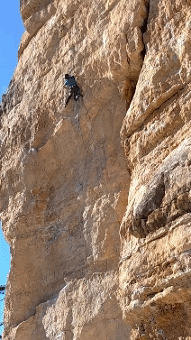

一次大幅度的 LRS 冲坠（whip）

首选的独攀先锋保护器：GriGri+

GriGri+ 的优势：

对任何认真的运动攀（也就是红点）攀登者来说，GriGri 都是随处可见的首选保护器。这种普遍使用使它成为世界上测试最充分的保护器——在各种角度、主锁横向受力、制动侧松弛很大的情况下都接过坠落，等等。失效报告很少，而且其失效模式在 LRS 使用中可以加以管理。（不过再次强调，我们是在严重非常规地使用这件器械。）

GriGri 在给别人保护“磕线”时的那些好处，独攀时同样受用。坠落后收绳相对容易（如果悬在空中的话，还可以加一个 PCP 用绞盘式方法上升）。你可以正常地磕动作、向上挂绳，像平常一样磕线。而且到达段顶后可以立刻下降而不必更换器械，这也降低了风险。Derek 和我都用这套系统经历过数百次 LRS 坠落，有些相当大。

挂绳用的松弛量，是在做挂绳动作之前，向下穿过 GriGri 送出的。这是一个学会后就会变得自然的动作。高位挂绳通常需要 3-5 次抽绳。在难点攀登时数一数很有帮助，免得抽得不够！宁可多送一些松弛，也不要在发力时把自己短绳吊住。做完高位挂绳后，一定要克制住把 GriGri 里的绳拉紧的冲动，否则会造成又短又突然的坠落。

GriGri+ 特别具备 TR 模式（Top Rope 模式）的优势：凸轮上的弹簧预紧力更低，使锁止灵敏度提高。这对 LRS 时的安心感非常有利，尤其是搭配细径轻量绳时！必须用胸式安全带或弹力绳把 GriGri 朝上定位，TR 模式才能自动送绳——此时向下送绳非常顺畅，可以轻松抽出松弛；但当攀登侧绳股被向上拉时（即 LRS 常规坠落或受力方向），器械会非常“咬绳”。这使得超细绳也能使用而不必担心打滑，但每一段出发前都要检查模式拨盘。现代版本的普通 GriGri 也还行，但要注意选择绳径，因为凸轮弹簧更硬，你可能会遇到延迟锁止。

观看这段视频，体会“无手持”介入所需的灵敏度。GriGri+ 的 TR 模式大大降低了这种失效模式：[《GriGri 的物理原理 | 无手持保护何时会失效？》](https://www.youtube.com/watch?v=We-nxljgnw4&t=0s)

如果你经常玩 LRS，考虑备一台专用的 GriGri+，以保持凸轮表面新鲜。夹住绳索的那个钢制凸轮凸点会因下降和绳降而磨损。用一台新鲜的专用器械，是避免打滑和超出预期的长距离坠落的好主意。

*器械攀登风险：GriGri 对独攀器械攀登有一个缺点——如果你站在挂在某个保护点上的绳梯里，而这个保护点同时也穿过先锋绳，当该保护点脱落时，坠落中绳梯在空中受力，可能会把 GriGri 的凸轮压住，从而妨碍凸轮咬合。避免方法是在站上下一个保护点的绳梯之前，不要把绳子扣入某个装备点。

GriGri+ 朝上且倒置（HUUD）：

原厂 GriGri+ 如果配合胸式安全带，被朝上且倒置地固定（Held Upwards and Upside-Down，HUUD），就非常适合先锋绳索独攀。在这种朝向下，绳索在保护侧与自由侧之间形成一个平滑的单一弯折。弯折越平滑，自动送绳就越容易。

不改装 GriGri 也能实现这一点：把约 2mm 的小绳系在侧板枢轴点周围，并穿过主锁孔靠主体的一侧，如下图所示。这根小绳确实位于绳路之内，可能会磨损，尤其是绳降时。两种“轻度改装”的替代方案是：使用同样的 V 形小绳布置，但把绳子穿进侧板上钻出的小孔，而不是绕过侧板枢轴的环；或者，改装塑料主体，把器械挂在 Petzl 标志中“L”字母所在的那一股上（位于 GriGri 底部）。

这种朝向确实会使头朝下坠落存在延迟锁止的风险，但使用 TR 模式有助于在这种不太可能发生的坠落情形中提高咬合概率。

GriGri 应该用上面说的扣环相对紧地朝上固定，在不影响上身活动的前提下尽量贴身。硬质胸式安全带能更确实地固定器械、更利于向下送绳，每次挂绳需要的抽绳次数更少；不过也有人更喜欢硬弹力绳的舒适感。

朝上且倒置的配置

此配置下无需改装的小绳连接方案

Brent 的胸式安全带布置

Derek 的胸式安全带布置

[购买 Avant LRS 胸式安全带](https://www.google.com/url?q=https%3A%2F%2Favantclimbing.com%2Fproducts%2Flrs-chest-harness&sa=D&sntz=1&usg=AOvVaw0vRzMm2XxM04DMBUkIWYE8)

Brent 的可调节 3/4 英寸织带胸式安全带

Derek 带有 TPU 柔顺结构的胸式安全带

GriGri+ 的“死亡改装”（Death Mod）：

原厂 GriGri+ 开 TR 模式用于 LRS 攀登已经相当不错，所以改装并非必要。

一项高风险高回报的自动送绳改进，是把靠近手柄枢轴处、位于绳路中的金属凸片切掉。这会让头朝下坠落更危险，因为此时绳索路径与顺畅送绳时完全相同，务必当心！而且它还会在金属下方形成一道锋利边缘。我不会进一步详述，请自行研究，去了解改装关键保护器金属部件的方法与风险。

扣环位置

扣环细节

磨掉的钢制凸片

GriGri 主锁横向受力（crossload）防护：

相较于其他专用独攀器械，GriGri 的一个额外风险是它只有容纳单个受扣主锁的空间。这在我看来并不算致命问题，因为所有有人保护时使用的保护器都是如此。不过，使用万无一失的锁门确实值得，比如三重动作的旋转锁。

GriGri 主锁因横向受力而爆开的风险，可以通过使用带防脱（captive）功能的现代保护主锁来降低（Edelrid FG、BD Gridlock、DMM Ceros 等）。更进一步的做法，是在 GriGri 两侧套上橡胶圈，使它保持在主锁直径较宽的弧段上（见下方链接，我出售的 Avant 品牌解决方案正是为此设计）。有了这些冗余的横向受力限制器，我可以放心地使用铝制主锁。有些攀登者则为了更安心而使用工业钢制主锁，甚至钢制梅陇锁。

[购买 Avant Flex-Link 横向受力防护器](https://www.google.com/url?q=https%3A%2F%2Favantclimbing.com%2Fproducts%2Fflex-link-anti-crossload-protector%3Fpr_prod_strat%3Djac%26pr_rec_id%3Da4a7eec99%26pr_rec_pid%3D8770657026332%26pr_ref_pid%3D8770648178972%26pr_seq%3Duniform&sa=D&sntz=1&usg=AOvVaw29yPMBaEouDVowP7Rop0ZT)

双重横向受力防护

简易 TPU 防横向受力配件细节

为什么不用那难得一见的 Silent Partner？

我当年在 BD 做工程师时，我们有一台拆开的 Silent Partner，我得以检查其内部机构。这种安全带式的制动系统依靠非常小的带齿钢齿轮，靠旋转惯性甩出并卡在主铝制外壳内侧。这些器械出厂时作为可靠的制动装置看起来很结实，但在我看来，钢与铝的接触界面在反复坠落（也就是“磕”难点段）后会劣化，改变其锁止特性。我确实常把这种器械用于快速的独攀器械攀登，包括一次[一日独攀 Nose](/climbing-blog/sniad-2018)，但后来把它卖掉了。在需要多次坠落的红点场景中，我更信任 GriGri，因为它没有关键的金属对金属咬合面——不过这只是我个人对该机构的解读。而且也很难超越 GriGri 系列的普遍口碑：在各种朝向下接过无数次坠落，失效极少。

用于结构备份的安全带配件

结构性装备环（Structural Gear Loop）：

可以把一条 30cm 的扁带用套结（hitch）环绕在安全带腰带上——可以放在两个装备环前方，也可以放在现有装备环之间——从而做出一个承重的挂环。可用魔术贴、扎带或 One-Wrap 线缆固定带把这条扁带贴着装备环固定住，避免套结在腰带上别扭地收紧。有些安全带本身就集成了结构性装备环（如 Metolius Safe-Tech），但我更喜欢在日常舒适、运动化的安全带上加装这种做法。

加装结构环的魔术贴版本

缝在扁带上的魔术贴翼片细节

扎带版本。胶带也行

结构性单点（Structural Single Point）：

可以把一段织带绕过腰带，用平结（water knot）打结闭合，做出一个承重的单点挂入点。对于偏好单一连续缓存绳环的人，这种做法的优点是可以把这个挂入点放在前方装备环之前。

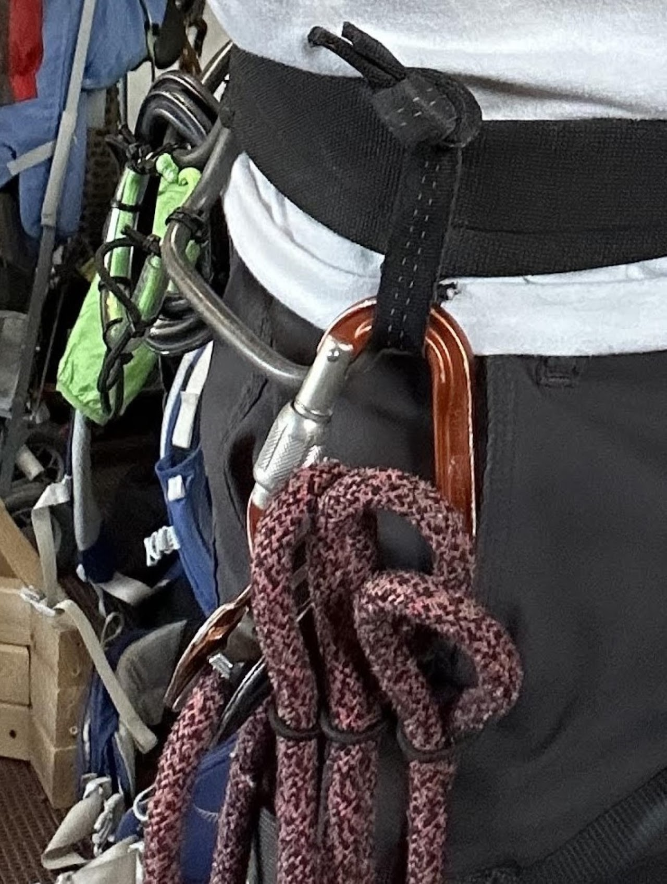

管理缓存绳环

既然缓存绳环是这套自动送绳系统能否奏效的关键，那我们就来考虑在一整段中维持合适大小缓存绳环的各种方案。这分为两类：预缓存（pre-cache）和连续缓存（continuous-cache）。

预缓存方法：

出发攀登之前，把绳索堆叠成多个缓存绳环，就能让系统在整段中自动送绳，只需在每个绳环用完后偶尔做一次释放动作。我在大多数 LRS 自由攀登中会把绳子预缓存成 10-15 英尺的环，从保护器旁边的自由侧开始，然后朝绳尾方向做出越来越大的环。绳重压在攀登者安全带上，这些环以看起来很滑稽的方式垂下来，但对攀登者而言，实际干扰比第一眼看上去要小。保护侧的绳索由防回喂扣件（backfeed keeper）固定，消除了绳拖，所以总体感觉到的重量与常规保护差别不大。我所有最难的 LRS 自由攀登都用了预缓存方法。

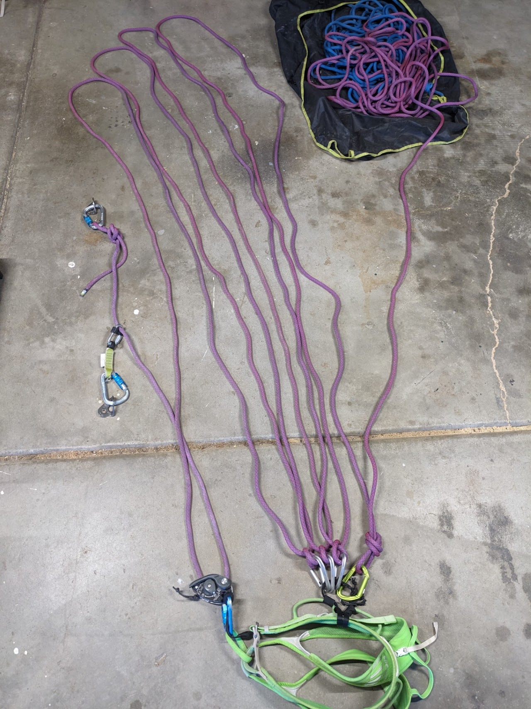

双套结卸放（Clove Dump）预缓存方案：

可以用松松的双套结（clove hitch）把缓存绳环固定在攀登者安全带上，挂在倒置、锁门朝内的主锁上，主锁鼻端要防勾挂。这样就形成一个是可释放的结，同时也是全力备份结（如果它挂在结构性装备环上的话）。用单手一个动作，就能轻松把绳子的双套结从开口主锁上脱落。支撑你绳环的最后一个结可以是在丝扣锁上的单结，这个永远不释放。我在[2021 年的博文](/climbing-blog/redpoint-rope-soloing-2021)中推广了这种方法，把这个新发现的全强度备份缓存方案作为我的首选。

优点

* 在每个绳环之间形成结构性备份结，以防 GriGri 打滑、其主锁爆开，或用于阻止头朝下坠落

* 单手释放相对容易

缺点

* 用身体对侧的手跨身释放不方便

* 双套结会使绳子产生扭结（交替使用左旋双套结与右旋双套结，有助于减轻一些绳子扭结）

* 多个缓存绳环之间可能互相缠绕（我把它们做成长度略微递增，以减轻这种情况）

* 更多绳重压在安全带上

* 比其他方案有更多金属和体积

* 绳环下垂，在坡度较缓的地形上可能勾挂岩壁特征

已受力的缓存双套结

受力前的主锁朝向

活结（Slip Knot）预缓存方案：

一种稍不安全但仍可释放的备份结是活结变体，Alex Huber 和 Fabian Buhl 大量使用。这种方法做出的结在朝 GriGri 方向受力时能拉紧，强度足以挡住 GriGri 以应对头朝前的坠落，但仍可通过朝缓存侧单手一拉而释放。由于这个结只能承受约 4kN（[Bliss Climbing 测试视频](https://www.youtube.com/watch?v=Mlwl49NAEuY)），它可以挂在普通装备环上，仍起到阻挡结的作用。全强度扁带可以把它们漂亮地撑开、腾出装备空间，但结本身并不像上面的双套结那样具有结构承重意义。打法：把一股绳从装备环内侧穿出，加一个整圈扭转，然后从装备环外侧把另一股绳穿过这个扭转环。用约 6 英寸的固定环拉紧。

优点

* 在每个绳环之间形成阻挡式备份结，以防 GriGri 打滑，或用于阻止头朝下坠落

* 单手释放相对容易

* 不需要额外的金属装备

缺点

* 结只能承受约 4kN，无法为 GriGri 或主锁的整体失效提供备份

* 如果缓存绳环勾挂到岩石上，结可能自行释放

* 用身体对侧的手跨身释放不方便

* 固定环带来明显额外体积

* 很难找对应该拉的那一股缓存侧绳

* 多个缓存绳环之间可能互相缠绕（我把它们做成长度略微递增，以减轻这种情况）

* 更多绳重压在安全带上

* 绳环下垂，在坡度较缓的地形上可能勾挂岩壁特征

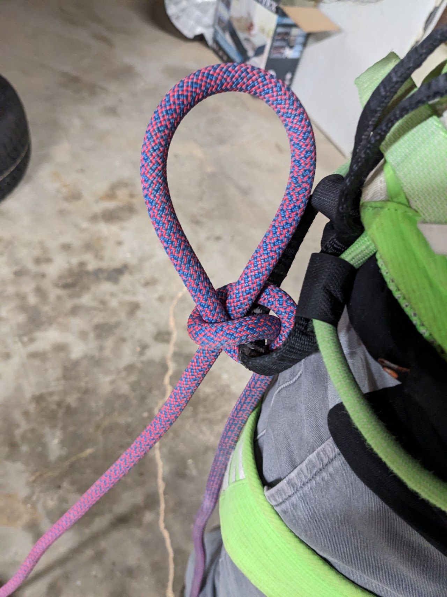

一个活结撑起一个缓存绳环——只展示一个，以便看清结内的绳索走向

释放环（Release Ring）预缓存方案：

把绳环固定到安全带上的另一种更易释放的方法，是用 ⅛ 英寸弹力绳打成约 1cm 直径的小环，做成快速释放装置。绳环之间那一股绳可以推过弹力绳环，当该绳环用完时轻轻一拉就能释放。这些小环可以打好后一直留在加装的结构性装备环上，需要时使用，几乎不增加体积。

优点

* 跨身释放容易，适合更陡的攀登，或在离地很近、备份结反正也来不及防撞地时使用

* 非常轻便、紧凑

缺点

* 对 GriGri／主锁失效或头朝下坠落没有备份结！

* 多个缓存绳环之间可能互相缠绕

* 安全带上绳重明显

* 绳股下垂，可能勾挂岩壁特征

多个释放环，随时待用

空的释放环，我把它们一直系在加装装备环上

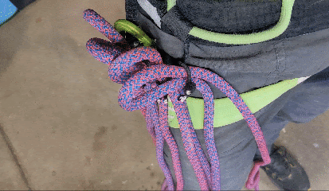

连续缓存方法：

一种更主动的缓存方式，是维持单一的缓存绳环，用单手动作每攀爬 5-20 英尺就把自由绳拉入缓存绳环一次。你必须时刻警惕、频繁补充缓存绳环，以免绳子用尽、把 GriGri 制动侧拉紧，从而把自己原地短绳吊住。

进度捕获滑轮（PCP）连续缓存方案：

连续缓存方法通常依赖安全带上的一个 PCP（Micro-Traxion、Spoc 等）。自由绳堆放在地上或绳包里。此时这种方法完全不为 GriGri 系统提供任何备份！要获得备份就必须在线加入阻挡结，而阻挡结会卡在 PCP 上（PCP 必须挂在结构环上）。这些结随即抵消了连续缓存的一些好处，造成明显的勾挂风险，而且攀登途中很难单手解除。这套系统最适合在没有备份的情况下快速移动。对于器械攀登／短距离固定绳而言，它比预缓存方法更少杂乱、更受青睐，因为那时安全带上本来就已经挂着很多东西，而且你可以随时悬挂下来，用双手处理备份结的释放。

优点

* 只有单一缓存绳环下垂，更少杂乱、更少勾挂

* 安全带上的绳重更小——多余的自由绳可以从下方的绳包里放出

缺点

* 攀登途中管理绳索需要大量额外动作，可能给你的红点带来小臂胀感！

* 可以使用在线备份结，但不易单手释放，且比预缓存绳环造成更大的勾挂风险

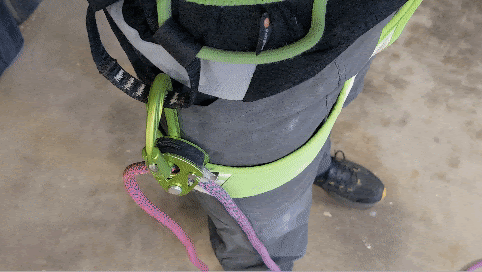

缓存方式的组合：

双套结卸放、释放环和连续 PCP 这三种方法各有适用的情形，甚至有时在同一条线路上混用！在攀岩场离地起步时，释放环很棒——此时跟绳环下垂较劲更容易导致坠落，而备份结反正也来不及在撞地前起作用。双套结卸放则是段中求安心、或某个动作有奇怪坠落风险时的绝佳首选。而 PCP 缓存则在攀爬高处杂乱登顶时有用，可以减轻安全带上的重量，或者当你不知道确切的段长时也有用。为便于攀登时清楚取用，这些缓存绳环系统都可以和谐地共存在你加装的结构性装备环上。

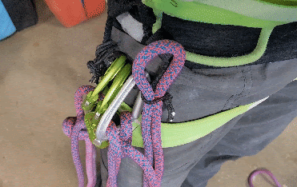

绳索选择

绳径：

如果使用 GriGri+ 的 TR 模式，一般越细越好，能改善送绳并减轻安全带上绳索的重量。稍具弹性的细绳甚至能让绳索独攀的坠落更舒适，因为绳索会在刚性保护站上绷紧。我在攀岩场做 LRS 的首选绳是 [8.6mm Canary](https://www.backcountry.com/edelrid-canary-pro-dry-climbing-rope-8.6mm)。多段攀登时，我用 [8.9mm Swift Protect](https://www.backcountry.com/edelrid-swift-protect-pro-dry-rope-8.9mm)，看中的是它的抗切割性。Derek 甚至在中等强度的线路上使用 [8.2mm Protect](https://edelrid.com/us-en/sport/ropes/starling-protect-pro-dry-8-2mm?filter%5Bkategorie_id%5D%5B0%5D=20&filter%5B6%5D%5Bmin%5D=2&filter%5B6%5D%5Bmax%5D=11&filter%5B13%5D%5B0%5D=2090&sort=new_desc&variant=2092937) 绳皮半绳——它抗切割绳皮的测试值堪比标准 9.5mm 先锋绳，但你的 Gri 最好开在 TR 模式！

绳皮类型：

细绳在干净的坠落中不会带来更大风险，但更容易绳皮受损，甚至被割断。细绳的绳皮材料就是更少。LRS 攀登对绳皮尤其苛刻，因为所有边缘锯切都是静止的，由于保护侧绳索相对岩壁固定，每次坠落都击打同一个磨损点。此外，多段的装备清理大多靠负重上升器攀升完成，对绳索的磨损也比自由攀登跟攀者更大。

这种风险可以用现代绳皮技术来补偿。Beal 的 Unicore 技术有些帮助，但主要针对上升器攀升时绳皮滑移的情况。[EDELRID Protect 技术](https://edelrid.com/us-en/knowledge/knowledge-base/cut-resistance-of-ropes)在减少边缘磨损造成的绳皮损伤方面是巨大的进步，其抗切割性与重 30% 的绳索相当。

保护站考量

运动攀岩场保护站：

在现代密集打栓的运动攀线路上，你可以从地面用挂杆把在线保护站预挂到线路的前两个螺栓上！用一个黄色 Superclip 配长杆（我用 320cm 的 Avi-Probe），有助于把结实的钢制丝扣主锁放到螺栓上。第一个螺栓用绳子扣入一个粗壮的钢制主锁（可以考虑 [EDELRID Bruce Steel Triple Twist Lock](https://www.backcountry.com/edelrid-hms-bruce-steel-screw-fg-locking-carabiner)），而第二个螺栓则配一副定制的快挂：挂片侧是钢制丝扣锁，一段短连接带（dogbone），绳侧是 5/16 英寸的钢制梅陇锁。如果第一个螺栓以某种方式失效或脱扣，下方的结会卡进梅陇锁，形成第二个保护点。在梅陇锁上加一个绳索紧束配件，有助于把第一个螺栓的主锁朝上紧束到稳定位置；见下方链接，那是我设计的 Avant 品牌方案，用来把绳子紧束穿过快链。

[购买 Avant Slide-Cinch 快链紧束器](https://www.google.com/url?q=https%3A%2F%2Favantclimbing.com%2Fproducts%2Fquicklink-slide-cinch-lead-rope-solo-backfeed-preventer&sa=D&sntz=1&usg=AOvVaw2TN7czooSvmOMeoKeF1FAH)

一个紧束整齐的双螺栓、在线式攀岩场保护站

下方螺栓细节

上方螺栓细节，配有专门的紧束备份快挂

一个省钱的 TPU 快挂紧束器——一段“Perfect Bungee”折叠后用胶带压平

传统攀岩场保护站：

对于单段传统装备线路，你无法享受从地面设置双螺栓挂杆保护站的便利。这时需要一点创造力：要么在附近的树上做保护点，要么在地面找可朝上受力的保护，要么在线路最初一段内设置可朝上受力的装备。我一般就直接用先锋绳本身，用双套结和阿尔卑斯蝴蝶结做出一个大致均衡的三点保护站。把保护站朝上紧束很重要，这样反复坠落时凸轮不会走位——使用下文描述的某种防回喂装置，或者在一段扁带的底部打双套结，并在保护站上方某件装备上保留足够自由度以不限制绳索延展。

弹力保护站（详见附录 A）：

对于前 50 英尺内有难点的攀岩场线路，Derek 和我开始使用一套 TPU 弹力系统，以获得更柔和的制动。这不是 Screamer 式的吸能装置，而是一点缓冲，让在难段上反复坠落时更舒适。想想被保护搭档“钉住”与对方那边哪怕只有一点点缓冲之间的区别。

弹力的伸展也让能量通过所有已扣主锁上的绳拖被吸收。这进一步提高了坠落的舒适性。一旦超过约 50 英尺，绳索本身的延展一般就会盖过任何可察觉的弹力效果。弹力拉伸超过约 18 英寸会在你往回拉上岩壁时造成困难。如果你想进一步了解弹力调校细节，请参阅附录中的《弹力保护站基础》文档。

多段保护站：

对于由两个均匀螺栓组成的多段保护站，我就直接用结实的钢制丝扣锁，在每段底部做出冗余的在线保护站。较远的丝扣锁留出松弛自由悬垂，较近的丝扣锁则朝上紧束，以在挂片上保持理想位置。如果使用连续缓存方法，用一个袋子装盘好的绳子是个好主意——基本的宜家购物袋就很好用。

防回喂（Backfeed Prevention）

回喂问题：

回喂绳索是绳索独攀时必须理解的一项重大风险。一旦攀登者爬得足够高，保护侧绳索的重量就可能沿自动送绳方向把绳子从保护器中抽走，并在下方保护站处不知不觉地堆叠起来。哪怕是带保护点的小坠落，也可能在不知不觉中变成巨大的坠落！要避免这一点，就要在一段攀爬中警觉地多次把固定的保护侧绳索朝上紧束。

有了恰当的防回喂，我们也能减轻可能损伤绳索的勾挂。注意避免系统中出现勾挂隐患。

防回喂小配件：

LRS 社群创造了一些小橡胶配件，装在主锁的背脊上，形成一个绳索紧束点，用于在一段攀爬中管理系统中保护侧的松弛（见下方链接的 Avant 品牌紧束配件）。这个带配件的主锁通常装在快挂的绳侧。快挂照常扣入，然后把绳子拉紧固定在位。在难点攀登中，我每 20-30 英尺用一次。在投入难点动作之前，知道系统里没有隐藏松弛，这是至关重要的安心感。我会准备 6 个已装好扣件的小配件主锁，LRS 出发前把它们与快挂上的绳侧主锁互换。

[在此购买 Avant Soft-Cinch 防回喂装置](https://avantclimbing.com/products/soft-cinch-lead-rope-solo-backfeed-preventer-5-pack)

一种省钱的版本是用 ⅛ 英寸弹力绳打结、甚至用扎带扎成闭环（约 1 英寸环），如下方照片所示，然后把它套在主锁外侧保持紧束。这个版本使用起来稍费些力，因为需要把弹力绳从主锁锁门上方滑过去，同时咬住绳子保持张力。它们很实用，因为你可以快速给整套传统攀登装备和／或快挂组临时装上，用于阿尔卑斯目标。双股使用时，它们紧束得足够好，能把传统保护站朝上拉紧，而不必担心绳子从小配件中弹出。

[购买 Avant Soft-Cinch 防回喂装置](https://www.google.com/url?q=https%3A%2F%2Favantclimbing.com%2Fproducts%2Fsoft-cinch-lead-rope-solo-backfeed-preventer-5-pack&sa=D&sntz=1&usg=AOvVaw33sUo7H19vPFY6goRzO9CB)

Brent 的“Soft-Cinch”可 3D 打印防回喂扣件

Derek 的省钱弹力绳防回喂扣件。这是 LRS Facebook 群组众多创意之一

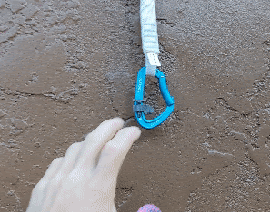

软固定（Soft Refixing）：

可以用一个可释放的活结把绳索紧系到某个保护点上，把下方的松弛全部收掉。活结对于长而难度适中的路段是可行的方案，但一旦坠落，这个结会自行释放。这是好事，能让整条动力绳延展，但坠落后需要重新打结。

我用这个结在绳降清理某一段之前做固定（或者用于方便的顶绳独攀 TR Solo 固定）。它比较容易逐段跳越，然后从上方释放。

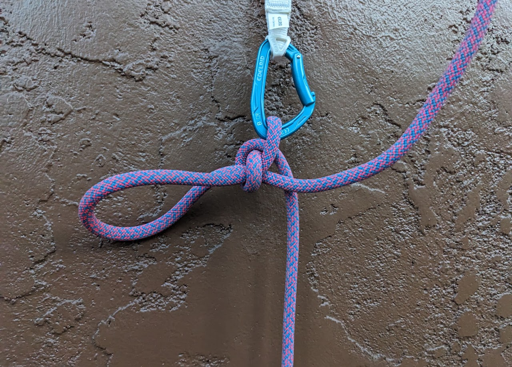

硬固定（Hard Refixing）：

在拥有良好站位的长路段上，有时把活绳朝下紧拉到下方保护站、并用结完全固定到某件装备或螺栓上是合理的。硬固定很适合把两段合并起来、在中间保护站休息，同时又不做系统转换。风险在于：系统中的动力绳长度会重新开始计算——刚过这个固定点就坠落可能会很生硬。把绳硬固定到一段延长扁带的底部，可以让那个保护点在朝上方保护点受力之前先有一段可控的绳索延展。注意不要以系数 2 的坠落砸到这个伪保护点上。

LRS 先锋之后的清理

绳降自由侧绳股（攀岩场）：

在攀岩场，值得额外背负一点安全带重量，拖出一段足够扣入顶部保护站的绳子（假设顶部器材是可以扣的），然后立即沿自由侧下降。这条拖尾绳在你缓存固定系统的最后一个结之后，就一直垂到地面。这确实需要绳索长度为段高的两倍，但换来的是快速的段落周转，在顶部保护站无需任何系统转换。在陡峭路段上，你甚至能像运动攀下降那样荡回岩壁。

拉绳回收（攀岩场）：

针对高难度攀岩场的一个小众方案是：用一条 40m 的先锋绳（或略长于岩场高度即可），再加 40m 的牵引绳（tag line），让安全带负担更轻。攀登者用完整条先锋绳到达保护站，同时拖着牵引绳。到达保护站后：用个人牛尾挂入保护站；用可回收的主锁结（biner block）固定先锋绳绳尾，把牵引绳系在拉拽侧；用先锋绳绳降并清理；然后用牵引绳把先锋绳反向拉过保护站以回收。这会损失一些荡回岩壁的能力，所以不太适合更陡的路段。

固定并绳降攀登者侧绳股（多段）：

类似拉绳法，多段攀登时你只需要足够的先锋绳到达顶部保护站，而不需要双股回收所需的长度。到达顶部保护站后：固定绳尾；绳降回下方保护站清理；然后用上升器攀升或顶绳独攀跟攀自己。如果顶部保护站固定点之后还留有多余绳尾，最好在末端加一个阻挡结！稍不留意，很容易朝着错误的那一股开始下降。

像有搭档一样绳降线路。带一个专用的绳降器，以节省你宝贵 GriGri+ 的凸轮磨损！

附录 A：弹力保护站基础

作者：Derek Averill

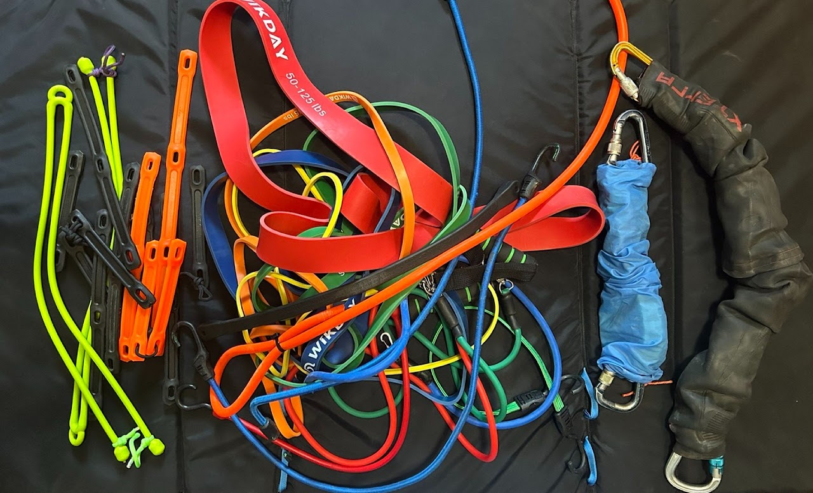

极简版和豪华版弹力保护站，旁边是 30 多个弹力装置试验品的残骸。

弹力保护站能让低处第三个螺栓上发生的 LRS 坠落变得相当舒适

这不是什么新概念，本快速教程也没有提及安全方面的内容或架设理论。

这些信息是关于弹力保护站、以及迄今为止的一些经验。这是一种提升坠落舒适度的装置，并非旨在降低装备所受的冲击力。使用风险自负。做好备份。

约束条件：

  1. 必须对攀登准备时间影响最小。

  2. 必须既能用于“路过式”（fly-by）保护站架设（攀登经过前几个螺栓时），也能在可能的情况下用于挂杆预挂在线保护站。

  3. 装置部件必须具备 1:1 或更高的伸长能力、长期耐用性和广泛可得性。

  4. 装置拉伸不得超过 18 英寸，否则很难拉回岩壁继续攀登。

  5. 装置必须能在单次攀登中多次受力与卸载，而无需返回保护站。**当心！每次坠落后都要低头看一眼，检查有无异常！**

  6. 装置必须让红点 LRS 攀登明显更愉快，同时不降低效率或安全性。

60 秒讲清吸能原理：

弹力带像弹簧一样，受力随伸长线性增加。把弹簧刚度（弹力带数量）调到与你体重匹配，是成功制作的关键。以前的版本采用多级结构。近几个月发现，调校得当的单级装置是更优的做法，部件更少。绳拖会显著影响调校，如果需要，可以根据你预计在路段何处坠落来做出调整。

弹力保护站的一个主要局限是调校。嗯……任何悬挂系统（比如山地自行车）都需要根据使用者体重进行调校。幸运的是，本文下面既给出了组装调校配方，也给出了调校建议：

材料选择：

各种材料和配置都经过了充分试验，聚氨酯篷布弹力带（polyurethane tarp straps）相比其他材料表现非常出色。“Perfect Bungee”品牌在本地五金店就能轻松买到这种材料，并支持紧凑的组装方案。偏离这种聚氨酯材料很可能会降低你做出令人满意的弹力保护站的机会。

弹力装置组装配置：

这里介绍两种组装配方：“极简弹力”（Minimalist Bungee）和“豪华弹力”（Plush Bungee）。阅读下文，帮你选出获得终极 LRS 体验的方案。

“极简”版在蓝色套管内，“豪华”版在黑色套管内。其他物品用于参照尺寸。

“极简”弹力装置组装概览：

优点：简单。快速。小巧。轻。可挂杆预挂或路过式使用。

缺点：制动没有豪华版那么柔和。

极简版最适合：大多数只是偶尔遇到意外 LRS 坠落的攀登者。

“极简”版制作配方：

我用过两种强度方案，感觉都很好（我体重略低于 145 磅）。极简弹力装置在自由悬垂时，应在体重下伸长约 10-15%。

较软方案：把两根“[48 英寸易拉伸弹力绳](https://www.theperfectbungee.com/products/copy-of-48-easy-stretch-bungee-cord)”对折，做成 8 股结构

较硬方案：把三根“[48 英寸易拉伸弹力绳](https://www.theperfectbungee.com/products/copy-of-48-easy-stretch-bungee-cord)”对折，做成 12 股结构

* 剪掉弹力绳末端的塑料钩，用伞绳把两个带球头的一端系在一起。

* 把弹力绳的环端和限位扁带装到一把 HMS 主锁上（不要滑过长而平的部分）。把弹力绳对折，把伞绳环扣入这把主锁。这一侧我们将用作绳端。

* 用一条全强度 60cm 迪尼玛长扁带作为限位扁带，因为在此配置下，这个距离正好对应弹力绳 100% 的伸长量。

* 然后，把带强度的限位扁带和弹力绳中点扣到另一把主锁上，这样你就可以用这一端扣入螺栓。

* 用防撕裂尼龙或类似材料给弹力绳做一个保护套管。

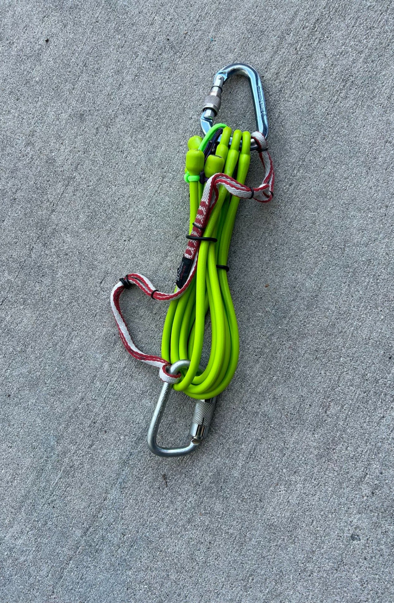

“极简”版制作细节

“豪华”弹力装置组装概览：

优点：额外吸能。在线路低处坠落时毫不犹豫。豪华版在多种场景下都能柔和制动。

缺点：必须自制限位扁带，需要更多弹力材料，更重、更长，6mm 连接绳增加了长度。路过式架设在扣入第二个螺栓之前存在额外松弛，明显更危险。体重大的攀登者需要过多弹力材料。

豪华版最适合：舒适的攀岩场攀爬，以及磕短线路、坠落时系统中没有多少动力绳的人。

“豪华”版制作配方：

豪华版与极简版类似，只是需要更多聚氨酯，并使用更短、不对折的 36 英寸弹力带。根据体重选择弹力带数量——豪华弹力装置在自由悬垂时，应在体重下伸长约 15-20%。

按下图组装，并记住要在你自制并打结的全强度限位扁带中为弹力绳预留 100% 的伸长量。因为限位扁带是打结固定的，所以最好再用一条 120cm 迪尼玛扁带做备份，以防结随时间变弱或松脱。在 145 磅体重下，我发现四根 [36 英寸易拉伸弹力绳](https://www.theperfectbungee.com/products/36-easy-stretch-bungee-cord-4-pack)（8 股）配合两段 [adjust-a-strap](https://www.theperfectbungee.com/products/adjust-a-strap-4-pack) 效果完美。加用 adjust-a-strap 是因为它们能在现场快速调整。注意，螺栓侧的弹力绳与主锁连接使用 6mm 绳，以减少主锁上的杂乱，而限位扁带和备份扁带则直接连在钢制主锁上。

“豪华”版制作细节

弹力材料来源：

所用弹力绳的完整链接：

[https://www.theperfectbungee.com/products/copy-of-48-easy-stretch-bungee-cord](https://www.theperfectbungee.com/products/copy-of-48-easy-stretch-bungee-cord)

[https://www.theperfectbungee.com/products/36-easy-stretch-bungee-cord-4-pack](https://www.theperfectbungee.com/products/36-easy-stretch-bungee-cord-4-pack)

[https://www.theperfectbungee.com/products/adjust-a-strap-4-pack](https://www.theperfectbungee.com/products/adjust-a-strap-4-pack)

###

[brent@avantclimbing.com](mailto:brent@avantclimbing.com)
