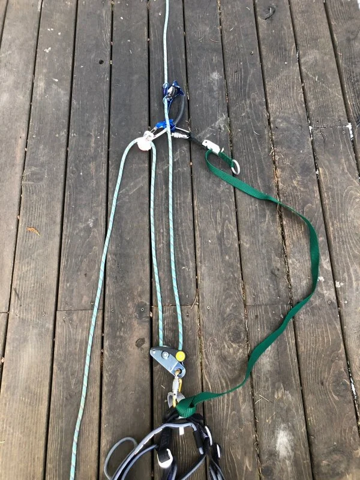
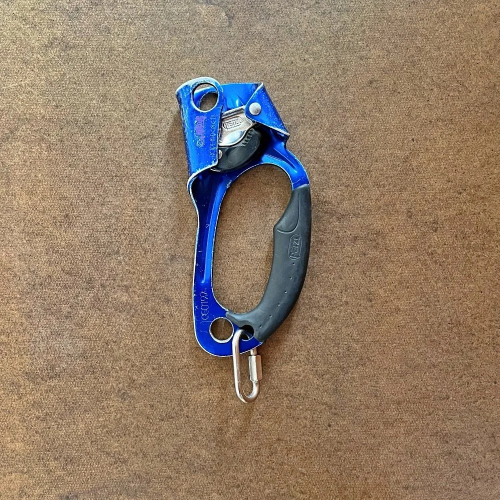
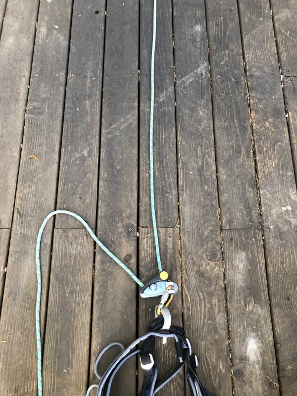
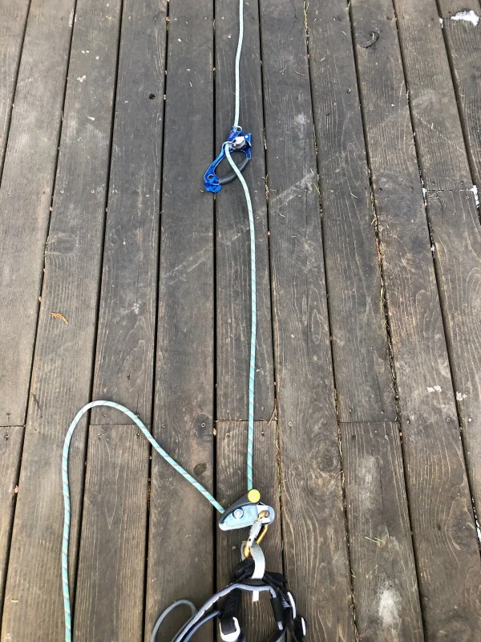
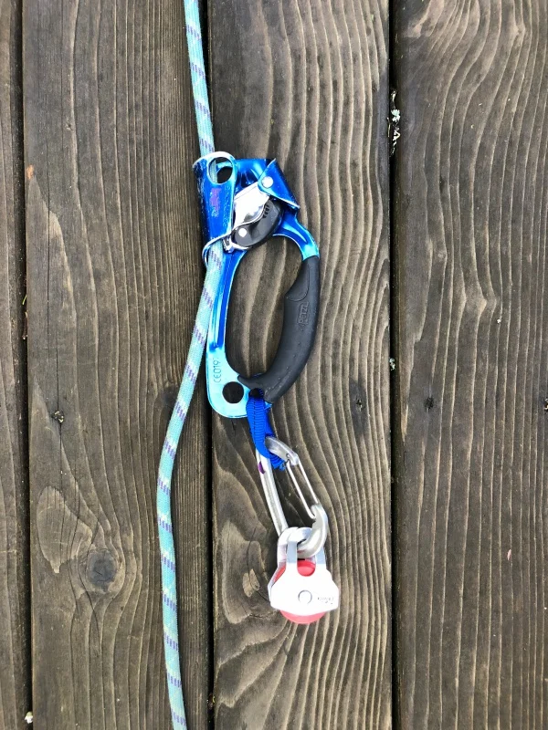
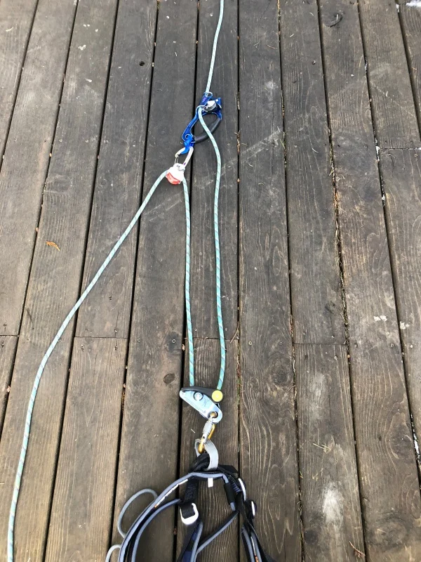
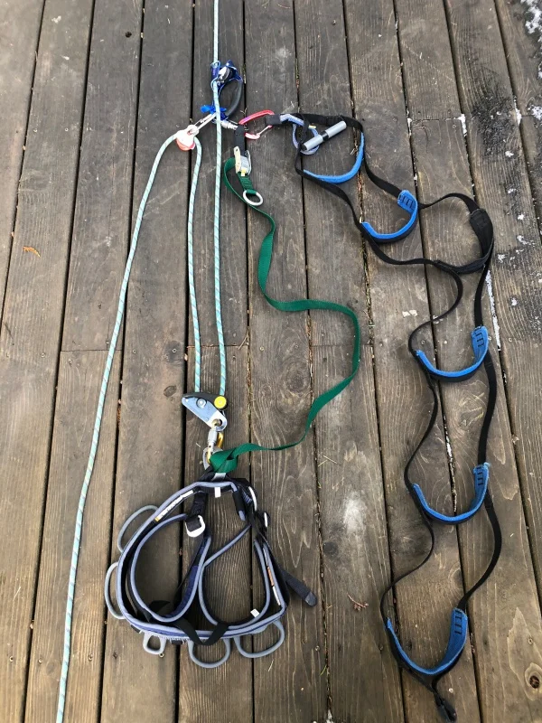
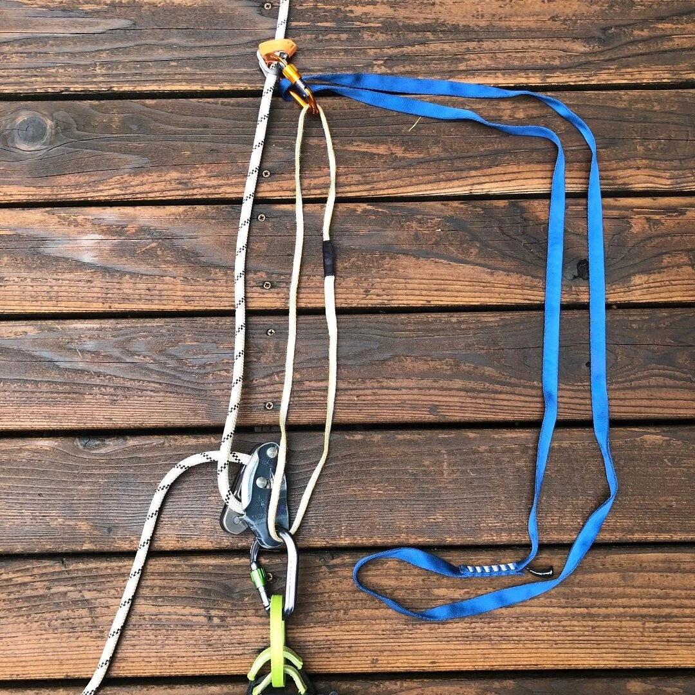

# Using a Grigri to ascend fixed ropes

- Category: Big Wall Climbing
- Published: February 7, 2019
- Written by John Godino
- Source: [Alpine Savvy](https://www.alpinesavvy.com/blog/using-a-gri-gri-to-ascend-fixed-ropes)

**With just a Petzl Grigri and an ascender, you can quickly and securely ascend and descend a fixed rope.**

Note: if you’re doing any kind of big wall climbing or going up multiple pitches of rope in a day, you’re probably going to find it more efficient to use the more traditional two jumar system. Once you get that dialed, it's probably going to be less strenuous.

This setup is favored by riggers, rock gym employees and climbing photographers, who often need to go up AND down to fine-tune their position on the rope. So, if you are not going up very far, and need to adjust your position, this system works great.

This system is also sweet for cleaning traversing aid pitches, because the Grigri is releasable under tension, letting you do a mini lower out as needed. This is extremely helpful—no more fighting with your lower ascender.

Note: while this system does give you some mechanical advantage to lift yourself, you don’t want to get into the habit of trying to use your arms when you're ascending. You should always be stepping up in your ladders to gain the height, and then using Grigri and pulley to capture your progress.

## What’s slick about this system?

- You always have two points of contact to the rope (three, after you tie a backup knot, and technically four, because you’re tied into the end)
- You can lower yourself/rappel if needed with the Grigri at any time
- It requires a minimum of gear, most of which you probably already have on a big wall climb
- It uses some mechanical advantage to raise your weight
- You can mix and match hardware depending on what’s available
- The length of your tether chain connecting your harness and the ascender doesn’t matter (unlike using a tether with a regular two-ascender setup, where the tether length is crucial)

**Ascender hack:** On my Petzl ascender, I added a 5mm stainless steel quicklink to the smaller of the two bottom holes. This makes a convenient place to clip a carabiner for the upper redirect, as well as a spot for clipping your ladder.

[Read more on this modification here.](https://www.alpinesavvy.com/blog/ascender-mod-quicklink-in-the-small-hole)

## There are a few ways to rig this. Here’s one that works for me.

You need: a Grigri or similar device, a handled ascender, an aider (or 7 feet or so of webbing), a tether, a few carabiners, and a pulley (optional).

### 1

**Feed the rope through your Grigri, and attach the Grigri to your belay loop with a large locking carabiner, just like you would for belaying.**

### 2

**Clip an ascender to the rope above the Grigri.** (Note that the ascender is usually for your non-dominant hand; i.e., right-handed climbers ideally should use a left-handed ascender. This example is set up for a lefty.)

### 3

**Clip a redirect carabiner (and ideally a pulley) through the quicklink (or webbing) tied to the bottom of the ascender.** (Do NOT clip the carabiner through the hole at the top of the ascender unless you’re not cleaning any gear or if the rope is traversing more than about 45 degrees. If you have to pass any gear, you need to remove and replace this carabiner each time you do so, which is a Major Hassle.) The pulley is optional, but will make the system more efficient. If you have a DMM Revolver carabiner, you could use that in place of the carabiner and pulley combination. The blue webbing loop is optional; it allows the carabiner to twist and align itself with the pull.

### 4

**Clip the rope coming out the bottom of your Grigri to the pulley.** This acts as a redirect, letting you pull downward rather than upward, which saves a lot of energy over the course of a pitch.

### 5

**Girth hitch a tether through your harness tie-in points or belay loop** *(pros and cons to both, won’t get into those here)* **and clip it to the ascender with a locking carabiner.** This is one of your two connections to the rope, so this carabiner needs to be a locker. If you don’t have an adjustable tether, a 120 cm / double runner should work as well. The length of this tether is not critical, but it should be at least 3 feet.

### 6

**With a non-locking carabiner, clip your aider to the locker joining the tether and ascender.** *(Note: This can be a simple sling or length of tied webbing, it doesn’t have to be an aider.)*

## To use

1. Sit with your weight on the Grigri. This is your “rest” position.
2. Slide the ascender as far up the rope as you can, while advancing your foot in the aider in the same motion.
3. Stand up in the aider, and at the same time pull down on the rope coming out of the pulley carabiner. (It can help to do a little “pop” up with your hips to get a few extra inches.) The Grigri will lock up as you finish pulling down on the rope. Sit in your harness, weight the Grigri, and slide the ascender again up the rope. Repeat.

Need to rappel? That’s the easy part! Because your Grigri is already properly attached to the rope, all you need to do is unclip the ascender, and you’re ready to head down.

As with any climbing skill, this is a better show than a tell.

(Note that in the video below, the climber does not have an aid ladder, it's just a sling that serves as a foot loop. This is simpler, cheaper, and lighter.)

## Same concept, less gear

You can also set this up with a Grigri on your harness, and a friction hitch or emergency ascender such as a Petzl Tibloc (preferred) above you. Here's a photo of that setup.

**Notes:**

- If the terrain is fairly low angle, you may not even need the Tibloc. Just push your feet off the wall and pull the rope through the Grigri to make progress. The Tibloc and foot loop will be needed when things get steep.
- The yellow sling is somewhat optional and it provides a second point of connection to the rope. If you wanted to skip that or didn't have it, you can tie backup knots below your Grigri to give yourself a second point of connection. (The blue sling is for your foot.)
- You can make the ascending process a bit easier by taking the tail of the rope coming out of the Grigri and running it through the carabiner on the Tibloc. This gives you a 3:1 mechanical advantage, and lets you pull down with your arm rather than up, which really makes a difference on a long climb. See the video below for an example of this.

Here’s a short video by IFMGA Certified Guide [Karsten Delap](https://www.karstendelap.com/) on a more minimalist way to set this up, using a Grigri, a Petzl [Tibloc](https://www.alpinesavvy.com/blog/petzl-tibloc-everything-you-need-to-know), and a double-length / 120 cm sling.

[Watch the minimalist setup video](https://www.youtube.com/watch?v=fWbmHfVibgg)

**Here’s an action video.** Note a few differences: He’s using a sling as a foot loop, not an aider, and he has the redirect carabiner clipped to the top hole on the ascender, because he’s not aid climbing and cleaning gear. Other than that, it’s the same basic system.

[Watch the action video](https://www.youtube.com/watch?v=NJHBQVkBxj0)

---

## Warning: Climbing is dangerous.

This website offers information and ideas (not advice) intended to reduce your risk when climbing. Many of the tips here are appropriate only for those with prior experience. All climbers need proper training and equipment, and to take personal responsibility for their choices.

**In-person training from a qualified instructor is strongly recommended** for any technique that, if you do it wrong, could result in serious injury or death.

If you use any of the ideas or information presented here, you acknowledge that the technique may be inaccurate or out of date, and you agree that Alpinesavvy LLC is not responsible or liable for any injury (or worse) that might result from you using the techniques presented here.
