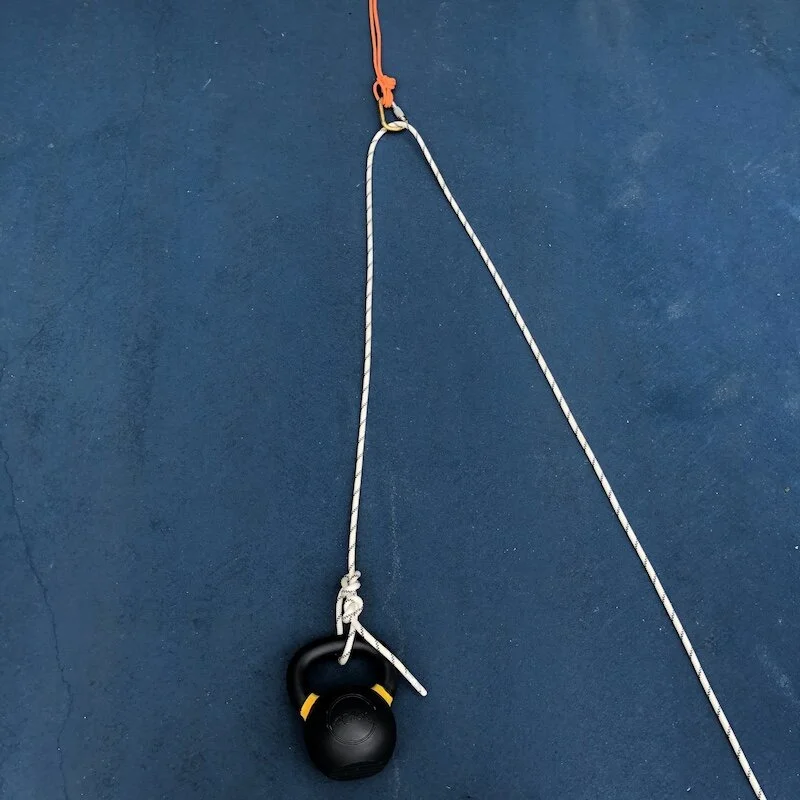
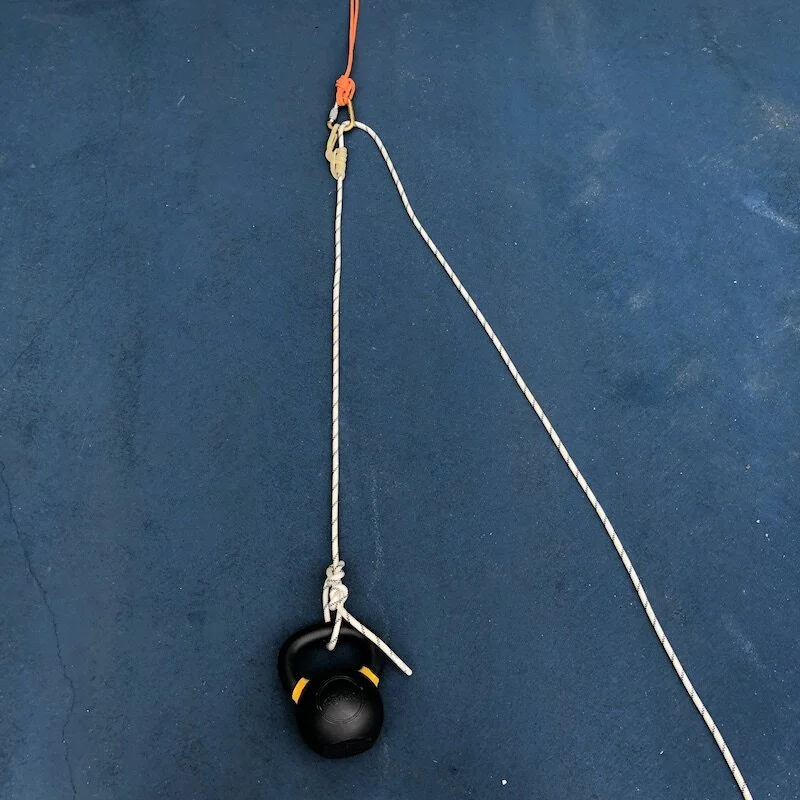
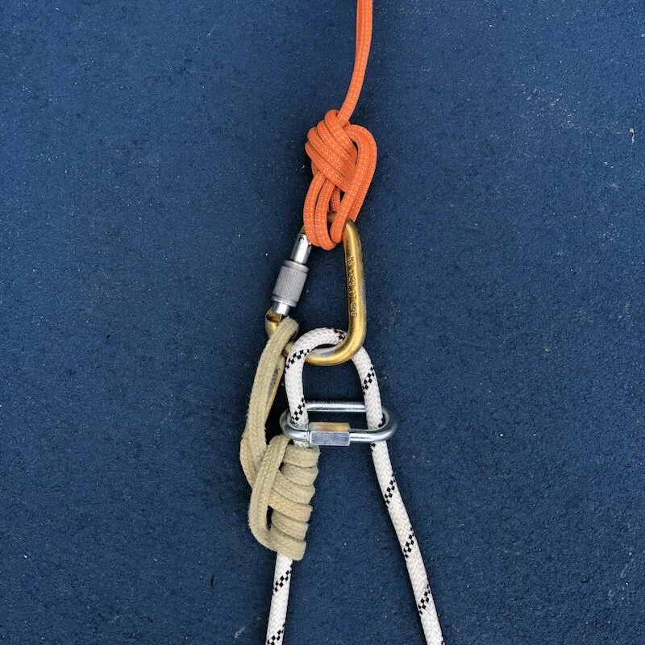
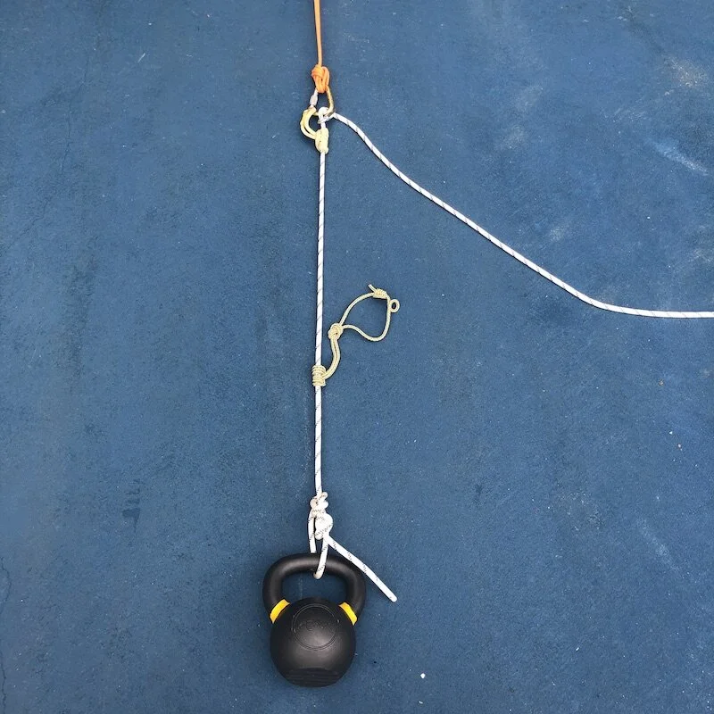
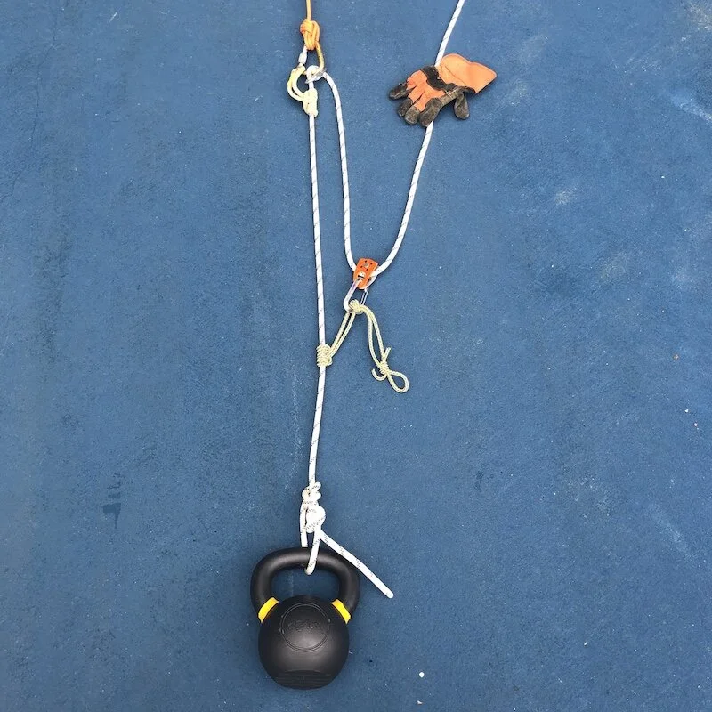

# 3:1“Z”形拖拉系统：分步详解

- 作者：John Godino
- 发布日期：2019-02-03
- 原文：[AlpineSavvy](https://www.alpinesavvy.com/blog/a-3-1-z-drag-step-by-step)

“Z”形拖拉系统（Z drag，因歪着头看时绳索呈字母“Z”形而得名）理论上可提供 3:1 的机械增益，是冰川裂缝救援和岩壁救援的基础系统之一。练过几次后，大多数人都能掌握。不过，如果有一段时间没有搭过，或者要在真实救援的压力下操作，高效、正确地架设系统仍可能颇具挑战。（我见过一些经验相当丰富的攀登者，因为久未练习，搭设时脑中一片空白……）

下面按步骤演示整个过程，希望能帮助绳索救援新手入门，也能帮久未练习的人重温这项技能。准备一根绳、两条普鲁士绳环（prusik loop）、几把锁扣；如果有滑轮，也拿上一个，然后跟着操作。

注意 1：本文只展示“Z”形拖拉系统的基本架设原理，不会涵盖器材和技术上的所有细节。普鲁士结自理滑轮（prusik-minding pulley）、单向制停滑轮（progress-capturing pulley）、抓绳器（rope grab）、备份结、可释放结（releasable hitch）及其他进阶绳索技术，都可以等你完全掌握这套基础系统后再加入。

注意 2：不要在家里拖家具练习，这会损伤地板和地毯。别问我是怎么知道的……

步骤 1 - 架设一个极其牢固可靠的锚点系统（bomber anchor），并在上面安装一把带锁锁扣。把连接负载的绳索扣入这把锁扣。现在得到的是一个改变了牵引方向的 1:1 系统，不提供机械增益。

步骤 2 - 在负载侧绳股上安装一个“止回”普鲁士结（capture prusik），并将这条普鲁士绳环连接到锚点系统。（它会锁住已经取得的提拉进度；即使你松开牵引绳，也能托住负载。）

步骤 2A - 按照目前的架设方式，拉绳时普鲁士结会被带着穿过锁扣，这显然不行。有几种办法可以避免。一种是在图示位置加一枚梅陇锁（quick link），用它挡住普鲁士结，防止抓结被拉过锁扣。实际效果取决于多项因素，例如梅陇锁的尺寸，以及主绳和抓结绳的直径与咬合力。请实际测试，确认是否有效。（CAMP 提供真正通过 CE 攀登认证的梅陇锁，[这篇文章有相关介绍](https://www.alpinesavvy.com/blog/ce-rated-quick-links-from-camp)。）

另一种办法是让第二个人“照看普鲁士结”（mind the prusik）：牵引时手动松开抓结，让主绳从中顺畅通过；停止牵引时则放手，让抓结咬紧主绳、托住负载。

如果你有一只功能先进、价格也不低的“普鲁士结自理滑轮”（prusik-minding pulley），就应当装在这里。

（没错，聪明的读者，我知道还可以在这里加一只管式保护器；不过今天不讲这个技巧。）

步骤 3 - 在负载侧绳股上再安装一个普鲁士结，称为“移动普鲁士结”（travelling prusik），因为牵引时它会沿绳移动。如果普鲁士绳环有些长，就像图中这条一样，可以打一个单结将它缩短。越短越好。

步骤 4 - 将绳索的自由端穿过滑轮，把一把锁扣扣入滑轮，再将锁扣连接到移动普鲁士绳环。

如果没有滑轮，也可以在这里用锁扣代替，不过使用滑轮的效果更好。如果只有一个滑轮，应将它装在移动普鲁士结上，以提高提拉效率。

很好，现在 3:1 系统已经搭好，可以开始牵引了！持续拉绳，直到负载到达所需位置，或移动普鲁士结上的滑轮碰到锚点系统。如果滑轮已经碰到锚点，而你仍需继续牵引，应先让止回普鲁士结咬紧主绳，确认它能够托住负载；然后将移动普鲁士结沿绳尽量推向负载，使其复位，再继续牵引。

