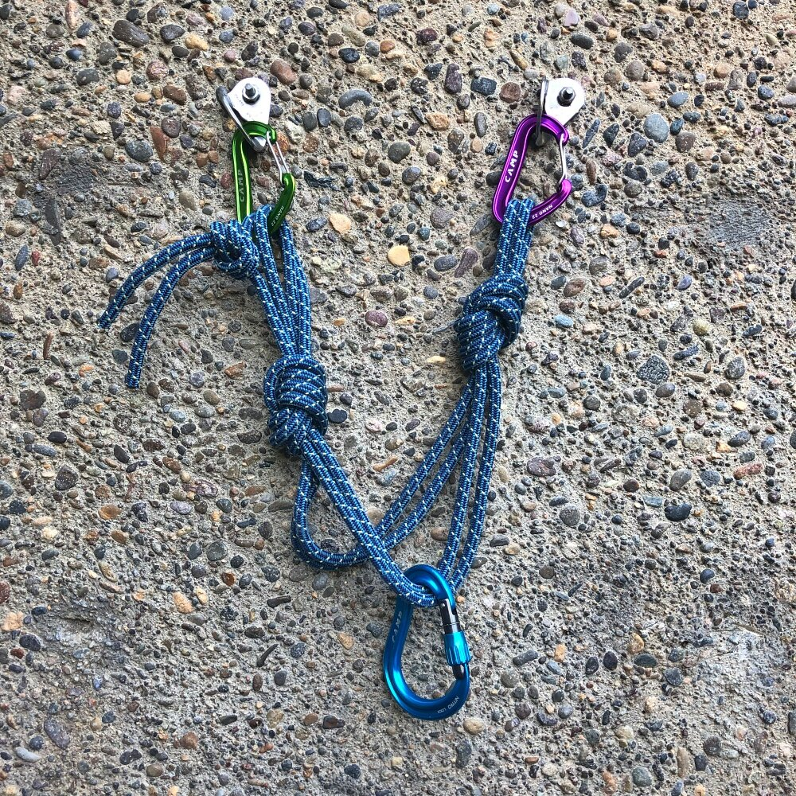
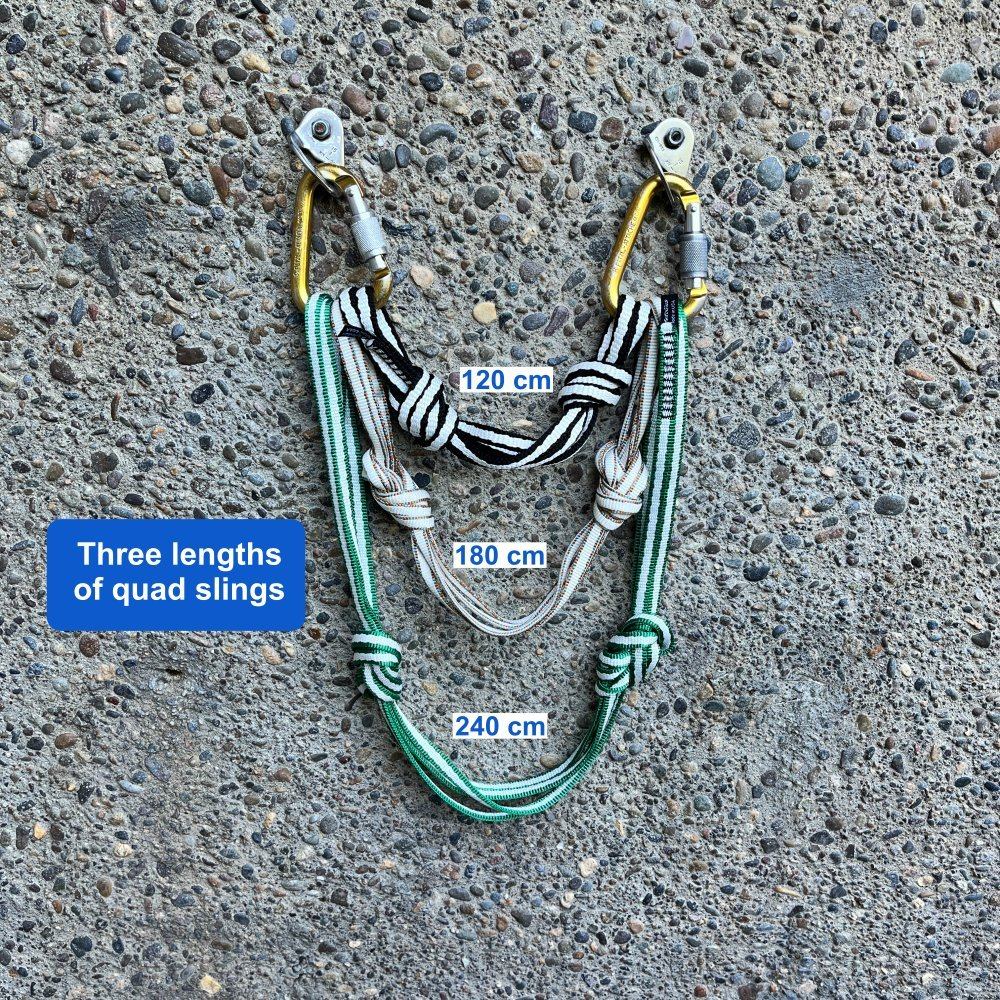
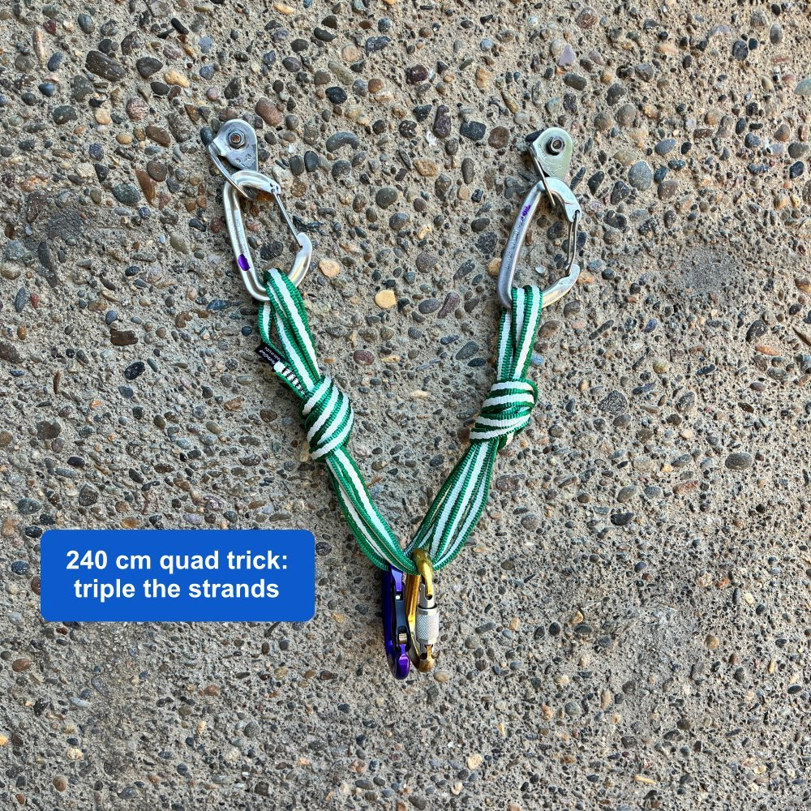
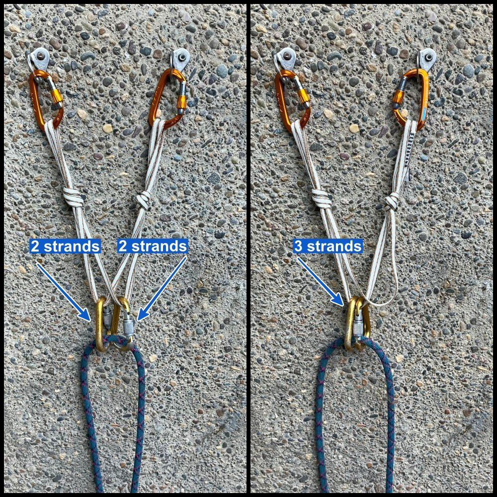
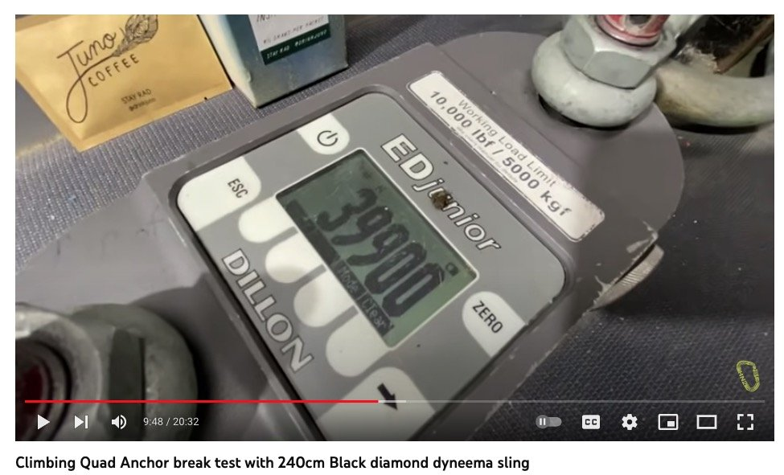
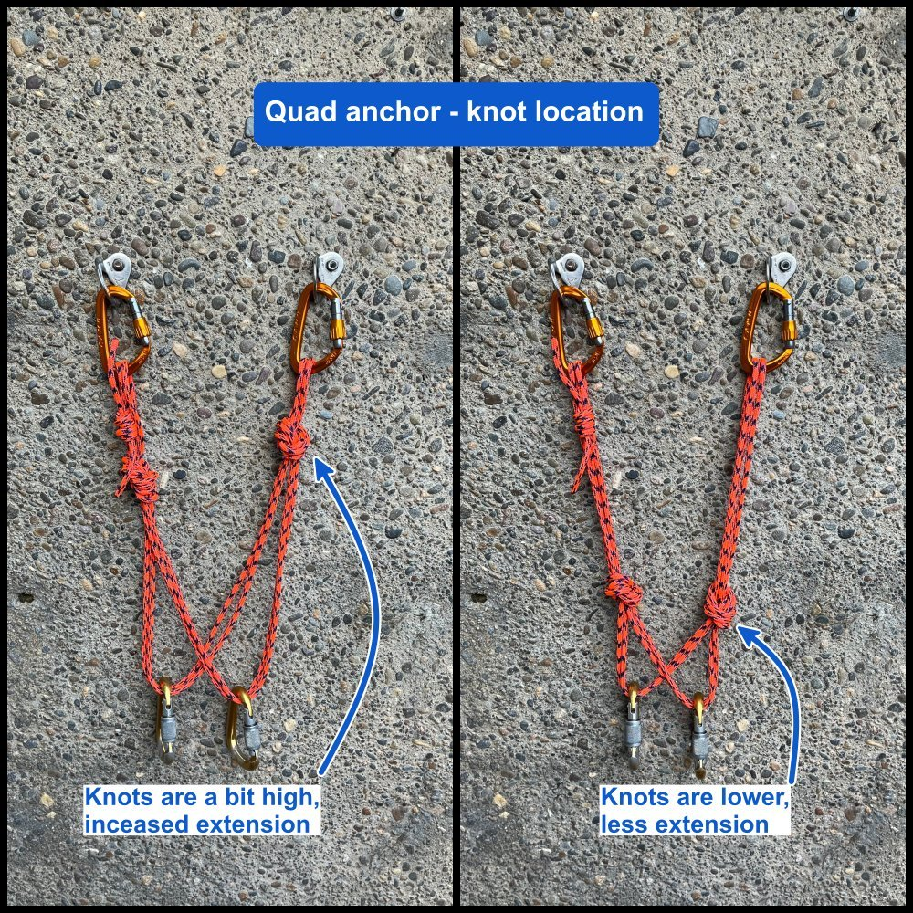
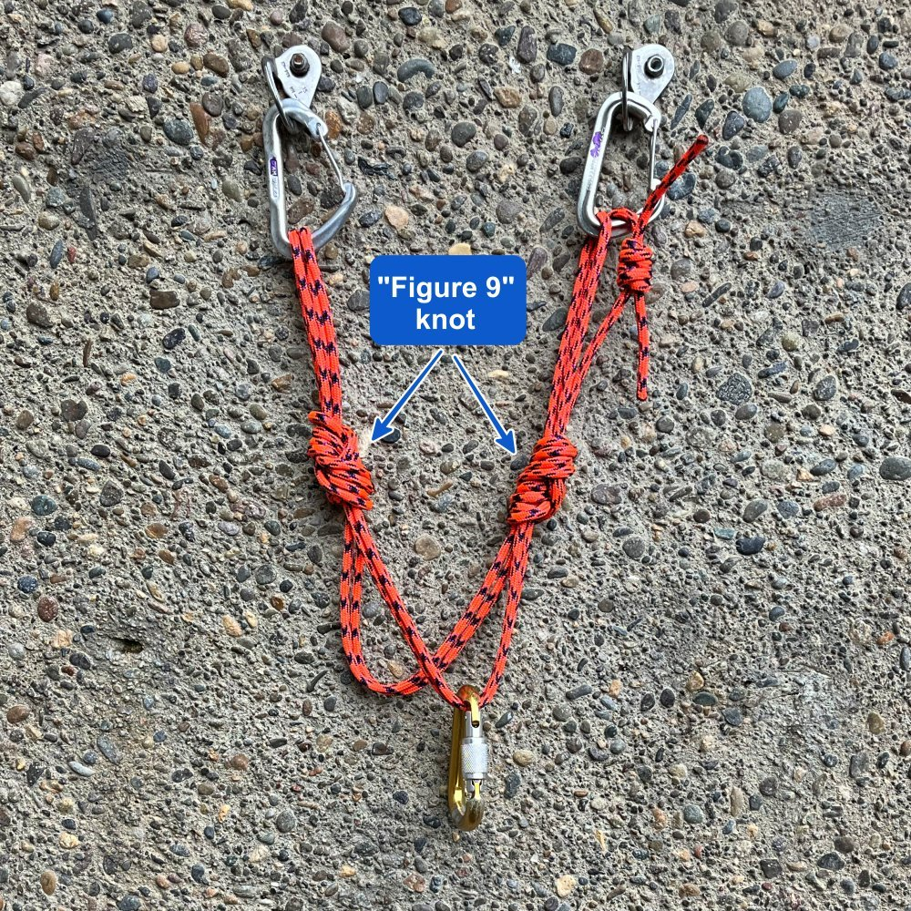

# The Quad Anchor

- Author: John Godino / Alpinesavvy
- Published: June 7, 2021
- Source: [Alpinesavvy](https://www.alpinesavvy.com/blog/the-quad-anchor)

The quad anchor, first mentioned (I think) around 2006 by John Long in his book “Climbing Anchors”, was an attempt to have the Holy Grail in anchors. What’s cool about the quad?

- Good load distribution

- Minimal extension

- Fully redundant

- Quick to set up and break down, no knots to untie

- Super strong (would you believe 40 kN?!)

- Bonus, two independent and load distributed master points, which can be quite handy

Well, it didn’t catch on right away. One reason may have been that the original version suggested using a long and bulky cordelette to rig it.

Traditional quad anchor rigged with 7mm cordelette. Nothing really wrong with it, just big and bulky.

Well, here’s the modern iteration of that idea, in a much lighter and more compact package. Rather than using a huge honker cordelette, instead you use a Dyneema sling; I prefer 180 cm. Double it, tie two a figure 8 or overhand knots (with the stitching in one of the end loops), and then use two strands to make an anchor for both toproping and multipitch.

The knots stay in the sling for at least the entire day. It's good practice to untie the knots every few days or after a weekend of climbing to “rest” your sling.

This system works best with two solid pieces of gear that are fairly close together and ideally in a horizontal plane. Two bolts on a sport route are a perfect application. Two ice screws that are slightly offset would also work too. (If you’re building a 3 piece anchor from trad gear, it may be faster to use a more traditional cordelette.)

## What's the best sling length?

For me, the 120 cm is a bit too short. It can work if the bolts are very close together and you use a small diameter sling, like 8 mm.

I think 180 cm is about the sweet spot. Not too short, not too long, works on horizontal bolts and with a little adjusting, vertically offset ice screws.

Some people think this is called the quad anchor because it uses a “quad” length sling, or 240 cm. A 240 cm sling can be handy for many kinds of anchor building, especially for equalizing three points of protection, orslinging around a tree. But for side by side bolts like this, many people find it’s too long, a bit bulky, and hard to rack.

- But hey, as you can see below it's only a bit longer than the 180, so many people this is gonna work fine.

- Notice the 180 and the 240 are tied with a figure 8 rather than overhands. This uses up a bit more material which raises the master point, and it also makes the knot quite a bit easier to untie after it's been loaded.

Here's another trick with the 240 cm sling quad to make it a little more manageable. Instead of doubling the cord, you can triple it. Then, when you tie your knots, it raises the master point and you clip to three strands rather than two. This makes it the effective same size as the 180 cm sling, nice!

If you look carefully at the photo below, you can see the yellow locking carabiner is clipped to three strands of cord, rather than two.

If you were climbing a route that maybe had a mix of gear anchors and bolt anchors, this might be a good trick to be able to use the 240 for both.

## Quad Toprope Anchor

Lockers on each of the two bolts, opposite and opposed lockers for the rope, good to go.

There's some difference of opinion about whether you should clip the master point lockers onto two separate strands (left), or put both of them onto three strands (right).

- Argument against the set up on the left: the sling arms could rub against each other when loaded, and the carabiners might bind against each other a bit, giving you less than ideal equalization.

- Argument against the set up on the right: if either bolt where to fail, you're only being held by one additional strand.

I think both of these issues are highly unlikely, and you're gonna be fine no matter how you rig it. Personally I prefer the one on the left.

(Hopefully this is glaringly obvious, but you absolutely should NOT clip all four strands. If you did this and any anchor point failed, the carabiners with slide off and you would die.)

Side note regarding lockers on the bolts . . . For a top rope anchor, when you're not right there next to it to keep an eye on it, and maybe multiple people will be using it over a long period of time, it's good practice to use locking carabiners on the bolts. In some circles this is known as an “unattended” anchor. However, if you’re multi pitch climbing, it's fine to use non-locking carabiners on the bolts. We can call this an “attended” anchor, because there's someone there the whole time watching it.

## Notes

For those of you who are extra concerned about tying a knot in Dyneema . . . A full strength Dyneema runner is about 22 kN. Here, we are doubling the sling, which in theory makes it about 44 kN, and then we're tying a knot, which reduces that in about half, which brings it back down to about 22 kN. In other words, it's absolutely not an issue. We cover the “tying a knot in Dyneema” issue more detail here.

A 180 cm sling can be a bit hard to find, But is this type of anchor becomes more popular, hopefully more manufacturers will offer them. (If the links below don't work, just Google around until you find them.)

- Petzl Pur’Anneau 180 cm sling

- Mammut Contact 180 cm sling

- CAMP Express 180 cm sling

- Blue Ice Mission 180 cm sling

A skinny Dyneema sling is best for this. (It won’t work nearly so well with a nylon runner because the knots are too big, plus finding a 180 cm nylon runner is difficult.)

A 10 mm or 11 mm Dyneema sling is recommended for anchor building. These are larger than the 8 mm used in many 60cm and 120cm slings. Most of the 180 cm slings I have seen are in this larger diameter, so that's good.

## How strong is the quad?

Ridiculously strong. How about a 40kN break test? The great team at HowNot2 tested this several times, and the quad is WAY stronger than anything else you will probably have on your harness. See the video here.

image: screen grab from https://www.youtube.com/watch?v=she8vH1DCBU

Can I clip the shelf? Yes. HowNot2 did a pull test on the shelf, and the knot started sliding at around 13 kN. SuperGoodEnough! (Same video link, start at 7:00.)

## Quad with a cordelette

While I'm generally not a fan of the 7 mm cordelette, you can certainly use one to make a quad anchor. In the photo below, the red cord is Sterling Powercord. While it’s a bit expensive, it's only 6 mm but is rated to 20 kN, almost 3 times stronger than normal 6 mm cord. If I am carrying a cordelette, this is what I grab first.

As the saying goes: “You can have it strong, light, and cheap. Pick two.”

In the photo, both left and right anchors are structurally strong. However, the right photo, showing the knots tied a bit lower, is slightly preferable. In the highly unlikely event of a bolt failing, the lower knots limit the extension of the anchor.

Here's another option: Tie a “figure 9” knot rather than an overhand knot to isolate the strands. This is simply a figure 8 knot with one more turn. This has a few advantages: it brings your master point up a bit higher, because the knot takes up more cord, and because of the extra turns, it's easier to untie at the end of the day.

> Note: the full article continues behind Alpinesavvy's Premium Membership; this archive covers the publicly available portion.
