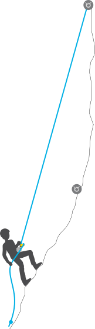
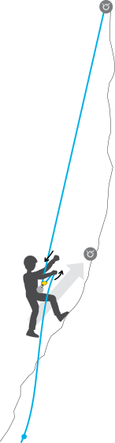
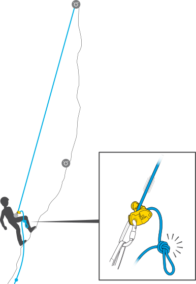
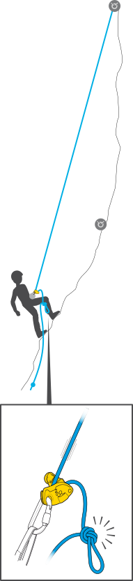
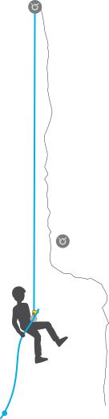
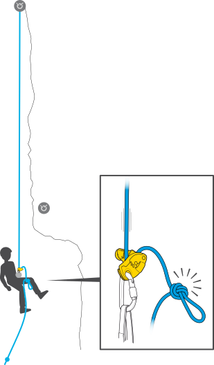
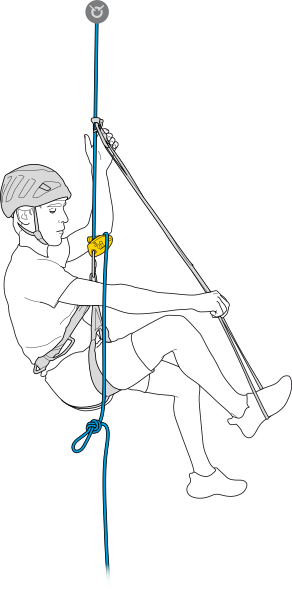
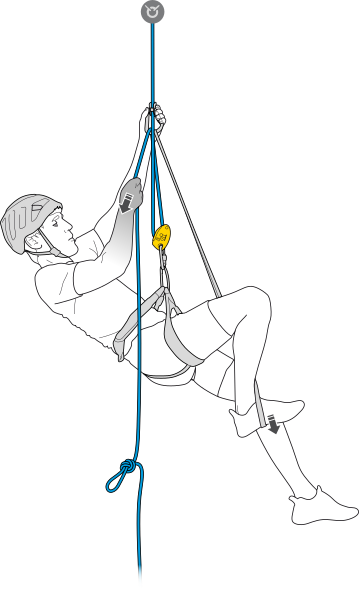

# 使用 GRIGRI、GRIGRI + 和 NEOX 沿绳上升

- 原文：[Petzl](https://www.petzl.com/INT/en/Sport/Ascending-a-rope-with-GRIGRI--GRIGRI-Plus-and-NEOX?ProductName=NEOX)

## 警告

- 阅读本技术建议前，请仔细阅读其中所涉及器械的使用说明书。只有事先阅读并理解说明书中的信息，才能理解这些补充内容。
- 掌握这些技术需要专项培训。在无人监督的情况下独立尝试之前，应在专业人员指导下确认自己能够安全、独立地完成这些操作。
- 本文提供的是与相关活动有关的技术示例，可能还有其他未在此介绍的方法。

在某些情况下需要沿绳上升，例如绳降时下降过头，需要重新上升到下一个绳降站。GRIGRI、GRIGRI + 和 NEOX 可用于沿绳上升；上升过程中应保持绳索绷紧，并不断收紧余绳。

> **警告：** 在固定绳上停留、起步、上升、下降，甚至摆荡，都会进一步增加绳索遭受磨损的风险。下降时应找出绳索可能与岩石摩擦的位置，以此判断出现问题时自己可以移动多大范围。

**注意：** 按照使用说明书中的描述，NEOX 存在锁止延迟（滚轮最多转动半圈），因此在这种用法下不如 GRIGRI 有效。另请参阅技术提示《NEOX 的正常声响》。

## 岩壁不太陡、双脚能够踩踏时

手应始终握住制动侧绳索，并在上升过程中不断收紧余绳。

如果操作任务要求你暂时腾出双手（例如解开缠绕的绳索或设置保护站），应在制动侧绳索上打结（参见技术提示《使用 GRIGRI 和 NEOX 时的免手操作位置》）。

> **注意：** 无论如何，都不得松开制动侧绳索后继续攀爬。GRIGRI、GRIGRI + 和 NEOX 均不允许用于自我保护攀登。

## 位于屋檐下方或双脚无处支撑时

在绳索上安装一件上升器（例如 TIBLOC、BASIC，甚至普鲁士结），并设置一个用于踩踏站起的扁带脚环。

### 1

在制动侧绳索上打结，以便腾出双手架设上升系统。

### 2

在下降器上方安装一件上升器。将制动侧绳索穿过上升器上的锁扣，形成自我提拉转向。再安装一个扁带脚环。

**注意：** 如果现有装备允许，可以考虑用挽索将自己与上升器连接。这样有助于防止操作过程中遗失上升器，也能避免因操作失误将其推到手够不到的位置。（为使示意图清晰，图中未画出这条挽索。）

### 3

踩扁带脚环站起的同时拉动制动侧绳索：下降器必须始终保持受力，你与上方锚点之间的绳索必须保持绷紧。整个操作过程中都要握住制动侧绳索。
