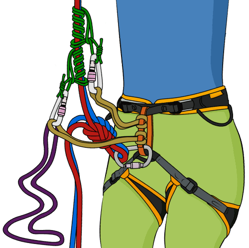
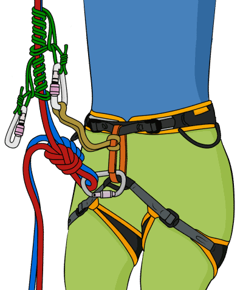
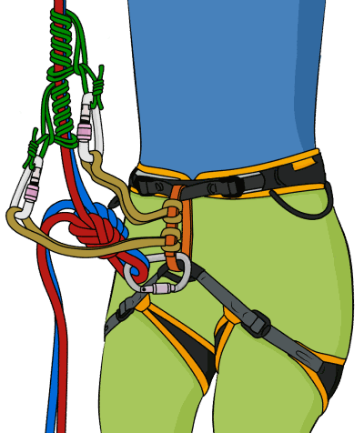
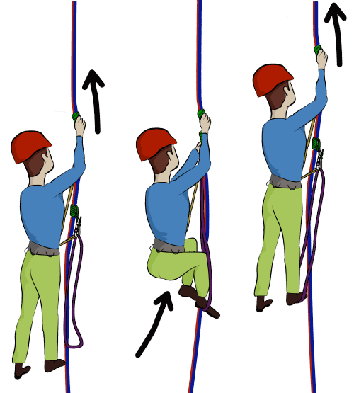
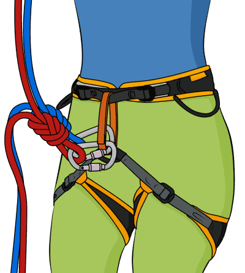
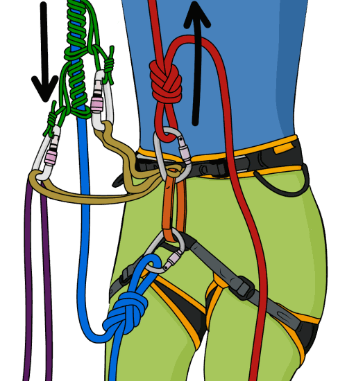
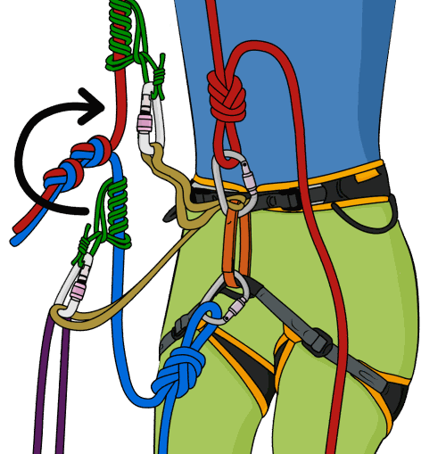

# Self Rescue: Prusiking Up a Rope

- Author: VDiff
- Published: December 28, 2025
- Updated: June 7, 2026
- Source: [VDiff Climbing](https://www.vdiffclimbing.com/prusik-rope/)

[Watch the Prusiking video](https://vimeo.com/822596951)

Knowing how to prusik up a rope transforms a potential epic into a mere inconvenience.

This article explains how to ascend a rope using prusiks, assuming that you already know how to tie one. If you don’t know how to tie a prusik knot, you can [learn here](https://www.vdiffclimbing.com/prusik-types).

Prusiking is most commonly needed when:

- You abseiled too far.
- You abseiled the wrong way.
- Your [ropes get stuck](https://www.vdiffclimbing.com/stuck-ropes/) after abseiling.
- You fall while leading or following a steep pitch.

## Before You Prusik up a Rope

### Only Prusik up a Rope Which Is Properly Attached to an Anchor

Sounds obvious, but many accidents have happened because a climber was ascending a “stuck” rope which then came free.

Another fatal mistake is to ascend only one rope on a double rope abseil, hoping that the knot will remain jammed in the anchor. Never do this! When under load, even large knots can squeeze through carabiners and certain types of chains or rings. If you descended both ropes, you’ll need to ascend both too. Remember that prusiks work equally well on one rope or two.

### Always Back up Your Prusiks

Prusiks are not full-strength attachment points. Tie a back-up knot in any rope which you are ascending. Clip this knot to your belay loop and re-tie it frequently as you ascend. When you re-tie it, make sure to tie the new back-up knot before removing the old one.

## The Standard Prusiking Technique

**Advantages**

- Safe to use in almost any rope-ascending situation.

**Disadvantages**

- Often more strenuous than other methods, such as the [slingshot](#the-slingshot-prusiking-technique).

### Step 1

Tie a back-up knot ([clove hitch](https://www.vdiffclimbing.com/clovehitch), [overhand](https://www.vdiffclimbing.com/overhand-knot/) or [figure-8 on a bight](https://www.vdiffclimbing.com/figure-eight-bight/) work well) in the slack rope(s) beneath you. Clip this knot to your belay loop with a screwgate. If you are ascending two ropes, make sure to tie back-ups in both of them.

If you are mid-abseil, simply weight your prusik and tie the back-up knots.

If you are abseiling without a prusik and dangling in space, you can wrap the rope around your leg at least three times, tie a prusik, release the rope from around your leg, weight the prusik and then tie the back-up knots. Whatever you do, make sure to keep hold of the brake rope until you have tied the back-up knots.

### Step 2

Attach two prusiks ([classic](https://www.vdiffclimbing.com/prusik-types/#classic) or [klemheist](https://www.vdiffclimbing.com/prusik-types/#klemheist) types work well) to the rope(s) above you.

### Step 3

[Girth-hitch](https://www.vdiffclimbing.com/girth-hitch/) a 60 cm sling to your belay loop and clip it to the top prusik. If it’s too long, you can tie a knot to shorten it.

Use screwgate carabiners for all connections. If you don’t have enough screwgates, you can substitute two snapgates with gates opposite and opposed.

### Step 4

Girth-hitch another sling to your belay loop and clip it to the bottom prusik.

### Step 5

Make a foot loop by clipping a long sling or piece of cord to the bottom prusik.

### Step 6

Now the hard work begins. To ascend, push the top prusik up the rope as far as you can, then sit back in your harness to rest your weight on it.

### Step 7

Slide the unweighted bottom prusik up the rope and stand in the foot loop. As you stand up, slide the now unweighted top prusik up the rope.

### Step 8

Repeat this process, making sure to adjust your back-up knots as you ascend.

## The Slingshot Prusiking Technique

The “slingshot” is a similar technique to the one used when winching yourself back up to your high point after falling on a steep sport route.

**Advantages**

- Less strenuous to ascend the rope than the [standard technique](#the-standard-prusiking-technique).

**Disadvantages**

- Only works in an abseiling situation. You cannot use this technique to regain your high point if you fall into space when leading or following a steep pitch.
- Difficult to set up if you can’t unweight the rope.
- Causes the rope to rub over the main anchor point. Never use this method if your rope is threaded through webbing, a sling or any fairly worn-out anchor point. The sawing action of this technique can cause the rope to cut the sling!

### Step 1

Anchor yourself independently of the abseil ropes, if you’re not already on the ground, and remove your belay device.

### Step 2

Tie a figure-8 on a bight in both strands of rope. Clip both of these to your belay loop, each with their own screwgate. One of these will remain weighted as you ascend; the other is your back-up knot.

### Step 3

Tie both prusiks on the side of the rope which has the knot joining the two ropes. Attach yourself to both prusiks and rig a foot loop as [previously described](#the-standard-prusiking-technique).

If you anchored independently from the abseil ropes, you will need to detach yourself from the anchor at this point.

### Step 4

Prusik up the rope, using the same technique described above. As you pull down on one side of the rope, the opposite side will pull up, assuming there isn’t much friction at the anchor point. This makes the ascent easier, but slower, than using the standard method.

Re-tie your back-up knot as you ascend, on the blue rope. Make sure to get the right knot though—do not untie the weighted knot!

### Step 5

In most cases, you’ll have to pass the knot which joins the two ropes. Simply re-tie your prusiks past this knot one at a time.

## Prusiking with an Extended Belay Device

**Advantages**

- Fairly quick to set up.
- Great for ascending a short distance, such as if you abseil past an anchor.

**Disadvantages**

- Only works if you are abseiling with an [extended belay device](https://www.vdiffclimbing.com/extend-atc/) which has a [guide mode](https://www.vdiffclimbing.com/guide-mode/) function.

### Step 1

Fasten a prusik knot—a [klemheist](https://www.vdiffclimbing.com/prusik-types/#klemheist) works well—around both ropes above your belay device with a long piece of 5 mm or 6 mm cord. This will be your foot loop.

### Step 2

Step into the foot loop and stand up, taking the weight off your belay device. Make sure to keep hold of both brake ropes as you do this.

### Step 3

Connect your belay loop to the auto-block hole on your belay device with a screwgate.

### Step 4

Sit your weight onto your now auto-blocked belay device.

### Step 5

Slide the top prusik up the rope and stand in the foot loop again. This takes the weight off your belay device, allowing you to pull the slack rope through it.

### Step 6

Repeat Steps 4 and 5 until you reach the anchor.

## Summary

Knowing how to prusik up a rope is an essential skill for any trad climber.

It is strenuous and awkward at first, and it may take a while to figure out the exact lengths of cord you need. But with a little practice, you will soon become a prusiking pro.

