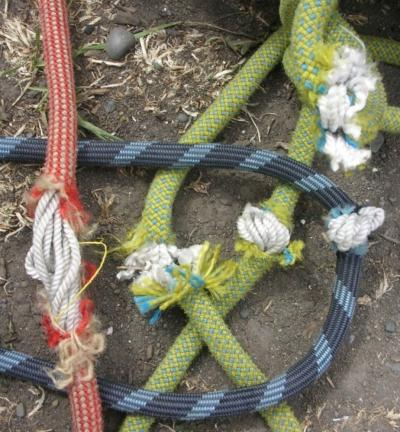
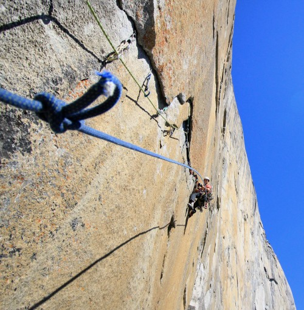
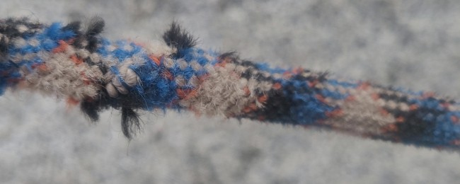
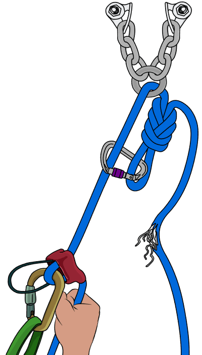
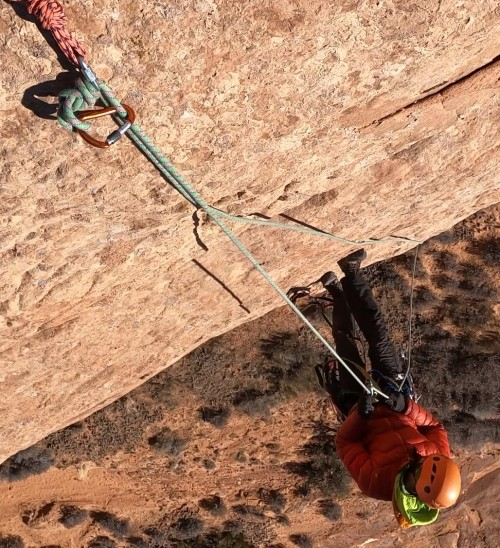
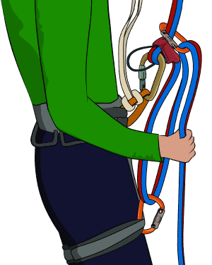
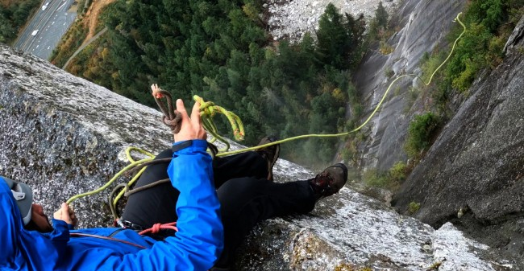

# 如何使用受损绳索绳降

- 作者：VDiff
- 发布日期：2025 年 12 月 28 日
- 更新日期：2026 年 6 月 7 日
- 原文：[VDiff Climbing](https://www.vdiffclimbing.com/damaged-rope-abseil/)

[观看视频：使用受损绳索绳降](https://vimeo.com/822598101)

只要攀登时间足够长，迟早都会遇到不得不用受损绳索绳降的情况。遗憾的是，绳芯外露（core-shot，即白色绳芯已经可见）似乎更常发生在地形破碎、绳降路线复杂的长距离多段攀登中。

解决方法取决于绳索受损的严重程度，以及损伤发生时你所在的位置。

## 使用受损绳索继续攀登

如果继续向上比下降更实际（例如你已经位于陡峭岩壁上方第十个绳距，却只差一个绳距就能到达便于步行下撤的位置），可以使用最长的一段完好绳索继续攀登。这样必须缩短每个绳距，但可能仍是最佳选择。

如果绳索不会穿过任何器材，例如在大岩壁上提拉装备，或在冰川上结组行进，可以在受损部位打一个[阿尔卑斯蝴蝶结](https://www.vdiffclimbing.com/alpine-butterfly/)。VDiff 称这样可使绳索恢复全部强度。

> **译注｜绳索状态：** “恢复全部强度”是 VDiff 对用阿尔卑斯蝴蝶结隔离损伤后的原文表述，不表示受损绳索已被修复、重新认证或适合继续先锋攀登。本文介绍的是紧急下撤思路，不能代替绳索与下降器制造商说明或专业现场训练。

## 使用轻微受损绳索绳降

如果只有少量绳芯从绳皮中露出，并且绳芯本身完好无损，可以用一小段攀岩指带紧紧缠住磨损部位。这样有助于固定绳皮，防止更多绳芯暴露。胶带用量应尽可能少，以免妨碍绳索顺畅通过下降器。

无论是否缠了胶带，都不能安全地用这种受损绳索进行先锋攀登。此方法只适用于绳降，可帮助你安全下撤，但并非永久修复。之后应将这条绳索退役。

## 使用绳芯受损的绳索绳降

如果绳芯已经受损，必须只用一股完好的绳股承重下降，并将受损部分作为回收绳。无需割断绳索。方法如下：

### 步骤 1

如图，将绳索穿过锚点。图中使用的是[8 字结](https://www.vdiffclimbing.com/figure-eight-bight)，也可以使用其他绳结，例如单结、9 字结、[双套结](https://www.vdiffclimbing.com/clovehitch/)或[阿尔卑斯蝴蝶结](https://www.vdiffclimbing.com/alpine-butterfly/)。关键在于结体绝不能从主锚点中被拉穿，也不能卡入主锚点。

这一系统最重要的部分，是用一把丝扣锁扣将绳索扣回自身，在主锚点周围形成一个“闭合环”。这样即使绳结意外穿过锚点，系统也不会彻底失效；但此时仍需要用普鲁士结沿绳上升，才能处理问题。

使用两条绳索绳降时也采用相同设置。用绳结将两条绳索系在一起，并把受损绳索作为回收绳。

### 步骤 2

将下降器安装到完好的承重绳股上。

采取普通绳降时同样的安全措施：在绳索下端打末端结，使用[普鲁士结](https://www.vdiffclimbing.com/prusik-types)备份，并在完全把体重转移到系统上之前逐步加载绳索，检查整个系统。

### 步骤 3

沿完好的承重绳股绳降，同时始终控制回收绳。最好把回收绳末端连接在自己身上。

第一名攀登者下降时，应持续观察系统。如果绳结卡住或穿过锚点，就需要改用更大的绳结，或把主锚点连接处换成尺寸更小的部件；小型梅龙锁／快速连接环适合这种用途。

### 步骤 4

拉下并回收绳索。

绳结和锁扣可能被卡住。与普通绳降一样，拉绳前应观察是否存在可能卡住绳结或锁扣的裂缝和地形特征。

多段绳降时，请记住每到一个锚点都必须让同一条绳索穿过该锚点。

### 增加绳降距离

如果绳降还差少量距离，可以在回收绳末端连接扁带和锚点辅绳环。

### 增加摩擦力

单绳股绳降时摩擦力较小，可能更难控制。若要让下降更平稳，请参阅关于[增加绳降摩擦力](https://www.vdiffclimbing.com/increase-friction-abseil/)的文章。

### 使用两条受损绳索绳降

如果两条绳索都已受损，最佳选择是保留最长的完好绳段作为承重绳，并将其余绳段连接成回收绳。这样无法绳降同样远的距离，但总比完全无法绳降更好。

另一种选择是把绳索一端固定在锚点上，沿单绳股绳降，并在途中完成[下降过结](https://www.vdiffclimbing.com/abseil-past-knot/)。采用这种方法后无法回收绳索，因此只有在绳索能够到达地面时才可行。
