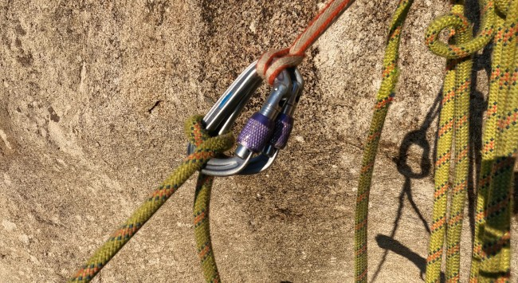
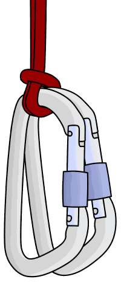
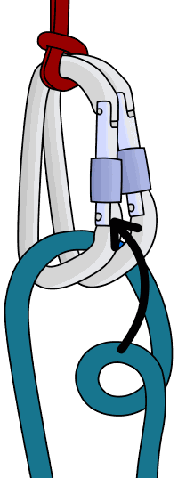
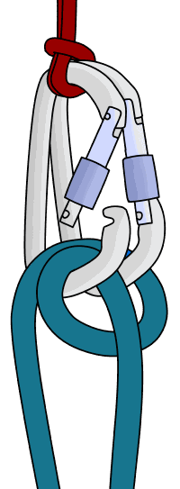
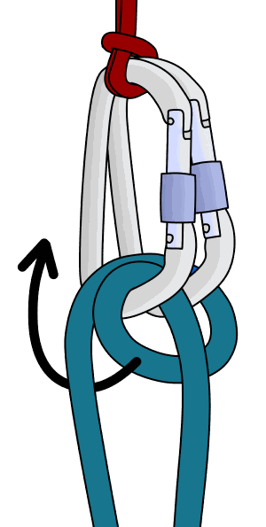
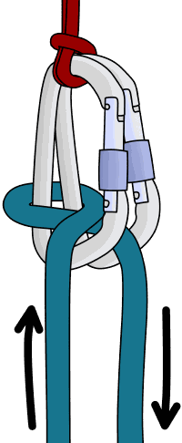

# 攀岩绳结：Garda hitch（Alpine clutch）

- 作者：VDiff
- 发布日期：2025 年 12 月 23 日
- 更新日期：2026 年 6 月 3 日
- 原文：[VDiff Climbing](https://www.vdiffclimbing.com/garda-hitch/)

Garda hitch（又称 Alpine clutch）利用两把平行锁扣构成单向止回系统，使承重绳索只能向一个方向移动，无法向相反方向移动。

**用途：**

- 作为提拉轻负载时的[临时提拉装置](https://www.vdiffclimbing.com/basic-hauling/)。
- 在[提拉同伴](https://www.vdiffclimbing.com/hauling-your-partner/#31-hauling-with-a-garda-hitch)时充当棘轮式止回装置。

## Garda hitch 打法

### 步骤 1

如图，用一条扁带打[雀头结](https://www.vdiffclimbing.com/girth-hitch/)，同时套住两把 D 形丝扣锁扣，使其保持平行，锁门位于同一侧。

### 步骤 2

将绳索同时挂入两把锁扣。

### 步骤 3

如图，在非承重侧绳股上做出一个绳环。

### 步骤 4

将这个绳环挂入图中左侧的锁扣，然后拧紧两把锁扣的丝扣锁套。

### 步骤 5

将绳环向后拉，使其环绕两把锁扣的锁背。

### 步骤 6

Garda hitch 现已完成。

绳索只能向一个方向拉动。务必确认 Garda hitch 的安装方向正确。

## Garda hitch 警告

- Garda hitch 是单向绳结，**承重时无法释放**。使用时务必谨慎规划。
- 必须使用 D 形锁扣。用 HMS 锁扣或椭圆锁扣打 Garda hitch 时，绳结容易向下滑移并导致失效。
- 必须用扁带以雀头结同时套住并固定两把锁扣。如果只是将两把锁扣共同挂入一条扁带或另一把锁扣，Garda hitch 将无法正常工作。

> **译注｜系统限制：** 原文未提供承重后的释放、下降、负载转移或备份方法，也未给出适用绳径、额定负载或效率数据。将其用于提拉系统前，应预先设计独立备份和可控卸载方案，并接受相应的现场训练；不能在系统承重后才依靠 Garda hitch 完成释放。
