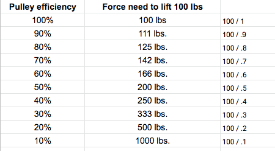
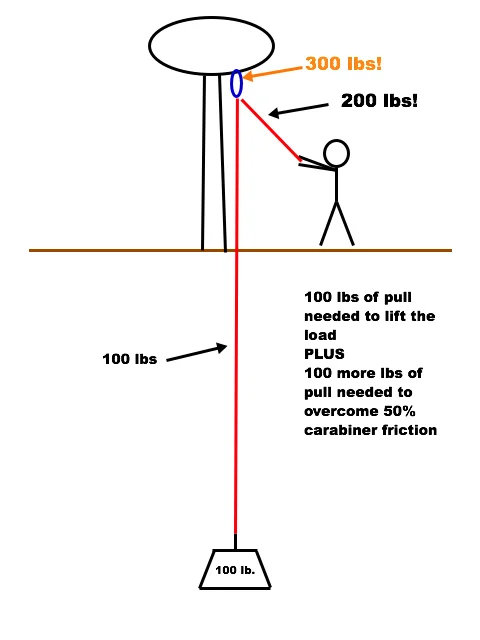
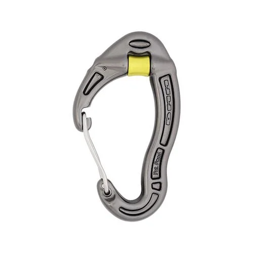
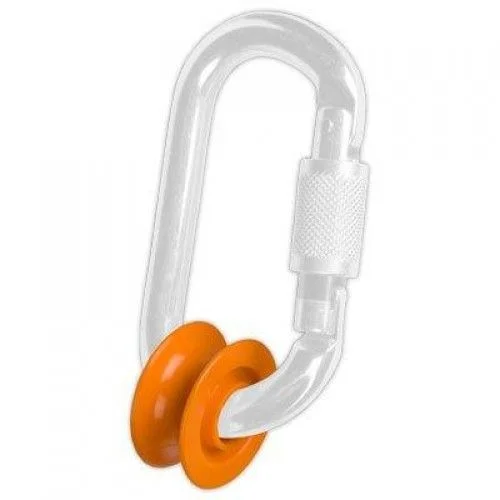
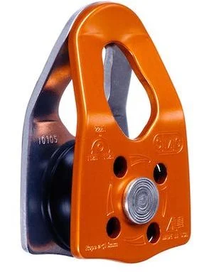

# A few basic questions and answers about MA systems

- Author: John Godino
- Published: 2019-02-03
- Source: [AlpineSavvy](https://www.alpinesavvy.com/blog/a-few-basic-questions-and-answers-about-ma-systems)

## When I start looking at some of the more crazy pulley diagrams of 5:1, 6:1, 9:1 . . . my eyes glaze over. As a climber, what's the most basic system(s) I need to know?

Learn how to do a 2:1 and a 3:1 pretty much with your eyes closed. These are the foundation systems that are used most in rescue and hauling scenarios. Any system that creates greater MA than a 3:1 is just a combination(s) of 2:1 and 3:1. Once you have these dialed, you can play around with combining them in various way to make a 5:1 or maybe a 6:1. That should be everything you should ever need for a rescue scenario. Learn these basics first and don't get confused by the fancier stuff.

Note that it’s not likely you’ll be able to lift someone just with a 3:1 unless they are actively assisting. To be really sufficient for various rescue scenarios, add a 5:1 or 6:1 to your engrained memory. [Here’s a great way to make a 6:1, for example.](https://www.alpinesavvy.com/blog/the-3-kinds-of-pulley-systems)

The good thing is, you can practice these at first on the floor and in the comfort of your warm, dry house. But then, please go try them in a more realistic setting.

## What are some real world climbing situations where I need to know this stuff?

**Alpine climbing** - In a crevasse rescue, you may need a 2:1, 3:1 or even 6:1. Or, perhaps various rock rescue scenarios where you might need to haul your second past a difficult move or two with a 3:1, and less commonly, setting up an ["alpine block and tackle"](https://www.alpinesavvy.com/blog/the-alpine-block-and-tackle), which can be a 4:1 or a 6:1 theoretical MA, which we cover in this tip here.

**Big wall climbing** - You’ve got two big honker haul bags for you and your partner to spend a week on El Capitan. The total load is going to be well over 200 pounds, and is going to absolutely suck to haul 1:1. Time to rig a 2:1 haul system. The scope of setting this up properly is a complicated topic and is [covered in a separate post here.](https://www.alpinesavvy.com/blog/the-2-to-1-z-pull-haul-explained)

## I don’t quite understand the math around pulley efficiency. Can you explain that?

Sure thing. One way to think about it is how different pulley efficiencies determine the effort needed to lift a load. Let’s use 100 pounds as a nice round number.

The table below pretty much spells it out.

What do we notice? With high pulley efficiencies of 70 to 90%, you’re not going to notice much real world difference when lifting a load. When pulleys start to fall below about 60%, you’re definitely going to start noticing a difference. If any component in your hauling system is much below 50% efficient, you need to ask yourself why you’re using it at all.

## I don’t quite get how a redirect increases force on the anchor in the real world. Can you explain that?

Sure thing. Say our friend Sticky decides to raise her 100 pound load through the carabiner redirected through an anchor point. The carabiner is roughly 50% efficient. From the table directly above, we can see that for her to lift 100 pounds, she needs to pull down with a force of 200 pounds. That force gets applied to the strand of rope she’s pulling. At the same time, the 100 pound load is weighting the other strand of rope. So together, her pulling force of 200 pounds plus the 100 pound load add up to be a 300 pound load on the anchor.

Now, let's say she has a pulley that's 80% efficient, and she runs her load through that instead. From the table above, we can see that she would need to pull with 125 pounds of force. We add this to the 100 on the other side, and get a total of 225 pounds on the anchor. Hopefully this convinces you to use a pulley whenever possible!

(I did this myself with a 10 pound barbell weight, a spring scale hanging from the ceiling, and a 9 mm climbing rope. Sure enough, set up exactly like below, it took 20 pounds of pull to lift the 10 pound barbell plate off the ground.)

## If a 9:1 is easier to pull than a 3:1, why don’t we use a 9:1 for everything?

Well, first try pulling with the 3:1 that you already have set up. If that's getting the job done, don't make it more complicated. Remember, every additional redirect and pulley that you add increases friction and decreases the real world MA. It also increases the amount of rope you have to pull through the system to raise your load, requires more gear like carabiners, prusiks and pulleys, and it may increase how often you need to reset the haul pulley. It can even add some more unexpected weird variables, like ropes twisting, ropes rubbing on each other, and prusiks slipping. Remember the law of diminishing returns from that long ago economics class; adding more input does not always get you a good return on the output.

A good rule of thumb: use the minimal mechanical advantage system that you can to get the job done. The best system is not necessarily the one which creates the greatest MA.

## How about something like a DMM Revolver carabiner, that has a little wheel in it, or the Petzl “ultra legere” orange plastic wheel thing. Can I use these instead of a pulley?

Probably not. The Revolver carabiner was really designed to minimize rope drag when lead climbing, not serve as a proper pulley in a block and tackle system. (My real world tests showed a Revolver carabiner was pretty much the same as a regular carabiner in hauling efficiency.) The legere I personally have found quite difficult to use in a crevasse rescue scenario, because the rope does not properly stay in place and wants to skip off of it at every opportunity. It also has it safe working load of only 1 kN, so that means it's appropriate for lifting your pack, but not a body. Get a real pulley (or two). [See some real world test results here.](https://www.alpinesavvy.com/blog/pulley-vs-carabiner-whats-the-difference)

image: dmmclimbing.com

image pinterest.com/pin/369295238177239123/?lp=true

## What kind of pulley should I get for crevasse / rock rescue?

There are two main types of pulleys, which you could refer to as fixed plate and swing plate. With the fixed plate pulley, the sides of the pulley look like a letter "U" and are made from a single piece of metal. Because of this wider shape, these can usually only be used with a oval or HMS belay carabiner. With the swing plate pulley, the two sides are separated, allowing one side to swing down to more easily insert the rope. The swing plate pulley is probably the most useful one to have for alpine rescue. The advantages are, it's easier to put the rope in, and it works with just about any kind of carabiner.

Having said that, it's usually better to use an oval shaped carabiner with a pulley if you can. If a D-shaped carabiner tilts the pulley off to one side, you're going to lose efficiency, because the pulley bearings will not be properly sharing the load.

image: https://smcgear.com/crx-pulley-orange.html

The American Alpine Institute recommends this model pulley for their glacier travel and crevasse rescue classes: the CRx, made especially for crevasse rescue. ("CR" Crevasse Rescue, get it?) It's a solid pulley, from the respected company SMC (Seattle Manufacturing Company), and best of all it's only about 15 bucks. I have one, it’s great.

Note that the wheel (aka sheave) in the CRx pulley is plastic, not metal. This makes it a hair lighter and less expensive, both of which are good for a lighter duty rescue pulley. But if you’re looking for a big wall hauling pulley, you want a larger diameter metal sheave with sealed bearings, both of which will increase your hauling efficiency, which is important when you're doing it 3000 times. More on big wall hauling systems and pulleys is [in this post.](https://www.alpinesavvy.com/blog/the-2-to-1-z-pull-haul-explained)

Petzl, SMC and CMC all make quality pulleys. Pretty much any small pulley by a name brand climbing company is going to work fine. You can find a lot of small inexpensive pulleys on Amazon; some of these are probably great, and some of them probably suck, so personally I'd stay away from those. There are ways to skimp on gear - rescue equipment is probably not a good one.

[get the CRX pulley here](https://www.amazon.com/gp/product/B00F3BX6GQ)

There is also a flavor of pulley called a "prusik minding" pulley, or as some manufacturers call it, a "PMP." These pulleys have a wider faceplate on either side of the wheel, which is designed to keep the prusik from being sucked into the wheel during a crevasse rescue. If you're going to get one pulley for crevasse rescue, you very likely want to get a PMP. Like I said, don't skimp on rescue gear. PMPs vary a lot in price. That’s why this CRx is such a good deal.
