# Self Rescue: Hauling your Partner

- Author: VDiff Climbing
- Published: (not dated on page)
- Source: [VDiff Climbing](https://www.vdiffclimbing.com/hauling-your-partner/)

This section describes methods of hauling your partner up part of a climb.

Times when you may need to set up a hauling system include:

- Assisting your partner through a short crux.
- If your partner falls while following a steep pitch and is left dangling in space.
- During a multi-pitch rescue for an injured climber, where descending would be more difficult or dangerous.

In most cases, it is easier for the follower to [prusik up the rope](https://www.vdiffclimbing.com/prusik-rope/) than it is for the leader to haul them. However, hauling may be the best option if they are injured or cannot use prusiks.

**Warning – Unconscious Climber**

Dragging a climber up a cliff may cause additional injuries. If the climber is unconscious, they should not be hauled unless directly attended. If a long or complicated haul is required, utilizing search and rescue professionals is usually the best course of action.

## Mechanical Advantage

The hauling systems in this section are described using their mechanical advantage. A 3:1 means that for every three meters of rope that you haul, your partner moves up one meter. With a 6:1, six meters of rope must be hauled to move your partner one meter.

In theory, a 3:1 is three times easier than just pulling on the rope (1:1). In reality, improvised hauling systems are fraught with inefficiencies, creating a significant difference between theoretical and actual mechanical advantage. This is primarily due to friction around carabiners and stretch in the rope ([explained here](https://www.vdiffclimbing.com/hauling-your-partner/#friction)). Taking this into consideration, a 3:1 setup is still a simple and effective solution for many situations.

## Drop Line 1:1 Hauling

**Best Use**

- Assisting your partner through a short crux near the top of a pitch

**Advantages**

- Simple

**Disadvantages**

- Only possible when the climber is less than 1/3 of the rope length from the belayer
- Must be able to drop a rope to the climber easily. Getting your rope stuck will add more problems

**Step 1** - [Tie off your belay device](https://www.vdiffclimbing.com/tieoff-belay/) so you can go hands-free.

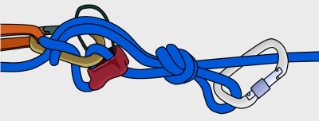

**Step 2** - Attach the standing end of the rope to the master point. Often it already is depending on your belay setup.

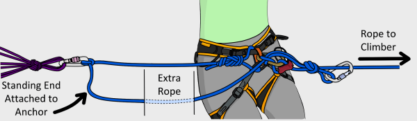

**Step 3** - Lower the rope stack to the climber.

**Step 4** - Release your tied off belay device. They can now pull on the standing end of the rope while you belay them up – they do all the hard work! Make sure the climber pulls on the correct side of the rope. You could also pre-tie some loops in the rope so it is easier for them to pull.

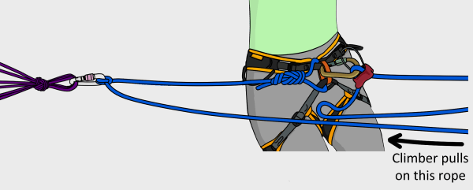

## Drop Line 2:1 / 3:1 Hauling

**Best Use**

- Assisting your partner through a short crux near the top of a pitch when belaying in guide mode

**Advantages**

- Simple

**Disadvantages**

- Only possible when the climber is less than 1/3 of the rope length from the belayer
- Must be able to drop a rope to the climber easily. Getting your rope stuck will add more problems

**Step 1** - Attach a screwgate to the rope stack and lower it down to the climber.

**Step 2** - The climber clips this to their belay loop.

**Step 3** - Tie a back up knot (such as a [figure-8](https://www.vdiffclimbing.com/figure-eight-bight/)) to the anchor. This back up knot should be adjusted every few meters.

**Step 4** - The climber pulls down (with a 2:1 advantage) while the belayer pulls up (with a 3:1 advantage).

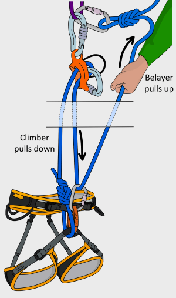

## Simple 3:1 Hauling

**Best Use**

- Hauling your partner through a crux when passing the rope to them is not possible

**Advantages**

- Only requires a few meters of rope to set up

**Disadvantages**

- The climber cannot assist

**Step 1** - If belaying from your harness, you’ll need to [escape the belay](https://www.vdiffclimbing.com/belay-escape/).

**Step 2** - Tie a [prusik](https://www.vdiffclimbing.com/prusik-types/#classic) on the weighted rope and clip it to the master point with a screwgate (depending on how you escaped the system, you may already have this).

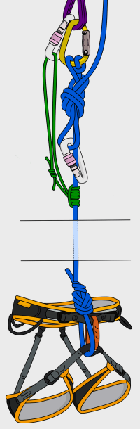

**Step 3** - Tie another prusik to the weighted rope as far down as you can reach. Clip this to the loose brake strand with a screwgate (Use a pulley here if you have one).

**Step 4** - Connect the rope to the master point with a screwgate as shown.

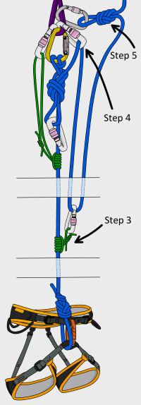

**Step 5** - Tie a back up knot (such as a figure-8) in the slack rope and attach this to the anchor.

**Step 6** - Transfer the load onto the upper prusik by slowly unfastening the munter-mule. Make sure you keep hold of the brake rope from now on.

**Step 7** - Remove the carabiner which the munter-mule was tied to. Pull in all slack.

**Step 8** - You are now ready to haul. Keep one hand over the upper prusik to maintain its position while pulling upwards on the rope. (Make sure the prusik does not get sucked through the carabiner)

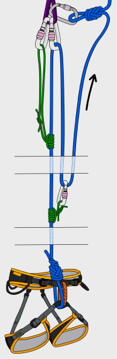

**Step 9** - The lower prusik will eventually join the upper prusik. At this point you will need to reset it. With the weight on the upper prusik, push the lower prusik down the rope as far as you can.

**Step 10** - This would be a good time to re-tie your back-up knot (Tie a new one before untying the old one). Repeat as necessary.

When your partner is able to continue climbing, re-attach your belay device and remove the prusiks.

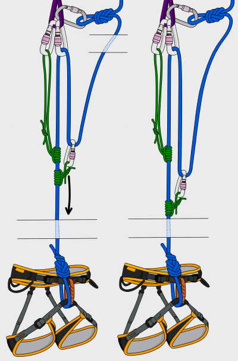

## 3:1 Hauling Tips

### Self-Sliding Prusik

If an ATC is available, you can add it to the master point during Step 4.

The ATC will not add friction, but it can help to prevent the upper prusik from getting sucked through the carabiner.

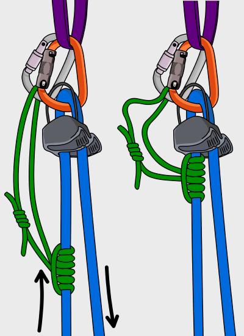

### Downwards Hauling

If pulling upwards is difficult, you can re-direct the rope through the anchor to change the hauling direction. This will allow you to more easily put your weight into the haul.

The disadvantage is that it adds more friction to the system without adding any mechanical advantage.

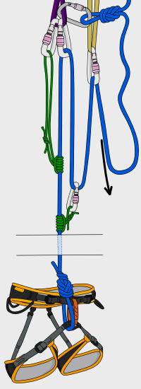

## 3:1 Hauling with Guide Mode

You can easily set up a 3:1 system if you are belaying directly from the anchor in [guide mode](https://www.vdiffclimbing.com/guide-mode/).

**Advantages**

- Quick to set up. There is no need to escape the belay or attach the upper prusik

**Disadvantages**

- Adds more friction to the system

**Step 1** - Attach a prusik to the rope as [previously described](https://www.vdiffclimbing.com/hauling-your-partner/#prusik).

**Step 2** - You are now ready to haul.

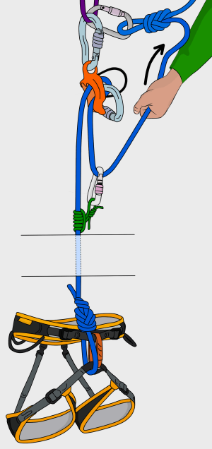

## 3:1 Hauling with a Garda Hitch

A [garda hitch](https://www.vdiffclimbing.com/garda-hitch/) is an improvised ratchet pulley.

**Advantages**

- Eliminates the need for the upper prusik

**Disadvantages**

- Adds more friction to the system
- The garda hitch is almost impossible to release when loaded. It is essentially a one-way hitch

**Step 1** - Instead of tying a munter-mule when [escaping the system](https://www.vdiffclimbing.com/belay-escape/), tie a garda hitch with a back-up as shown.

**Step 2** - Attach a prusik to the rope as [previously described](https://www.vdiffclimbing.com/hauling-your-partner/#prusik), and you are ready to haul.

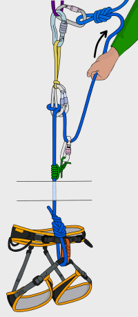

## 3:1 Hauling from your Harness

The same system can be set up from your harness.

**Advantages**

- Can be used with non-cordelette belay setups
- No need to escape the belay

**Disadvantages**

- The weight of the climber hanging from your harness can be uncomfortable
- Your range of motion is restricted. Pulling the rope and adjusting prusiks is much more difficult

**Step 1** - Tie-off your belay device to get hands-free.

**Step 2** - Follow steps 2-10 of ['Simple 3:1'](https://www.vdiffclimbing.com/hauling-your-partner/#prusik).

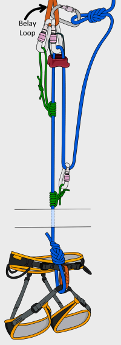

## Adding More Mechanical Advantage

Endless variations are possible by adding more prusiks, slings and carabiners. Two of the most common systems are shown below.

### 5:1 System

A 3:1 can be converted into a 5:1 by adding a sling and 2 carabiners.

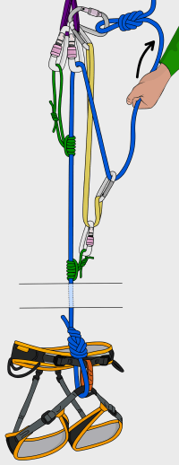

### 9:1 System

A 3:1 can be converted into a 9:1 by adding 2 carabiners and a prusik.

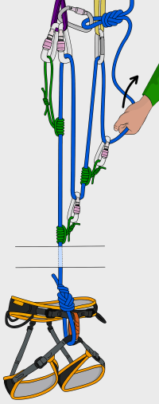

## Forces, Friction and Efficiency

### Forces on the Anchor

Mechanical advantage hauling systems place increased forces on your anchor. If you continue hauling with something stuck (e.g: a prusik or carabiner gets caught in a crack), the forces on the anchor increase exponentially.

Don’t force the haul if it feels like something is stuck. It may be wise to beef up your anchor with more gear prior to hauling.

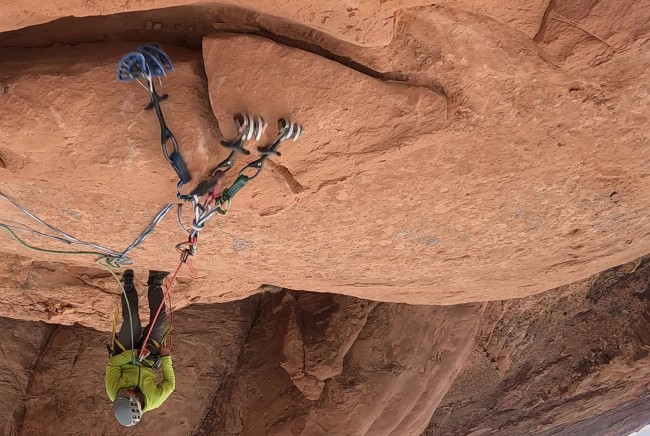

### Friction

More friction means harder hauling. Friction is increased by:

- More weight on the rope
- More carabiners in the system
- Rope running over more surfaces

In a simple 3:1 setup, the weighted rope runs around 2 carabiners. This is the minimum number for a 3:1 haul, and therefore this system has the least friction.

Creating a 5:1 or a 9:1 may not necessarily make the haul easier, especially if your anchor is built on the ground and the rope is zigzagging over rough rock. Not only does this generate a lot of friction, it also means that you will have to haul five (or nine) meters of rope to get your partner one meter up.

Depending on how far you can reach to reset the prusiks, you may only get your partner up a few inches between each reset. If set up on an awkward stance, it could literally take hours to haul a person half a rope length.

### Carabiner and Pulley Efficiency

Pulleys significantly reduce friction in hauling systems, but are rarely taken on climbs because they are unlikely to ever get used.

A good compromise is the [DMM Revolver Carabiner](https://amzn.to/3Yne9uQ) which features a tiny pulley. It reduces friction and can be used as a normal carabiner too.

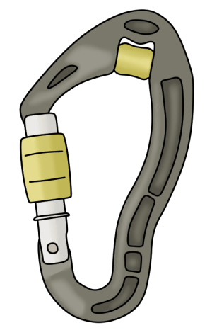

## Summary

Keeping your system simple, straight and away from unnecessary friction will help more than adding mechanical advantage to an inefficient system.

If you can throw some rope to your partner, the [drop line](https://www.vdiffclimbing.com/hauling-your-partner/#drop-line) techniques will be quickest. If not, a 3:1 will be the next best option. It is often more efficient to pull harder on a 3:1 than it is to add carabiners (and friction) to set up a 9:1. Only add more mechanical advantage if you need it.

Complicated belays and loose rock on belay ledges can add more problems than a hauling setup may solve. Consider alternative solutions (such as lowering your partner, or getting them to [prusik up](https://www.vdiffclimbing.com/prusik-rope/)) before you set up a hauling system.
