# 如何计算机械增益

- 作者：Petzl
- 发布日期：（页面未标注日期）
- 原文：[Petzl](https://www.petzl.com/GB/en/Operators/How-to-calculate-mechanical-advantage?ProductName=RESCUE-S)

机械增益拖拽系统可以减少提升负载所需的力。其机械增益来源于滑轮效应。

**警告**

- 在查阅本技术建议之前，请仔细阅读其中所涉及器材的使用说明书。你必须已经阅读并理解使用说明书中的信息，才能理解这些补充内容。
- 掌握这些技术需要专门的培训。在无人监督的情况下尝试之前，请与专业人士一起确认你有能力安全、独立地运用这些技术。
- 我们提供的是与你活动相关的技术示例。可能还有其他我们未在此描述的技术。

## 1. 滑轮效应

设想一个悬挂在绳上的负载，绳子穿过使用者上方的一个滑轮，使用者的手在滑轮另一侧握住绳子；施加在绳子一端的任何力，都会被传递到绳子的另一端——在这个情形中，就是滑轮另一侧的那段绳端。

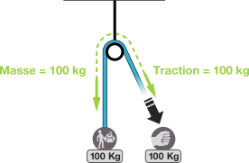

如果负载重 100 公斤，显然使用者必须在自己一侧拉住 100 公斤才能让负载保持不动。两股绳各施加 100 公斤的拉力，因此滑轮承受 200 公斤。

注意：这个理论只适用于效率 100% 的理想滑轮，而理想滑轮在现实中并不存在。实际上，滑轮效率大约在 50% 到 98% 之间。为简化计算，本文的讨论仅限于理想滑轮。

## 2. 实际计算机械增益

拖拽系统的效率（E）表示你能施加在绳上的力的倍增系数。例如，如果你徒手最多能在绳上拉 20 公斤，一套 3:1 拖拽系统就能让你提起 60 公斤的负载。这种省力是靠增加拉绳长度换来的：用 3:1 系统把负载提升 1 米，你必须拉 3 米的绳。

拖拽系统的效率（E）可以通过把每个滑轮的效应相加来计算。

- 先画出系统的简单示意图，然后标出手施加在绳上的拉力 F。
- 沿着绳子传递力 F，途中加上每个滑轮的效应。
- 当有多股绳连接到负载时（双滑轮、抓绳器……），把各股绳施加的力相加。

### 1:1 拖拽系统

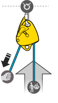

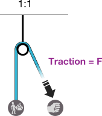

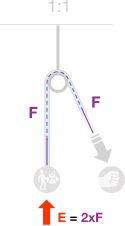

### 2:1 拖拽系统

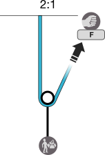

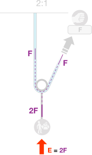

### 3:1 拖拽系统

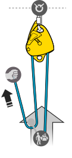

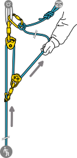

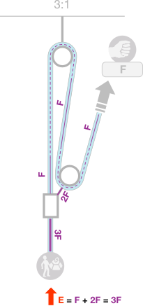

注意：3:1 系统的优点是架设简单，而且只需再加一个滑轮和一段辅绳，就能轻松转换成复合系统（7:1）。

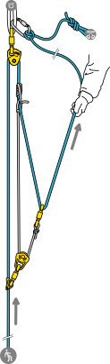

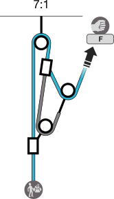

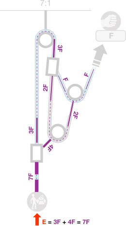

### 4:1 拖拽系统

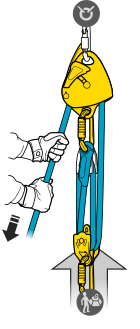

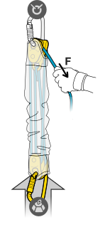

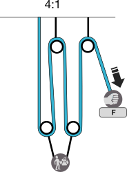

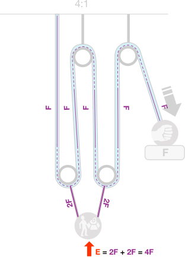

### 5:1 拖拽系统

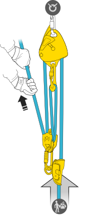

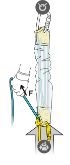

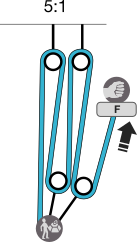

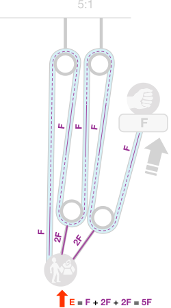

---

本文涉及的相关产品：FIXE（固定侧板、紧凑多用途滑轮）、RESCUE S（轻量超紧凑高效率滑轮）、NANO TRAXION（高效率超紧凑单向制停滑轮）。
