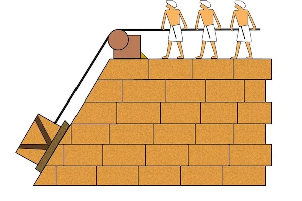
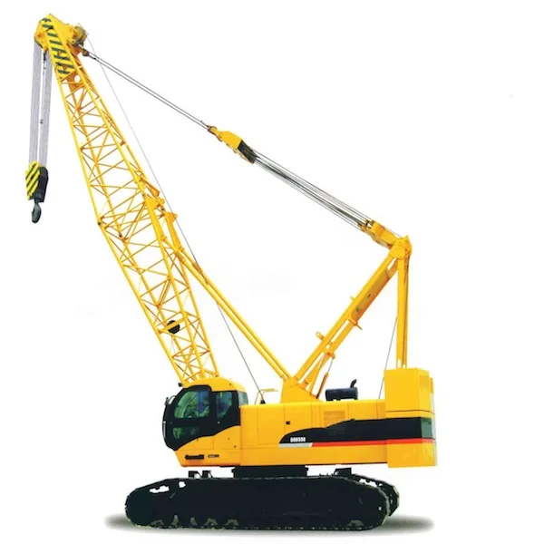
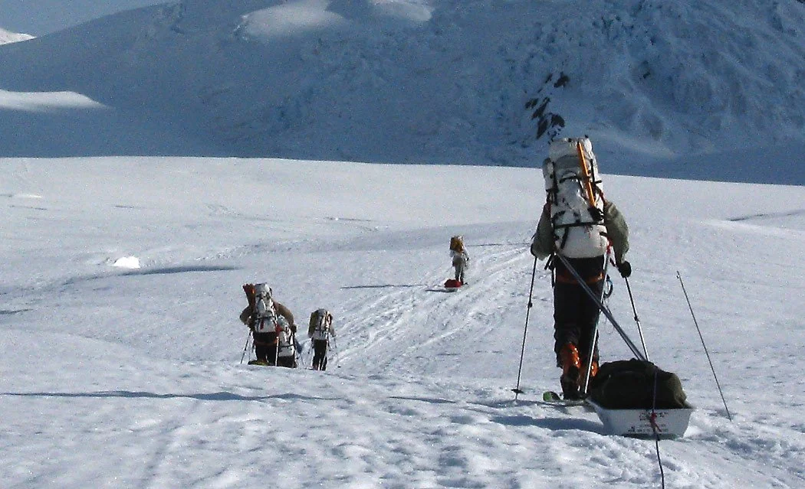
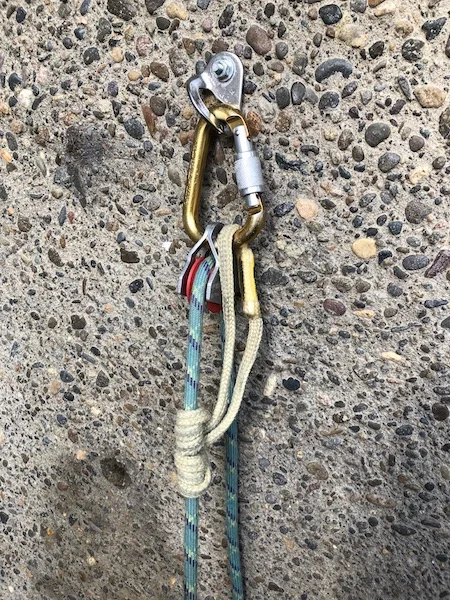
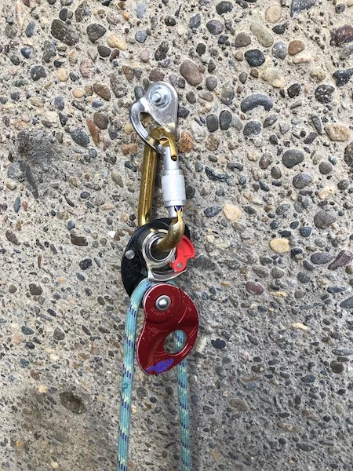

# 机械增益系统入门

- 作者：Alpinesavvy
- 发布日期：2019-02-03
- 原文：[AlpineSavvy](https://www.alpinesavvy.com/blog/introduction-to-ma-systems)

首先要感谢几位非常聪明的人，他们为这一系列文章提供了帮助。向 Barry O'Mahony、Bryan Hall（[Rose City Ropes](https://www.rosecityropes.com/)）、Deling Ren 和 Derek Castonguay 致意。谢谢朋友们！

## 我很忙，注意力也维持不了多久。直接告诉我重点吧？

- 先学会 2:1 和 3:1，练到闭着眼睛都能搭出来。其他所有花哨的系统其实都只是这两者的组合。
- 实际机械增益永远小于理论机械增益，有时甚至小得多——标称“3:1”的系统，实际可能更接近 2:1。
- 能用滑轮就别用锁扣。
- 改变牵引方向会增加摩擦，除非确有必要，否则不要换向。
- 让牵引绳经锚点换向，会增加锚点承受的作用力。
- 锚点上的滑轮只改变牵引方向；装在负载或负载侧绳股上的滑轮才会产生机械增益。
- 棘轮式止回系统（ratchet）的效率可能比你想象的更低。
- 机械增益系统会增加锚点上的力。
- 静力绳比动力绳效率更高。
- 轮盘直径较大的滑轮，效率略高于轮盘较小的滑轮。
- 不要使用超出完成任务所需的机械增益。
- 阿尔卑斯式攀登者和大岩壁攀登者的需求不同，使用的系统也不同。
- 这些文章大体上按由易到难排列，简单的话题在上，进阶的话题靠下。

如果你有些时间，注意力也能维持得更久，而且真想把这些内容学明白呢？

很好，那我们就开始吧。

我永远记得自己第一次接触滑轮的经历。我从小生活的乡下有位名叫 Ray 的邻居，他成天鼓捣汽车。有一天，父亲对我说：“明天早上我们去 Ray 家看看吧，我觉得他有件特别的东西要给我们看。”

第二天，我们走到 Ray 家。他正埋头摆弄一辆停在橡树下的老雪佛兰，树上有一根粗壮的枝干。我看到几段绳索在树枝和汽车之间来回穿绕，却完全不明白那意味着什么。几分钟后，Ray 把一个绳端递给我，说：“好了，开始拉吧。”我双手交替拉绳……然后无比惊讶地看着自己八岁的小胳膊把整台发动机从车里吊了出来！在那短短一刻，滑轮的魔力让我觉得自己成了超级英雄。

机械增益（mechanical advantage，下文通常简称 MA）能够近乎魔法般地放大牵引力，是人类智慧的奇迹之一。仅仅让绳索在锚点与负载之间来回穿绕，就能让你获得提升数倍于自身体重之负载的能力。

各种形式的机械增益都是建造埃及金字塔的关键要素。下图所示，沿坡道向上移动石块就是机械增益的一种应用：负载在水平方向移动数米，垂直方向却只升高一米，因此所需的力更小。

现代起重机利用滑轮组提升极其沉重的负载。

几个世纪以来，人们以各种巧妙的方式应用机械增益！

这一系列文章将深入探讨 MA 的工作原理，以及它在攀登场景中的应用。我们的目标是让所有读者——尤其是没有工程背景的人——从基础内容入手，逐步接触更深奥的知识，最终完整、扎实地理解 MA 滑轮系统及其攀登应用。如果你读完这一系列文章，就称得上专家了！

机械增益系统的知识并非只对攀登者有用。激流漂流和皮划艇运动员也会使用类似的救援系统，因此这一系列文章对他们同样有帮助。

请注意，本文不会重复讲解高山救援或大岩壁拖拽的具体操作；网络和出版物中已有许多资料对这些主题作了充分说明。

## 将负载运到大本营：一种理解 MA 的方式

图片来源：https://wildsnow.com/3368/denali-mckinley-gear-tip/

小型飞机把你和队友送到冰川上。现在有 100 磅（约 50 公斤）装备需要运到第一处大本营。你会怎么做？

如果你足够强壮，可以把所有东西都装进一个大背包（或许再加一副雪橇），一趟全部运走。可以把这种方式称为 1:1：一次移动全部负载。

如果不想一次背太多，可以把装备分成五份，往大本营走五趟，每趟只背 20 磅（约 9 公斤）。可以把这种方式称为 5:1。背包几乎没有多少重量，但同一段路必须走五遍。

更实际的做法或许介于两者之间：把装备分成两半，用两趟运完，每趟背负较容易承受的 50 磅（约 23 公斤）。可以把这种方式称为 2:1。

最终，所有装备都会运到大本营。你并没有神奇地让这 100 磅装备变轻；搬运所需的“功”仍然相同，只是改变了移动负载所花的时间和距离。某种方式一定比其他方式“更轻松”吗？并非如此。

根本问题是：你愿意一次搬 100 磅、五次搬 20 磅，还是两次搬 50 磅？没有唯一正确的答案。

## 先来几个定义。

**机械增益（mechanical advantage，MA）**：指牵引力被放大的倍数。机械增益以 2:1、3:1 等比值表示，读作“二比一”“三比一”。第一个数字表示作用于负载的力，第二个数字始终为 1，表示你施加在绳索上的力。例如，在理论 2:1 系统中，施加 100 磅力（约 445 牛）便可提升重 200 磅（约 91 公斤）的负载；在 3:1 系统中，同样的拉力可提升重 300 磅（约 136 公斤）的负载。神奇吧！

**理论（即“理想”）MA 与现实（即“实际”）MA**：在纸面上的无摩擦世界中，滑轮完美无损耗，绳索也不会伸长，MA 系统可以达到标称效果。但现实并非如此。主要由于摩擦，现实（实际）MA 始终小于理论（理想）MA。（也就是说，理论上的 3:1 实际可能更接近 1.7:1，真够呛！）

**效率（efficiency）**：效率与 MA 密切相关。可以把它理解为：你付出的力气中，有多少真正传递到负载并转化为有用功？效率越高越好，因为这意味着你为克服损耗付出的额外功越少。（说实话，我们大多数人都挺懒的。）在现实环境中，拖拽系统的效率受许多因素影响，包括绳索受力后的伸长、滑轮质量、绳索的摩擦与扭转、拖拽系统需要复位的频率，以及其他一些特殊变量。

**摩擦（friction）**：这是将漂亮的“理论”MA 变成“现实”MA 的主要而又棘手的变量。在 2:1 系统中，理论上施加 100 磅力可以提升重 200 磅的负载；但在现实中，摩擦意味着实际能够提升的负载必然小于 200 磅。遗憾的是，根据器材选择，差距有时会非常大。攀登系统中的摩擦主要来自绳索绕过滑轮或锁扣时的弯折，以及绳索与岩石平台边缘或冰裂缝边缘的摩擦。摩擦不是我们的朋友，应尽可能将其减小。

**定滑轮（fixed pulley）**：连接在锚点上的滑轮或锁扣。它的位置不随负载移动，只用于改变牵引方向，不产生机械增益。

**动滑轮（moveable pulley）**：也称移动滑轮（travelling pulley）或“牵引”滑轮（tractor pulley），也可以用锁扣代替。它以某种方式连接在负载或负载侧绳股上，牵引绳索时会随之移动。动滑轮既改变牵引方向，也产生机械增益。

**进度捕获（progress capture）**：也称棘轮式止回系统（ratchet）。在提升负载时，进度捕获可以确保停止牵引后负载不会回滑。攀登系统通常使用简单的普鲁士抓结（Prusik），或带有抓绳机构的滑轮来实现这一功能。Petzl TRAXION 系列等单向制停滑轮价格昂贵，却十分实用。在阿尔卑斯式攀登中，单向制停滑轮并非必需；在大岩壁拖拽中则是必备器材。后续文章会进一步介绍止回系统。

下面是两种进度捕获方式：简单的普鲁士抓结，以及 Petzl MINI TRAXION 单向制停滑轮（图中器材处于打开状态，以展示抓绳齿）。

进度捕获：Petzl 滑轮，以及用 Sterling HollowBlock 辅绳打成的三圈普鲁士抓结。

进度捕获：Petzl MINI TRAXION
