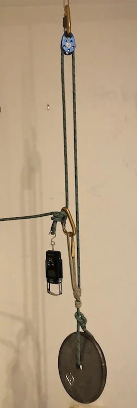
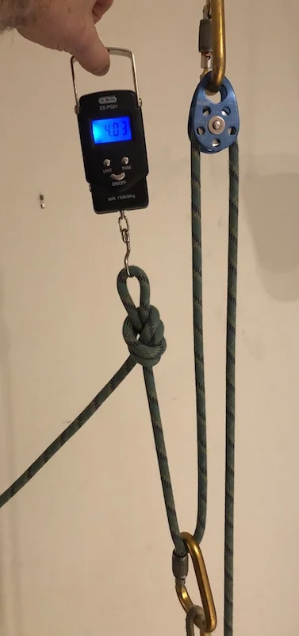
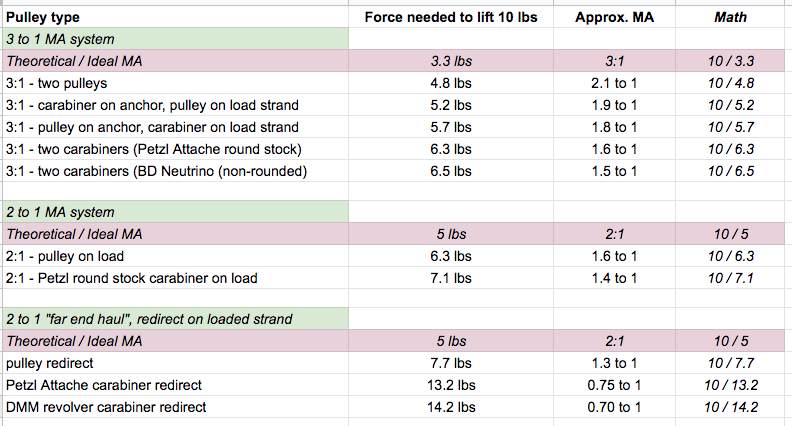

# 现实世界中的机械增益

- 作者：John Godino
- 发布日期：2019-02-03
- 原文：[AlpineSavvy](https://www.alpinesavvy.com/blog//ma-in-the-real-world)

在上一篇文章中，我对通过不同器材换向的 1:1 拖拽做了一些简单测试。现在，我想看看实际采用机械增益系统时，结果会怎样。

我测试了 3:1、2:1，以及 2:1“远端拖拽”（far-end haul）系统的多种架设方式。

下面列出所用器材和测试结果。

器材：

- 约头部高度的锚点
- 10 磅（约 4.5 公斤）的杠铃片
- 两只质量尚可的救援滑轮
- 9 毫米动力攀登绳
- 用 Sterling HollowBlock 辅绳打成的普鲁士抓结，或作为替代抓绳装置的 Wild Country Ropeman
- 数字弹簧秤
- 各种锁扣（圆截面的 Petzl Attache、Black Diamond Neutrino 和 DMM Revolver）

测试 3:1 系统时，我将绳端直接穿过杠铃片并系牢，再让绳索向上通过锚点，然后使用不同器材架设拖拽系统。测试 2:1 系统时，我将一根短扁带环穿过杠铃片，再把绳索扣到扁带环上。

我缓慢、匀速地牵引了数次，并记录弹簧秤上最常出现的读数。

这当然算不上科学测试，但应该足以大致反映不同系统的相对效率。不妨自己复现实验；额外需要的器材只有一个 10 磅重物和一只弹簧秤，后者[在 Amazon 上售价约 11 美元](https://www.amazon.com/gp/product/B00ZWNGZFO/)。

我的测试装置如下：

我们看到了什么？

- 在 3:1 系统中使用两只滑轮，效率最高；但其实际机械增益基本仍只有 2:1。
- 如果只有一只滑轮，应将其装在 3:1 系统的负载侧绳股上，以获得最高效率。
- 圆截面锁扣与非圆截面锁扣的差异不大，有哪种就用哪种。
- 使用滑轮的 2:1 系统，与只使用锁扣的 3:1 系统所需拉力相同。此时不妨选择 2:1，因为相同的牵引行程可以让负载提升更远。
- 远端拖拽系统应使用滑轮；如果使用锁扣，实际机械增益甚至会低于 1:1。
