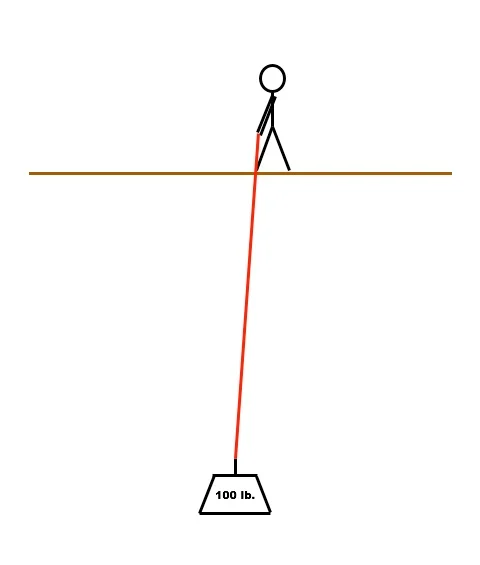
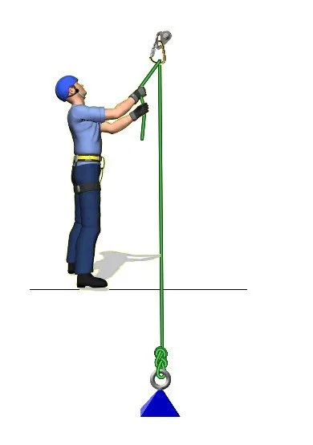
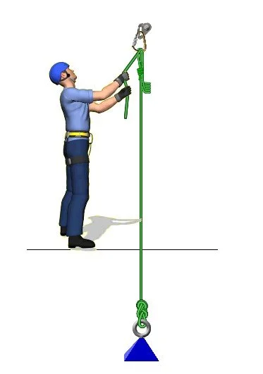
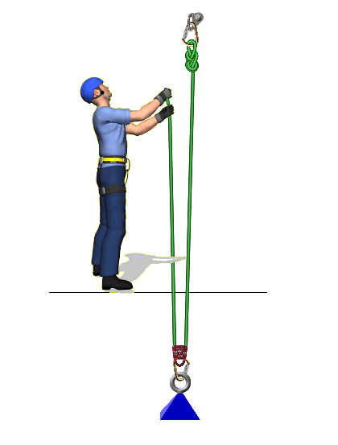
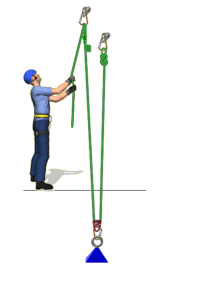

# Overview of a simple pulley system

- Author: John Godino
- Published: 2019-02-03
- Source: [AlpineSavvy](https://www.alpinesavvy.com/blog/overview-of-a-simple-pulley-system)

## Let's start simple.

I don't know about you, but when I start looking at diagrams of complicated pulley systems and 5:1 rescue setups, my eyes get crossed and my brain starts to fog. Good news is, we don’t need to analyze a 5:1. At least not right now. Let’s break this down by starting at the beginning and then working up to a simple MA system, so you can really see how this works.

## The basic 1:1 pull

Sticky the climber needs to haul a 100 pound load up to the ledge. Sticky ties a rope onto the load, and starts pulling. To even budge it off the ground, Sticky needs to pull up with 100 pounds of effort. Sticky pulls 1 foot of rope, and the load rises 1 foot. Sticky has no mechanical advantage or progress capturing, so Sticky’s arms get tired pretty fast!

In this case, it's probably not a good system. But in other situations, it might work just fine. Got a crevasse rescue with five people on top ready to pull? Great! Put prusiks on the rope for everybody, have them clip in, and start pulling, ideally with their legs and bodyweight. Probably no need for anything fancier than this.

Bluehat thinks, “Hmm, how about clip a carabiner to that bolt, and clip in the rope? That way, I can pull DOWN with my bodyweight instead of lifting UP with my arms, and I won't get so tired. That should be easier, right?”

## The 1:1 pull with a redirect carabiner

Does Bluehat gain any MA with this setup? No. He changed the direction of pull, but because the direction change is on the fixed anchor, he did not gain any MA. He’s still pulling a 1:1, just like before, just with the rope now moving down instead of up. He pulls 1 foot of rope, and the load rises 1 foot. This carabiner on the anchor is called a “redirect”, because it, umm, redirects your direction of pull.

Does he get an easier pull? Maybe. He can now use gravity and pull down using bodyweight rather than lifting up with his muscles. Pulling down is usually easier than pulling up! But the redirect adds a lot of friction. By running the rope through a carabiner, which is only about 50% efficient, he'll have to pull down with 150 pounds of force to move the 100 pound load.

Which is better, 100 pounds lifting straight up, using your arm muscles, or 150 pounds, pulling down, using your bodyweight? There's really no right answer. It depends on how far you need to move the load, your weight, and your strength. (Personally, I'll take 150 pounds with the redirect pulling down, thank you very much.)

Does he need a bomber anchor for the redirect? Yes! When Bluehat is pulling, the force on the anchor is approximately twice the force they’re applying to the rope, or about 300 lbs. Which introduces a good general rule of thumb: a redirect on the anchor increase the load on the anchor.

## The 1:1 pull with a redirect carabiner and progress capture prusik

Bluehat thinks, “Well, it is easier pulling down with my bodyweight, but if I ever let go, this load is going to zing all the way to the ground again. How about I put a prusik on the load strand so I can take a rest?”

Excellent idea! This is known as a progress capture (aka “ratchet”). It allows the load to move up, but whenever Bluehat wants to let go and rest, the prusik keeps the load from sliding back down. (If you want to get fancy, you could use a progress capture pulley here, such as Petzl Traxion.)

## The 2:1 pull

Bluehat thinks, “OK, time to start working smart instead of working hard!” He clips one end of the rope to the anchor, puts a pulley on the 100 lb. load, runs the rope through the pulley, and starts hauling. Now he’s getting somewhere!

Does Bluehat gain any MA with this setup? YES! He’s now pulling with a 2:1 mechanical advantage. Look how the load is distributed on the rope. 50 pounds goes to the anchor, and 50 pounds goes to him. So, if he pulls with 50 pounds of force, the load will rise! He has to pull 2 feet of rope to move the load 1 foot.

Does he get an easier pull? Well, it depends how you look at it. In theory, he only has to pull with 50 pounds of force to move the load, which is good. But, he needs to pull twice as much rope, which is not so good. In the end, he's doing the same amount of “work”. Would you rather lift 100 pounds 10 times, or 50 pounds 20 times? In the end you’ve still moved 1,000 total pounds, it's all the same.

Here's another way to think about it: work equals force times distance. You're doing the same amount of work in the end, lifting a given load the required distance. But with a mechanical advantage system, you use a lower force to move the load over a longer distance.

How’s he doing for efficiency? Great! By using a quality pulley on the load, he can lift the load with much less effort. Way better than the carabiner with a 1:1 redirect.

## The 2:1 pull with redirect and progress capture prusik

Bluehat thinks, “Well, this is definitely easier to pull, but my arms are still getting tired. Let's put a redirect on the anchor, and a prusik on the load strand.”

Now we're getting somewhere. He’s lifting with 2:1 MA, and added a ratchet prusik so he can take a break whenever he needs to without dropping the load. Nice!

This, right here, is the foundation of mechanical advantage systems. All the fancy stuff in the rock or crevasse rescue books that makes you go cross-eyed? It's all just adding and stacking additional redirects and pulleys in different variations on top of pretty much what we just saw.

## Now, the above diagrams might appear to be overly simplistic. But if we break them down, we can learn some important principles that apply to any flavor of simple or compound pulley systems.

- Changing the direction of pull at the anchor does NOT add mechanical advantage.
- Changing the direction of pull at the load (or the load strand) DOES add mechanical advantage.
- Even if a change of direction at the anchor does add friction, it might make your pull easier, depending on your own personal strength, body weight, and the weight of the load you need to move.
- A redirect on the anchor increase forces on the anchor. Be sure your anchor can handle this.
- Try to minimize friction at every change of direction by using a pulley rather than a carabiner whenever possible.
- Adding a progress capture / ratchet means your load will not slide back down if you stop pulling.
- In the end, the “work” you do is the same with an MA system. You move the same amount of weight over the same distance. So, in a sense it's not necessarily “easier” to move the load all the way up, you just get to pull less weight on each stroke.
