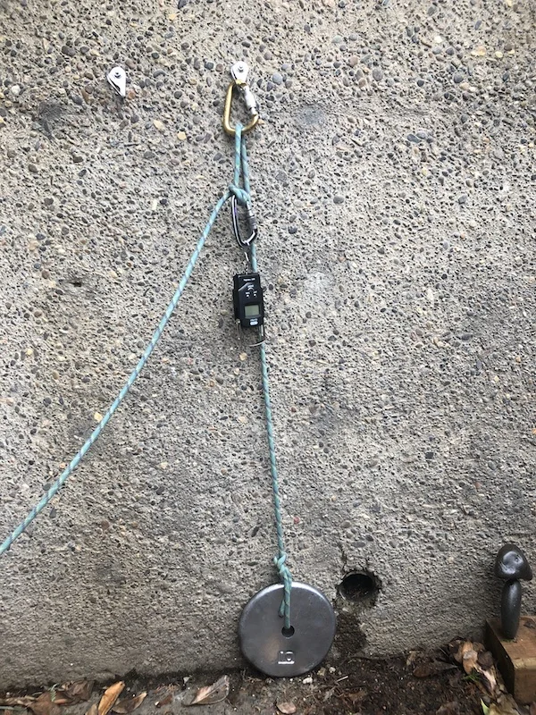
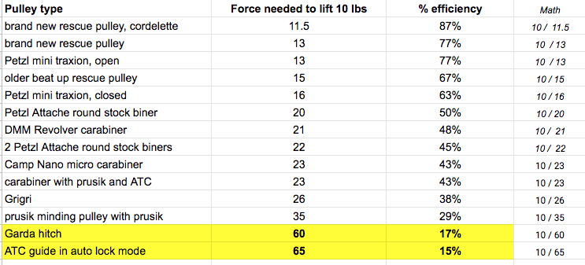
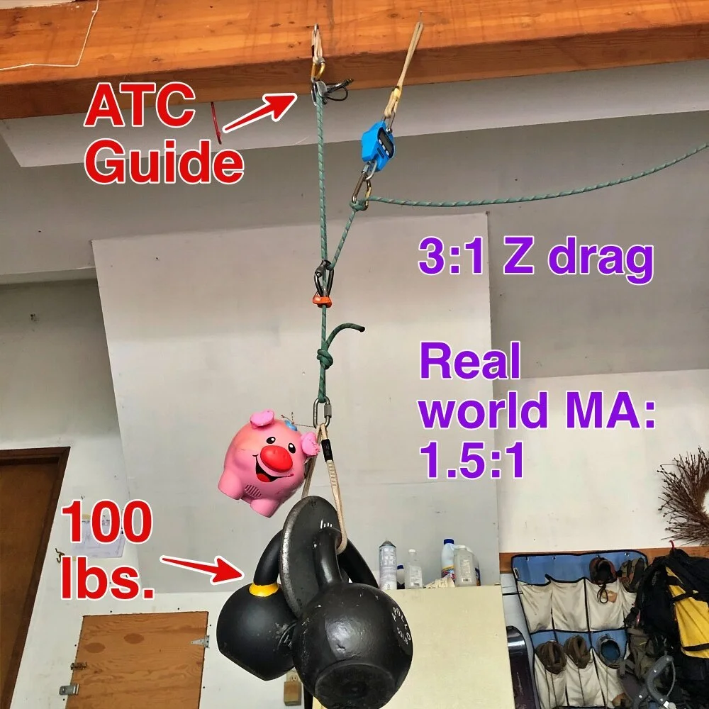
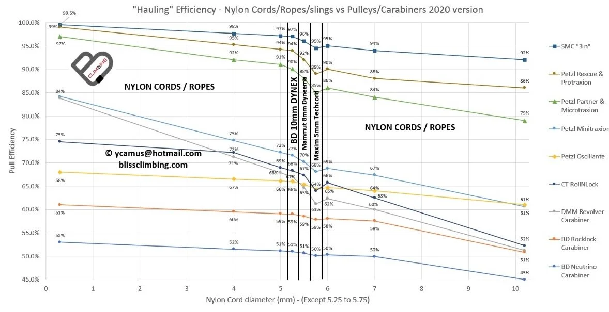

# Progress capture - efficiencies of various devices

- Author: John Godino
- Published: 2019-02-03
- Source: [AlpineSavvy](https://www.alpinesavvy.com/blog/progress-capture-efficiencies-of-various-devices)

So, we have more than few options for Progress capture / ratchet devices. But which one’s best, in terms of minimizing evil friction in our MA systems?

I did a few studies on the efficiency of different pulley, carabiner and ratchet systems, and found some to be dramatically better than others.

It's important to note that the efficiency of the ratchet varies a lot on your rigging. If it's a progress capture for a 1:1, the efficiency might be terrible. But, if it's a progress capture for a 3:1, the efficiency can be much better.

Here’s how I set up my 1:1 study.

- All 1:1 pull with a redirect through the anchor, no mechanical advantage
- Fixed anchor point around head level, could be pretty much anything
- About a 9 mm dynamic rope
- 10 pound barbell plate
- Various types of pulleys / ratchets clipped to anchor point
- Inexpensive spring scale from Amazon, about $11, cloved to the pull rope, Link: https://www.amazon.com/gp/product/B00ZWNGZFO/

The set up looks something like this. The scale is cloved hitched to the left side "pull rope".

I set up the pulley or ratchet, then slowly pulled the spring scale to raise the weight and noted the scale reading during the steadiest pull I could manage. The measured force is approximate as I used a cheap spring scale, but I think it’s accurate enough to give a rough idea of efficiencies.

I tested pretty much every flavor of pulley or ratchet mechanism that I owned.

All of the pulling force listed below is for a 1:1 redirected pull of a 10 pound weight.

## Here’s a summary of the raw data.

## and here’s a bar chart:

## Here are some takeaways.

- Never use a garda hitch or ATC in guide mode as the ratchet in a 1:1. Friction is HUGE, it took about 60 lbs of pull to move a 10 lb weight! (If this is your only option as a progress capture, you’re probably better off setting up a separate 2:1 on the load to lift it, and then when the rope has some slack, use the hitch or ATC to capture the progress of the loose rope.)
- Pulling force of round stock vs "I-beam" carabiners is pretty similar, not really noticeable in the real world.
- DMM Revolver carabiners did not seem to reduce friction very much, comparable to a plain round stock carabiner in this study. (They were actually worse.)
- 2 identical carabiners side by side did not change the friction much compared to a single carabiner.
- If a prusik is jamming in your pulley even a little (as I had), it adds noticeable friction.
- Using a 5.5 mm Spectra cordelette gave better efficiency than a 9 mm diameter climbing rope. This gave the best efficiency of 87%.
- Pulley ratings from manufacturers are probably calculated under ideal lab conditions, and not under real world testing conditions like I tried to model.

As I covered in [this article, "Progress capture options"](https://www.alpinesavvy.com/blog/progress-capture-options), things are quite a bit different with a 3:1. Surprisingly, using an ATC guide or similar device, or a Grigri as a progress capture introduces no significant amount of friction into the system, at least according to my limited testing.

I tested this with both a 10 pound load and a 100 pound load. The efficiencies were just about the same with each one. A 3:1 Z drag set up with just carabiners at the change of direction gets a real world mechanical advantage of about 1.5 to 1.

Check out the photo below. You would think that ATC Guide would had a ridiculous amount of friction, right? In fact, it doesn't really add any at all.

Finally, we have this interesting chart created by Yann Camus of [BlissClimbing](https://blissclimbing.com/en/). (Shared here with permission from Yann. He’s an expert in rope soloing, and if you want to learn this from someone who's been there done that, Yann would be an excellent choice.)

It shows a few interesting general concepts: The smaller diameter cord, the greater the efficiency. The largest diameter pulley, 3 inches, gave the highest efficiency. The DMM revolver carabiner was slightly better than a regular carabiner, but not nearly as good as a proper pulley. (If you're squinting at this graph on a phone, it's easier to see on a desktop / larger screen.)

image: https://blissclimbing.com/en/
