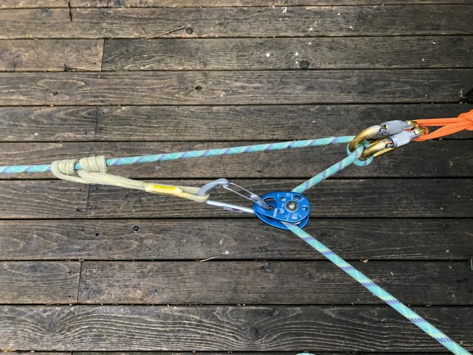
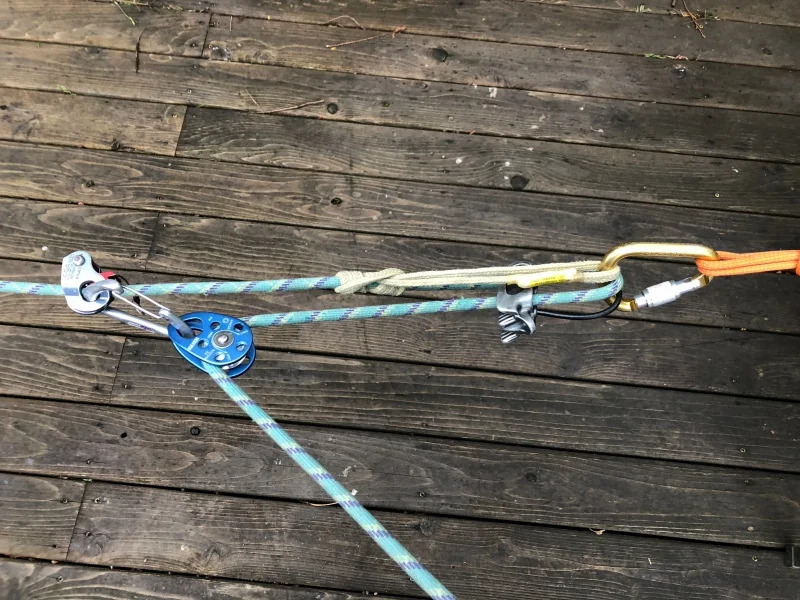
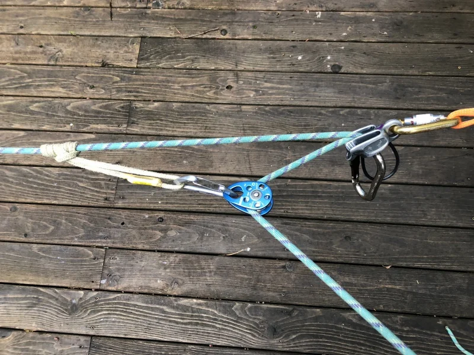
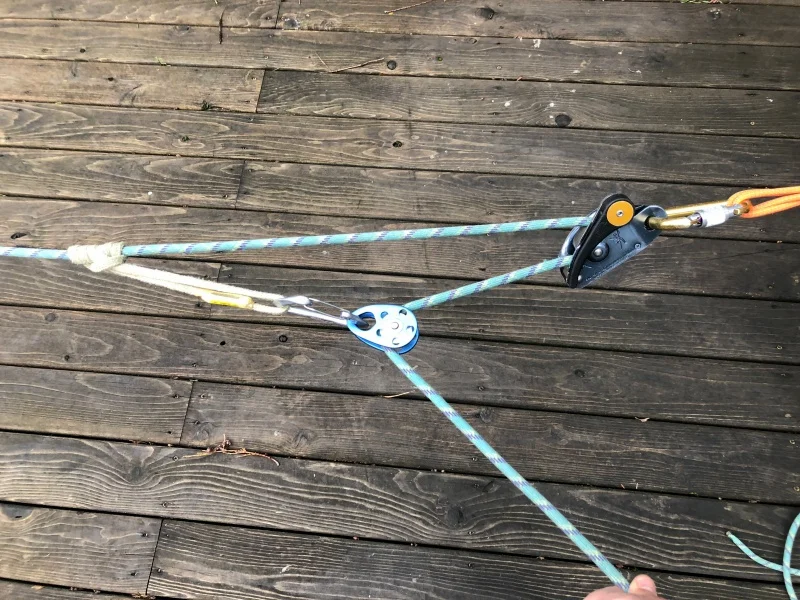
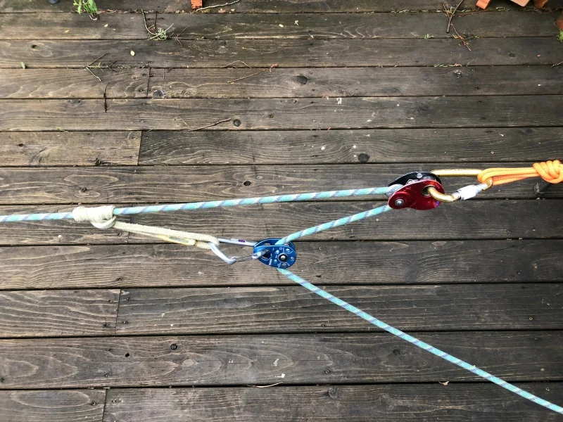
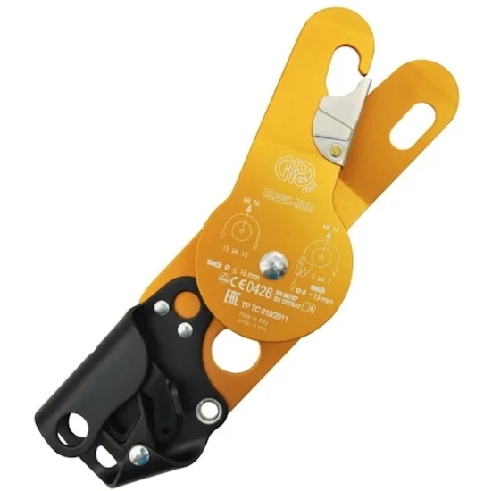

# 进度捕获的几种方案

- 作者：John Godino
- 发布日期：2019-02-03
- 原文：[AlpineSavvy](https://www.alpinesavvy.com/blog/progress-capture-options)

进度捕获（progress capture，也称单向制停或 ratchet）是拖拽系统的关键环节。它使你可以停止施加拉力，以便休息或复位系统，同时防止负载回落。

进度捕获有多种实现方式。以下是几种常见方案，按成本和／或重量由低到高排列：

- Garda 结（Garda hitch）
- 普鲁士抓结（prusik）
- 导向型保护器（plaquette-style device，如 Black Diamond ATC Guide 或 Petzl Reverso）
- Grigri
- Petzl Traxion

来看看它们的优缺点。

注意：尤其对于冰裂缝救援，务必在真实环境中练习这些不同的进度捕获系统。它们在客厅地板上能够正常工作是一回事；承受很大张力、内部又塞满积雪时表现如何，可能完全是另一回事。

[我测过这些系统的效率，并写在了这里。](https://www.alpinesavvy.com/blog/progress-capture-efficiencies-of-various-devices)

## Garda 结

优点：不花钱，也不增加重量。（目前听起来不错！）缺点：即使架设正确，锁扣仍可能偏斜，导致绳结无法锁止；因此在我看来，它并不是最可靠的系统。此外，它还会产生巨大的摩擦，使拖拽费力许多。我个人或许会把 Garda 结用于提升背包等非关键任务；除非实在别无选择，否则不会在救援中使用。[这里有更多关于 Garda 结的介绍。](https://www.alpinesavvy.com/blog/try-the-garda-hitch-for-quick-hauling)（没错，我知道 Garda 结最好不要使用丝扣锁扣；照片中的做法并不理想，抱歉……）

## 普鲁士抓结

这是经典做法，至今仍常为向导、救援队和消防部门等采用。优点是价格低、重量轻，而且几乎可以用任何合适的绳环材料临时制作。缺点是：如果普鲁士抓结在主绳上收紧，就会增加牵引摩擦。拖拽时应让抓结保持松弛，但在救援的混乱和压力下，这一步很容易被忽略。除非使用普鲁士抓结自理滑轮（Prusik-minding pulley，简称 PMP），或安排一个人守在旁边担任不怎么讨喜的“抓结看管员”，又或者操作者协调性足够好，能同时完成拖拽和抓结管理，否则普鲁士抓结可能被卷入滑轮，引发各种问题。此外，每次停止牵引时，除非有人把抓结推回负载方向，否则负载会因普鲁士绳环本身的长度和伸长而回落一段距离。复位滑轮时，这可能让你损失约一英尺来之不易的提升距离。（困在冰裂缝里的搭档绝不会喜欢因此被放低一两英尺。）

这里有一个老派的绳索妙招（Crafty Rope Trick，CRT）：如果没有普鲁士抓结自理滑轮，锚点处只能使用锁扣，可以先让绳索穿过 ATC 一类的管状保护器，再扣入锁扣。保护器可以阻止普鲁士绳环被拉进锁扣。这个方法的效果出奇地好，不妨试试。见下图。

## Black Diamond ATC Guide

（或类似的导向型保护器。）将这类保护器设置为自动锁止保护模式（autolocking belay mode，也就是向导模式）后，牵引时绳索可以通过装置；一旦松手，装置便会立即锁止。优点是停止牵引时不会损失已提升的距离。如果原本就在用 ATC 以向导模式保护跟攀者，那么把系统转换为 3:1 拖拽非常简单。缺点是需要额外一件器材，而你未必随身携带，尤其是在冰川攀登中。

我对此做过一些非正式测试。令人意外的是，它并不会增加明显的摩擦。此前，我把 ATC 单独用作 1:1 进度捕获系统中的换向装置时，测得其效率极低，只有约 15%；因此我原以为这种低效率也会出现在 3:1 系统中。所幸事实并非如此。

我分别使用 10 磅（约 4.5 公斤）和 100 磅（约 45 公斤）的负载进行了测试。两种情况下的实际机械增益都相同，约为 1.5:1；这与只使用锁扣、完全不设进度捕获装置时基本一致。

我不能完全确定，但大概知道原因。开始牵引时，ATC 处会产生少量松绳，使绳索以极小的张力通过 ATC，因而不会产生额外摩擦。我不是工程师，这也只是一项观察性测试，但在我看来，这应该就是它表现不错的原因。

## Grigri

Grigri 的工作方式与导向型保护器非常相似，优缺点也基本相同。攀岩时你很可能随身带着一个，但在冰裂缝救援中通常不会携带。Grigri 还有一项优势：可以带载释放；如果出于某种原因需要卸除张力，这会很有帮助。

如上文讨论 ATC Guide 时所述，我也测试了 Grigri 的实际效率。结果与 ATC Guide 相同，也与直接让绳索通过锁扣时基本一致。换言之，它不会引入明显的额外摩擦。我同样分别使用 10 磅和 100 磅的负载进行了测试，两种情况下结果相同。

使用 Grigri 进行进度捕获时，实际机械增益约为 1.5:1。这是个好消息：可以直接用平时随身携带的 Grigri 捕获进度，而且它不会显著增加摩擦，也不会让系统的实际机械增益进一步降低。

## Petzl Traxion

这些小装置把高效率滑轮与类似上升器的弹簧加载抓绳机构结合在一起，既能让牵引轻松顺畅，又不会损失提升进度。优点：工作可靠，效果出色。缺点：价格约为 100 美元，着实肉疼！（依我看，对于不常使用的救援器材来说确实有点贵……）Traxion 有多个型号，包括 Micro、Mini（下图是我拥有的 Mini，现已停产）和 Pro。用于阿尔卑斯式攀登时，应选择 Micro Traxion。

如果要在大岩壁上以 1:1 系统拖拽较重的吊包，最好选择轮盘直径稍大的滑轮，以小幅提高效率。Kong Block Roll 是大岩壁攀登者常用的一款单向制停滑轮。（我自己没有，但听说非常好用。）

