# 滑轮系统分析

- 作者：Tuomas Pöysti（为 RopeLab 撰写）
- 发布日期：2019
- 原文：[RopeLab](https://www.ropelab.com.au/pulley-system-analysis/)

RopeLab 的好友 Tuomas Pöysti 撰写了这篇文章，介绍他对滑轮系统分析的一些思考。

## 前言

我对滑轮系统的兴趣，超过了它们作为实用工具所应得的程度。如果你读到这里却不明白这有什么用，那就别读了，去做点对你更有用的事。如果这个星球上除我之外还有哪怕一个人觉得这篇文章在智识上有启发性，我的工作就值得了。

专家读者可能会注意到，本文背后的文献研究并不充分。我不能说自己在科学数据库中做过像样的检索，也只读过寥寥几本设有滑轮系统专章的教材。对非专家读者而言，更重要的是认识到：这项工作并非建立在坚实且经过同行评议的既有研究基础上——如果真要称得上科学，本应如此。请不要被那些花哨的词语误导。说到用词，本文的一些术语很可能不同于业内惯用说法，只是我并不了解。任何建议都十分感谢。

希望我这显然不是母语水平的英语，不会进一步增加理解难度。这里提出的想法其实并不难，我也努力追求明确无歧义的表达，避免使用没有必要的术语。不过我承认，自己本可以做得更好。如果你努力理解、也确实想理解，却仍未弄懂，请来问我。最后，向所有有毅力读完全文的人致敬。

## 范围与定义

滑轮是一种绳索架设器材，理想情况下，它能使绳索改变方向而不影响绳中张力——也就是说，滑轮两侧的绳索张力必然相等。现实中的滑轮当然并不理想，但可以通过引入效率值在一定程度上加以处理。图 1 是一个滑轮示意图，其效率为 P（0 < P < 1）。当绳索右侧受到力 F 张紧时，滑轮内部、绳索内部以及二者之间可能存在的摩擦，使得只有 P * F 的力能通过滑轮传递到左侧。现实中，使用尼龙绳和尺寸合理的滑轮时，效率 P 通常约为 0.8。

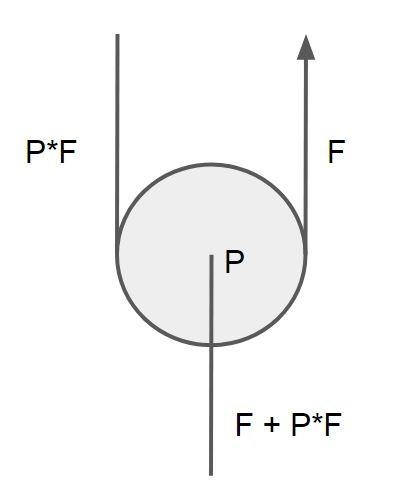

注意，图 1 中的标记不是矢量；箭头表示绳索的移动方向，或表示从哪一侧张紧绳索。这一点很重要，因为它决定了哪一侧的张力更大。图中以标量表示力，力的方向需要根据示意图判断。在这个例子中，滑轮静止不动，因此作用在滑轮上的向下合力必然等于 F + P*F。这种架设本身也是一种简单的滑轮系统，通常称为 V 或 V-rig（V 形系统）。

滑轮系统一般而言是滑轮与绳状元件的任意组合。对滑轮系统的另一个最低要求可以是：它应具有单一自由度，意味着所有元件的位置彼此之间都无歧义地关联，尤其与某个特定元件——这里称之为输入元件——的位置相关联。（见后文关于复位的说明。）输入元件是力/能量施加到系统上的那个元件。

滑轮系统的另一个特殊元件是输出元件，负载就连接在它上面。滑轮系统的目的是让输出元件处的力（Fo）大于输入元件处的力（Fi）。Fo/Fi 这个比值就称为机械增益（mechanical advantage，MA）。

理想 MA 基于“所有滑轮效率都等于 1”的假设，此时每个滑轮实际上都会使力加倍。本文为简洁起见，常省略“理想”一词。现实中的 MA 可称为“有效 MA”（effective MA），既可通过在输入元件和输出元件上安装测力传感器来测量，也可通过计算求得；后一种情况在本文中特称为“计算 MA”（calculated MA）。上图所示 V-rig 的理想 MA 为 2:1；其输出力如前所述为 F + PF，若写成相对于输入力 F 的倍增系数，则计算 MA 为 1 + P。有效 MA 与理想 MA 之比，就是滑轮系统的效率。下图展示的是一个简单的理想 3:1 系统，也称 Z-rig（Z 形系统）。两个滑轮分别标为 P1 和 P2。图的右侧将系统拆分为若干元件。拆分方式有多种；这里的原则是把各自独立运动的部分分开。

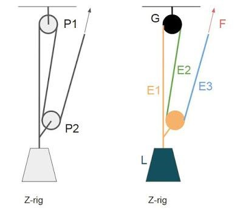

理想情况下，滑轮系统的所有绳状元件都应共线；但出于实际原因，现实中的系统并非如此，示意图中更不可能完全共线。也就是说，拉动输入元件时，每个元件不是向上运动，就是向下运动。本文把向上运动定义为正方向，向下运动定义为负方向；静止的元件 G（ground，固定端）在这个意义上为中性。如果输入元件与输出元件的运动方向相反，该滑轮系统就是变向系统（direction-changing system）。

同样，本文中滑轮也根据其朝向标记为正或负。P1 是负方向，P2 是正方向。见图 3。

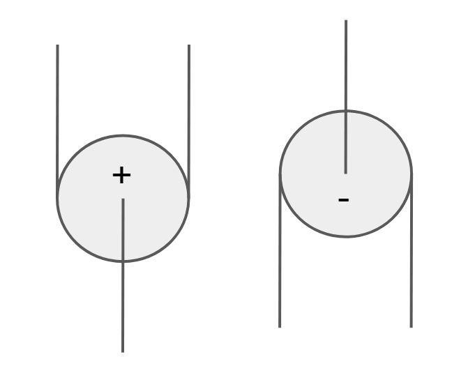

本文只关心那些能进行受力分析的滑轮系统。这通常意味着，除了单一自由度的要求外，力路径在系统内部以某种特定方式分叉。为了让本文保持相对简单，略去形式化定义。

关于讨论范围，最后再说明一点：复位（resetting）问题不影响本文的大部分分析。这里不考虑行程距离（stroke distance）、系统收拢速率（collapse rate）等实际问题。图 2 中的滑轮 P2 完全可以通过抓绳器或绳结连接到元件 E1，因为受力分析只需假想系统发生一小段位移。

## 受力分析

图 4 展示了一个我称之为"5:1 冰裂缝"（5:1 crevasse）的滑轮系统，尽管我已想不起这个名字的出处，现在它似乎也不太常见了。总之，这个三滑轮、理想 5:1 的系统按如下方式分析：假设输入元件上受力 F，然后向输出元件方向推进，计算每个元件上产生的力。为简化，字母 F 用 1 代替，于是所有得到的项都是力 F 的倍数。有时也用字母 T（表示张力 tension），整个方法可称为 T 方法（T-method），但这只是记法不同。

每当绳索绕过一个滑轮，绕过滑轮后的力都等于绕过前的力乘以该滑轮的效率。在本例中，灰色绳索各段的张力因此分别为 1、P2 和 P1P2（均为力 F 的倍数）。每当两个元件共同牵引另一个元件，后者所受的力就是前两者的力之和，例如 1 + P2。另一个汇总受力的位置，是 David Fasulo 在书中所称的“牵引点”（tractor）：P3 在这里连接到从 P1 向下延伸的元件。将 1 + P2、P3 + P2P3 和 P1P2 相加，即得到该滑轮系统的计算 MA。

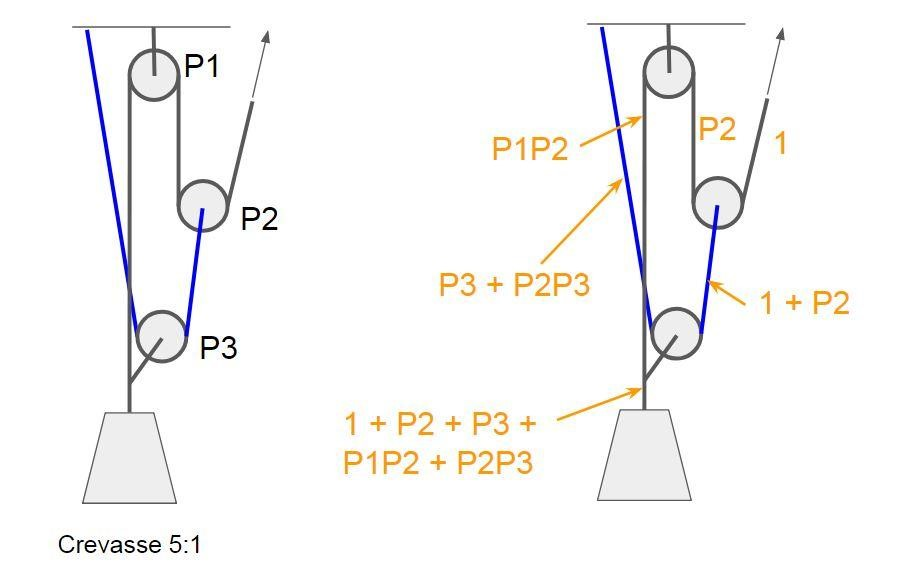

让我们研究一下这个结果。首先，输出力由五项组成。考虑到每个 P1、P2、P3 都满足 0 < Px < 1，每一项（"1"除外）的取值范围都是 0…1。也就是说，总和的最大值是 5（当 P1=P2=P3=1 时），每一项的最大贡献是 1。

那么这些项代表什么呢？从第一项"1"说起：它只出现在不改变拉力方向的滑轮系统中，也就是输入元件与输出元件同向运动的系统。如果你想象所有滑轮都极差——差到结果就是三股绳之间的刚性连接——这就说得通了。这正是滑轮效率为 0 的情形。即使在这种极端情况下，计算 MA 表达式中含"1"项的滑轮系统，其 MA 也等于 1，跟一根直绳一样。

继续这个思想实验，逐个锁死滑轮。可以发现，每一项都对应一个子滑轮系统，也对应能量通过整个系统的一条可能路径。

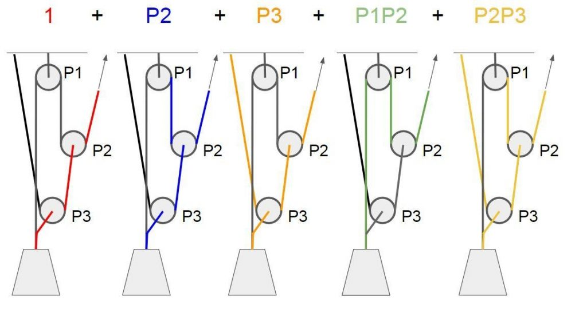

与项"1"相关的红色路径已经解释过了。P2 类似于一个 V-rig（2:1），P3 也是。P1P2 对应 Z-rig，P2P3 对应 4:1 的"V on V"。

## 关于各项

还可能有别的什么项？P1 是一个显然的候选。再回到思想实验：如果我们锁住滑轮 P2 和 P3，让 P1 滚动也得不到任何好处，所以它对系统没有任何影响。进一步说，项 P1 应当对应一条只流经滑轮 P1 的路径。否则效率 P2 或 P3 也会出现在该项中。而一个像 P1 这样的负方向滑轮，怎么可能成为能量路径上唯一流经的滑轮——毕竟滑轮是改变力方向的唯一手段？我现在不打算更正式地证明这一点：

如果滑轮系统不是改变方向的，负方向的滑轮绝不会单独作为一项出现在计算 MA 中。更一般地说，与输入元件方向不同的滑轮不会单独出现。

让我们对另外几个滑轮系统做同样的事。图 6 展示了一个 9:1 的"Z on Z"及其变体 11:1。两者都不改变拉力方向，所以都应有"1"这一项。此外，它们分别应有 9 项和 11 项，且 P1 和 P3 项应缺席。

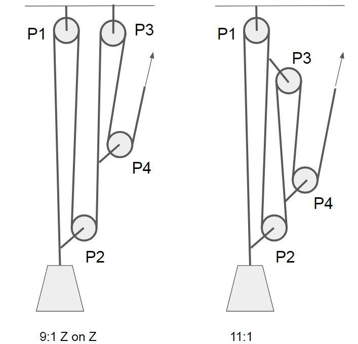

分析得到的计算 MA：9:1 为

1 + P2 + P4 + P1P2 + P2P4 + P3P4 + P1P2P4 + P2P3P4 + P1P2P3P4

11:1 为

1 + P2 + P4 + P1P2 + P1P4 + P2P4 + P3P4 + P1P2P4 + P1P3P4 + P2P3P4 + P1P2P3P4

除了第四个滑轮之外，这里还有新东西。项 P1P2P3P4 意味着现在存在一条穿过所有滑轮的路径，这在 5:1 情形中是没有的。这里出现了从 0 次（项"1"）到 4 次（P1P2P3P4）不同次数的项。

一个项会重复出现吗？我认为这是不可能的，虽然我同样给不出严密而形式化的证明。但那将意味着两条独立的能量路径流经完全相同的滑轮序列。

那么，是否会出现 P1P1、P2P2P2 这样的幂项，也就是同一滑轮在一项中出现多次？同样，这里没有严密的形式化证明；但要出现这种项，就必须存在一条两次经过同一滑轮的能量路径，而每个滑轮中只穿过一根绳索。

所以，留待日后由更聪明的人来证明，我们先作为一个前提接受：

由若干滑轮效率相乘构成的每一项，在计算 MA 表达式中至多出现一次（前提 1）。此外，每个滑轮的效率在同一项中也至多出现一次（前提 2）。

由此推出：使用 N 个滑轮时，单个项中滑轮效率的最大个数是 N。一个项是至多 N 个效率值的乘积，因此项的最高次数是 N。（可能的）零次项与 N 次项之间的其他次数，是滑轮的组合，如"P1P3P4"等。到四次为止的可能项如下：

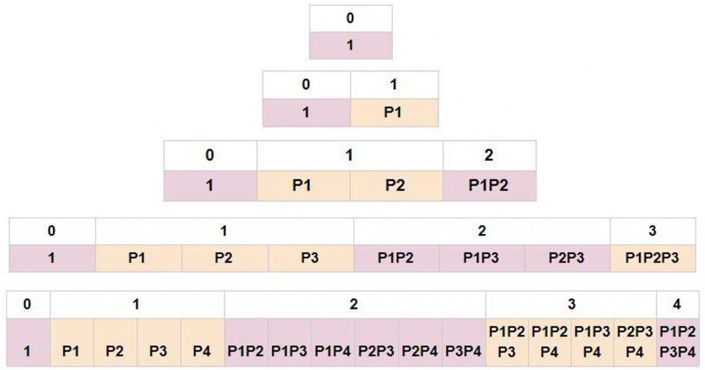

幸运的是，这是个熟悉的结构。数学家几个世纪前就已了解它，虽然后来一位名叫 Pascal 的白人获得了大部分赞誉——这就是帕斯卡三角（Pascal's triangle），由不同次数的二项式系数排列而成。不必被它吓到；这至少意味着，无论向下延伸多少行，我们都知道每一行有多少项。第 N 行的项数为 2^N（最顶端为第零行）。

所以，如果上述前提成立，计算 MA 表达式中的最大项数——也就是用 N 个滑轮搭建的系统所能达到的最大理想 MA——为 2^N。第一行：零个滑轮能组成什么滑轮系统？答案是一根绳，其 MA 显然为 1。第二行：使用一个滑轮时，似乎存在两种系统，即 V 与倒置 V。前者的理想 MA 为 2；后者仅改变牵引方向，理想 MA 为 1。两者的计算 MA 分别为 1 + P1 和 P1。倒置 V 没有零次项“1”，因为它是变向系统；其负方向滑轮则构成一次项 P1。

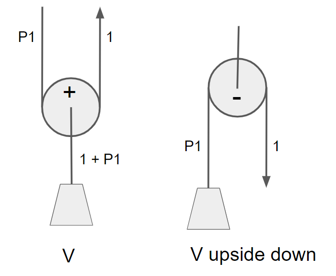

第三行，也就是使用两个滑轮的系统，又如何呢？至少有著名的 Z-rig，即简单 3:1（1 + P2 + P1P2，见图 2），以及图 8 所示、理想 MA 为 4:1 的“V on V”（也称 piggyback）。后者也可以倒置，构成一个理想 3:1 的变向系统。倒置后没有零次项“1”，因为它改变了牵引方向；也正因如此，尽管相应滑轮为负方向，表达式中仍同时包含一次项 P1 和 P2。

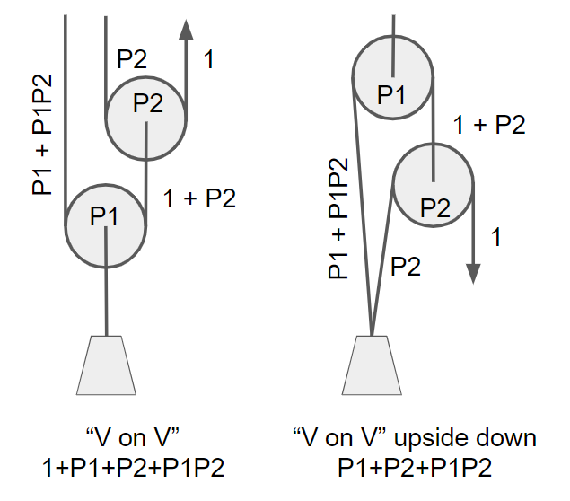

看来 V 和“V on V”很擅长囊括所有可能项。仔细想来，所有线索都指向这一结论。N 个滑轮可达到的最大理想 MA 为 2^N，这意味着每增加一个滑轮，都必须使 MA 加倍。所有滑轮还应与输入元件同向，才能产生所有一次项。我同样不打算正式证明，但很可能除了“V on V on V on……on V”之外不存在其他解。至少可以确定：无论 N 是多少，都存在一种使用 N 个滑轮、MA 为 2^N 的系统。

让我们研究几个三滑轮系统，看它们如何填满格子：

- 冰裂缝 5:1，见图 4
- 简单 4:1，见图 9
- 7:1（双）海员式（mariner），见图 9
- V on Z 及其逆序，见图 9
- V on V on V 及其倒置，见图 9

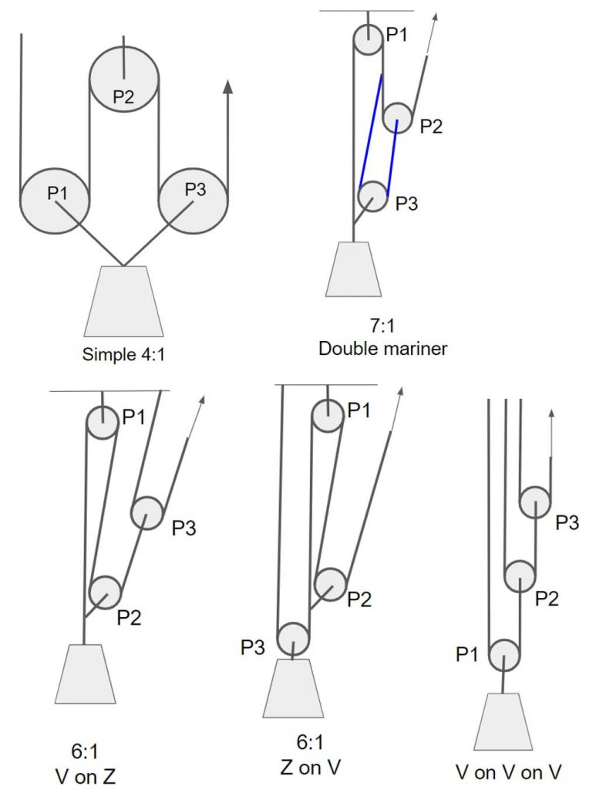

这些滑轮系统的计算 MA 包含以下各项：

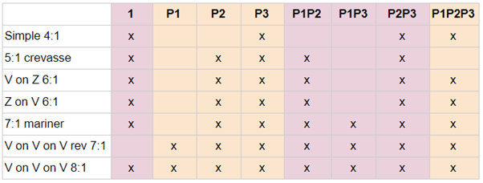

这里有几点值得说明。“V on Z”和“Z on V”很好地表明，不同的滑轮系统可能具有完全相同的计算 MA 表达式。这也多少体现出一种趋势：越靠近输入元件的滑轮，在各项中出现得越频繁。滑轮如何编号当然完全取决于定义；我习惯把最明显会充当进度捕获装置（progress capture device，PCD）的滑轮标为 P1，而它通常离输入元件较远。可以看出，P2 和 P3 往往出现在更多项中。

## 滑轮系统效率

那么，我们希望表中的勾出现在哪里呢？如果滑轮都有 0.8 这一不错的效率，各项对计算 MA 的贡献如下（蓝色一行）。这张表针对四滑轮系统；三滑轮系统同理，只需忽略多出的项。

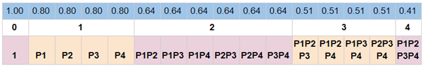

在各滑轮效率相同的情况下，决定每一项数值的只有该项的次数。果然，每个数值都等于 0.8 的相应次幂。例如，四次项的数值约为一次项的一半。滑轮系统的计算 MA，就是所包含各项数值之和。如果再增加一行（绿色）列出累计和：

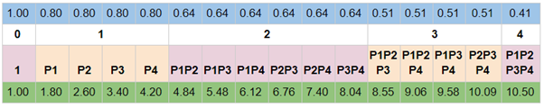

可以看到，当滑轮效率为 0.8 时，零次项和一次项贡献了计算 MA 的 40%。高次项代表穿过多个滑轮的能量路径，由此可以清楚看出多次经过滑轮造成的能量损失。

如果存在不同的滑轮呢？一个有现实意义的情形是：用一个很差的"滑轮"当 PCD，比如 Petzl I'D。如果我们计算 P1 = 0.3、P2=P3=P4=0.8 时的各项值，得到：

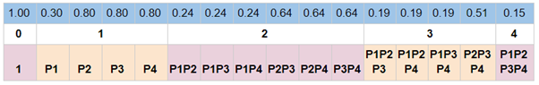

可以看出，只有包含 P1 的项受到影响。不含 P1 的三次项，其数值甚至高于包含 P1 的二次项。

来看一个实际例子：Z-rig 使用效率分别为 0.8 和 0.7 的两个滑轮。P1P2 的值为 0.8 * 0.7 = 0.56，计算 MA 为各项之和，即 1 + 0.7 + 0.56 = 2.26：

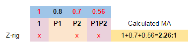

让我们研究四个滑轮系统：

- 简单 5:1，见图 10
- Z on Z 9:1，见图 6
- 11:1，见图 6
- V on V on V on V，类比前面定义的 8:1，见图 9。

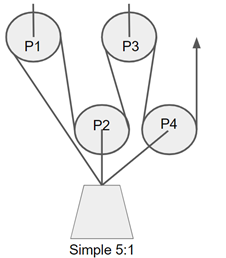

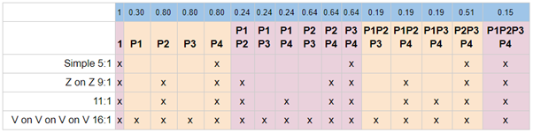

5:1 延续了简单 4:1 的规律：简单系统在每个次数上似乎只包含一个项。相同次数出现多个项，似乎源于滑轮系统的某种“复杂性”（complexity）。按照这一说法，复杂滑轮系统中，有些滑轮并非只连接在固定端或输出元件上；因此，系统内会出现运动速率不同于输出元件的动滑轮。这是个有趣的切入点，不过暂且按下不表。

还可以看到，PCD 天然为负方向，而且“离手较远”（即离输入元件较远），这在此处反而很有利。与 9:1 相比，11:1 显然多出 P1P4 和 P1P3P4 两项，而两项都会被 P1 的低效率削弱。从蓝色一行可读出：11:1 的计算 MA 为 5.4，9:1 则为 5。换言之，为使 MA 增加 8%，必须接受从系统中多拉出整整 2/9，即 22% 的绳索。

实际使用中还会遇到严重的系统收拢速率问题，也就是必须频繁复位，但这不在本文讨论范围之内。不过，从实用角度不难看出，新增的两项效率很差：11:1 中新增的滑轮连接点会牵引绳索通过低效的 P1，所以它所贡献的力必然都会被 P1 削弱，正如表中所示。

这引出一个重要观点：必须清楚，我们一直是按滑轮数量——以及由此决定的理论最大理想 MA——对系统分类，而不是按各系统本身的理想 MA 分类。因此，把表格填满只是一项目标偏学术性的追求；实际应用中，更应关心勾选的是哪些项。例如，使用三个效率均为 0.8 的滑轮时，若以最大化有效 MA 为目标，理想方案当然是构造一个计算 MA 表达式为 1 + P1 + P2 + P3 的 4:1 系统。我们已经知道三个滑轮都必须为正方向，读者不妨尝试构造。我猜这样的滑轮系统并不存在；不过我仍不打算证明这一点，如果有人能举出反例，我会非常高兴。

继续探究哪些组合实际可行，会很有意思。即使是这种最优的“只含零次项和一次项”的情况，也存在限制：最大计算 MA 只能达到 1 + NP，其中 P 为各相同滑轮的效率，N 为滑轮数量。例如，使用三个效率为 0.8 的滑轮时，这种最优系统的计算 MA 为 1 + 3 × 0.8 = 3.4，即 3.4:1；这个假想系统的效率则为 3.4 / 4 = 0.85。

如果我们找到优化低次项时的规则和极限，这个效率上限很可能会低得多。例如，如果四滑轮系统在其计算 MA 中必然至少有一个二次项，那么 MA 的最大值（仍用 0.8 效率的滑轮）将是 1 + 0.8 + 0.8 + 0.64 = 3.24:1，效率 0.81——而我猜连这个都偏乐观。走着瞧。

## 样例

下面研究“冰裂缝”5:1（图 4）和“海员式”7:1（图 9）的若干变体。二者有一个共同结构：一个连接在固定端（或锚点）、功能类似 PCD 的负方向滑轮，一个正方向的第二滑轮，以及输出元件处的一个牵引点（tractor）。用不同的小型系统替换主系统中的 x 段，便可以定义这两种系统以及更多变体，见图 11。

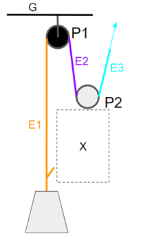

已知的这些系统分别使用固定端 G 和 E2 作为系统 x 的内部锚点（姑且这样称呼）。x 似乎只有一种不需要内部锚点的变体：若以一段固定连接直接连接 P2 与牵引点，令 x 为 1:1，就会得到 Z-rig。“冰裂缝”系统以 2:1 V-rig 作为 x，并以 G 作为内部锚点；7:1 海员式系统则以 E2 取代 G，使 MA 表达式增加两项。

什么样的元件可以用作内部锚点？同样，不声称有形式化证明，我假定：

- x 内部的负方向滑轮不能连接到主系统的正方向元件上
- x 内部的正方向滑轮不能连接到主系统的负方向元件上
- x 内部的负方向元件不能连接到主系统的正方向元件上
- x 内部的正方向元件不能连接到主系统的负方向元件上

也就是说，x 内部任何倾向于向下拉的元件或滑轮，只能连接到主系统中向下运动的元件或地面上等等。这个提议只是个草图，它是否成立对下文无关紧要。

图 12 展示了一组满足这些条件的四滑轮系统。对于 x，这些系统用了我能想出的所有非变向两滑轮系统，以及各自的全部内部锚定组合。

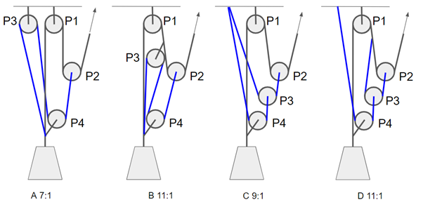

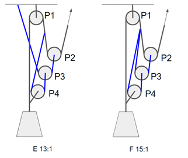

它们的各项如下：

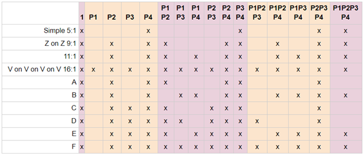

如果所有滑轮的效率相同，只需统计各次数分别有多少项即可：

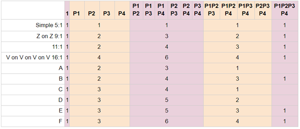

请注意，这些数字不能直接比较，因为每个滑轮系统的项数总和——也就是系统的理想 MA——各不相同。将各次数的项数除以该系统的项数总和进行归一化，就能得到可相互比较的数值，表示每个次数在各系统中所占的权重。把这些系统按便于观察的顺序排列，可得下图：

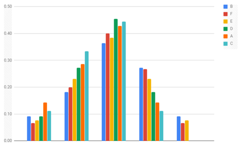

一次项与三次项尤其呈现出明显的对称性。总体趋势也很清楚：有些滑轮系统的权重更多落在低次项上，另一些则更依赖高次项。B-F-E-D-A-C 这一顺序实际上与内部滑轮系统 x 的锚定方式有关：B 和 F 只使用元件 E2，E 和 D 同时使用 E2 与 G，A 和 C 则只使用 G。该图很好地说明了：通过连接到运动元件来增加 MA，增加的可能主要是高次项。毫无疑问，从“冰裂缝”5:1 改为双海员式 7:1（图 4、9），或从 9:1 改为 11:1（图 6）时，理想 MA 增加 2，也会产生类似结果；前文讨论 9:1 与 11:1 时已简要提到这一点。通俗地说，与直接牵引负载相比，使用内部滑轮系统拉动绳索通过另一个滑轮，会产生更多高次项。

还可以从另一角度进行归一化。二次项的柱形最高并不意外，因为其允许的最大项数也是最高的，为 6。若将各次数的项数除以该次数允许的最大值（1-4-6-4-1），就能看出每个次数的可能项被占用了多少：0 表示没有任何一项，1 表示所有可能项都存在。

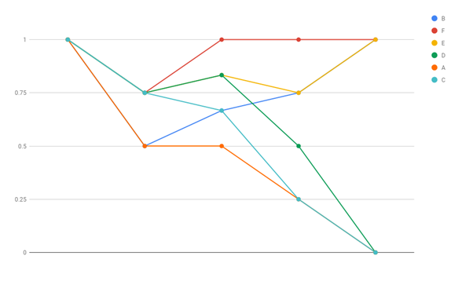

我尤其感兴趣的是，在这组滑轮系统中，三次项把系统分成两类：B、F、E 有三至四项，其余系统只有一至两项；四次项也呈现相同的分组。B 显得格外糟糕：低次项的占用率下降，到高次项又重新上升。“A”和“C”表现最好，其项的占用率与次数几乎呈负线性相关。

## 一个实用发现？

既然从数字上看"A"如此可行，让我们再研究一下。它的理想 MA 是 7:1，双海员式（Double Mariner）也是。双海员式其实是 Petzl 为冰裂缝救援建议的，所以至少有人觉得它在实际中可行。

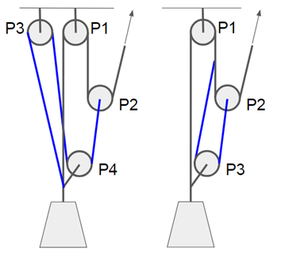

当然，双海员式（DM）比"A"少一个滑轮。仍然可以把它们的项放在同一张表里——DM 只是所有含 P4 的项都缺席：

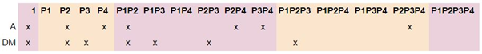

首先，我们看到两者每个次数的项数相同（1-2-3-2-0）。这意味着如果滑轮相同，它们的计算 MA 也相近。这对 DM 有利，因为它需要的滑轮少一个。当然，除非所有滑轮都是锁扣，那样差异就不是大问题了。

但"A"对 P1 的依赖更小（出现一次，DM 是三次），如果 P1 是个低效的 PCD，这可能造成差异——比如 I'D、Grigri 或向导模式下的 ATC。让我们试着对 P1 取效率 0.3、其余取 0.8。"A"的计算 MA 是 4.63:1，DM 得到 3.91:1。好吧，公平地说："A"仍需三个 0.8 的滑轮，而 DM 两个就够。

那么，用一个 0.3 效率的 PCD 和两个 0.8 滑轮，再在"A"的第四个滑轮处用一把锁扣呢？"A"对 P3 最不敏感（出现一次），所以试着把它换成一个 0.5 效率的锁扣：我们得到计算 MA 4.2:1——仍优于 DM。

只用锁扣和一个发涩的 PCD 当滑轮呢？对 P1 取 0.3、其余取 0.5：DM 2.65:1，"A"2.78:1。这大概可算平手。

所以，就计算所得的机械增益而言，“A”至少不逊色。但在实践中，滑轮系统还有其他重要因素，例如复位。首先，DM 有两个抓绳器需要在复位时照看，而“A”只有一个。其次，DM 的复位频率比“A”高三分之一。这里不展开完整计算，但可以算出：在滑轮走完整个可用行程时，“A”可将负载提升该行程的三分之一（见图 18），DM 则只能提升四分之一。

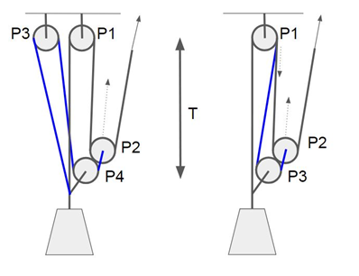

这当然是理想化。但我相当确信现实世界更偏爱"A"。如果你试过复位时要照看两个抓绳器的滑轮系统，你就明白了。

## 结论

受力分析即 T 方法是有效的，这点毋庸置疑。把滑轮效率当作系数来处理、而不是立刻把它们算成数字，这种做法也讲得通。它有助于理解，比如说，该把你的好滑轮放在哪里。在某些情况下，如果听众准备好了，它可能是一个不错的教学工具。

这种分析方法实际上也是量化滑轮系统的一种可行手段。当然，正如前文指出的，这种参数化并不能唯一确定一个系统；换言之，多个不同的滑轮系统可能具有相同的项组合。但若只考察滑轮系统效率，这种方法已经足够。图 19 是一张用于计算滑轮系统效率的电子表格截图。只需分析系统，以 1 标记表达式中实际存在的项，再填入各滑轮的效率（绿色单元格）即可。这张表非常简单。

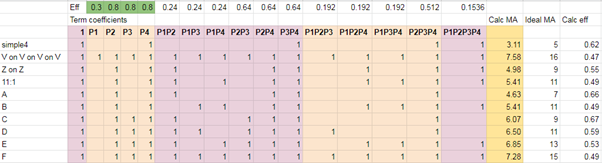

这种分析可用于比较不同场景下的不同滑轮系统。例如，使用 Micro Traxion 作为 PCD，与使用向导模式下的 ATC 相比，结果会有很大差异。借助这张表，可以针对现有器材快速找出最优方案。当然，遇到紧急情况或一般的实际需求时，不会有人现场掏出电子表格；但事先用它分析过之后，或许就能在脑中调用这些结论。大多数人只需遵照成熟做法操作，这完全没问题；这个工具更适合教练使用。

## 简要总结

1. 定义你感兴趣的滑轮系统。画出它的示意图，把滑轮标为 P1、P2 等。
2. 按常用的 T 方法分析滑轮系统，但不要把绳索绕过滑轮后的张力仍视为“1”，而要计入效率：张力 1 绕过效率为 0.8 的滑轮后变为 0.8，再绕过另一个效率为 0.8 的滑轮后变为 0.64。实际推导时不要代入具体数值，而应保留代数形式，例如以 P1 代替 0.8、以 P1P2 代替 0.64；其中 P1、P2 分别是滑轮 1、滑轮 2 的效率。见图 4。
3. 最终你应得到类似 1+P2+P1P2 的计算 MA 表达式，其项数与滑轮系统的理想 MA 一样多。乘积中应只有 P1、P2、P3 等的组合；每个滑轮在一个项中至多出现一次（如果有的话）。例如，使用三个滑轮，可能的项是 P1、P2、P3、P1P2、P1P3、P2P3 和 P1P2P3。也可以有"1"，当滑轮系统不改变拉力方向时出现。总共有 2^N 种可能组合，其中 N 是滑轮个数。
4. 存在一个计算 MA 表达式中含所有可能项的滑轮系统，即"V on V on V"（等等，每加一个滑轮就再加一个 V）。见图 8 和 9。
5. 例如，图 2 中定义的 Z-rig 的计算 MA 是 1+P2+P1P2。如果你想给 P1 和 P2 代入具体值，例如 P1=0.8、P2=0.5，你得到 1+0.5+0.8*0.5 = 1.9。所以该 Z-rig 的计算 MA 是 1.9:1。
6. 可以看出，无论滑轮多差，这个例子中的计算 MA 都不会低于 1。这是因为在 Z-rig 及其他不改变拉力方向的滑轮系统中，总有输入张力（1）施加在负载上。即使滑轮完全卡死、效率为 0 也一样。
7. 还可以看出，现实中的高次项必然小于低次项。以 Z-rig 为例，“1”是零次项，P2 是一次项，P1P2 是二次项。只有在所有 P 都等于 1 的理想情况下，无论多少个 P 相乘，乘积才始终为 1。现实中，如果各滑轮效率均为 0.8，各次数项的值将依次为 1、0.8、0.64、0.51，等等。
8. 在 Z-rig 中，P1 只出现在一个项里，而 P2 出现在两个项里，因此就效率而言，Z-rig 对 P2 更敏感。那条著名规则“把最好的滑轮放在离手最近的位置”，根源就在这里。如果把第 5 点中的 0.5 与 0.8 两个滑轮互换，计算 MA 将变为 1 + 0.8 + 0.5 * 0.8 = 2.2:1。

© Tuomas Pöysti, 2019
http://www.kiipeilytuomas.fi/category/articles-in-english/
