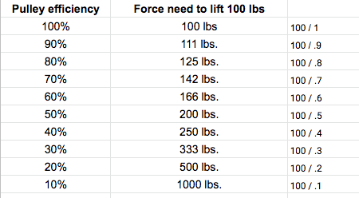
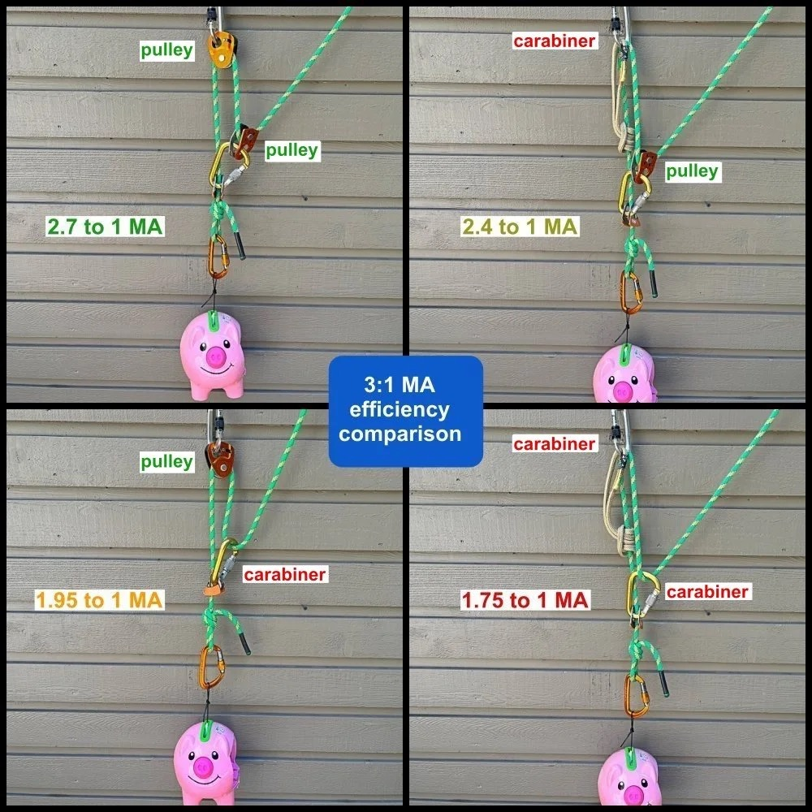
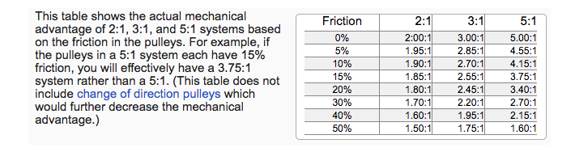
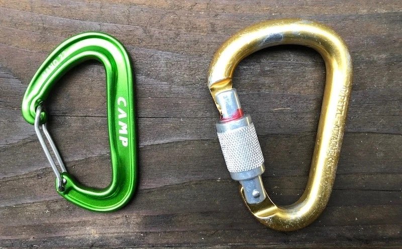
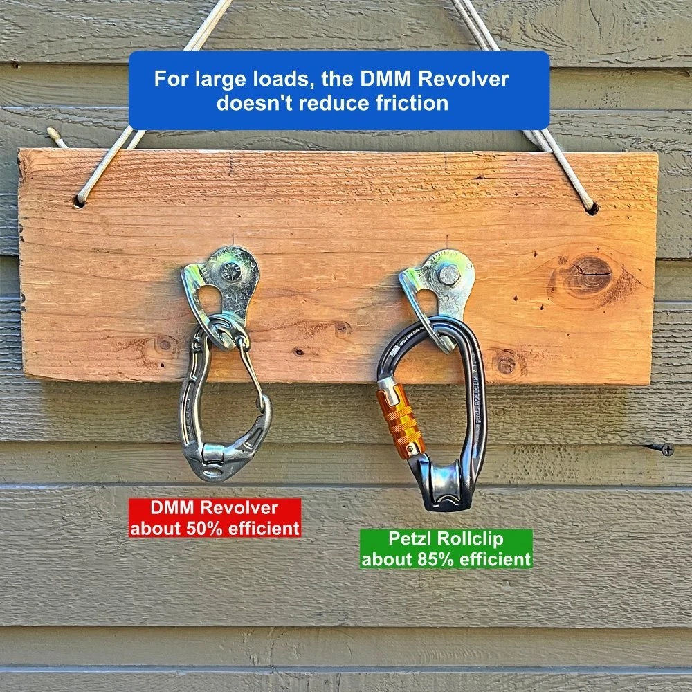
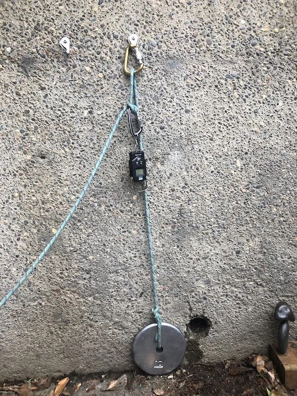

# 滑轮与锁扣——区别有多大？

- 作者：John Godino
- 发布日期：2019 年 2 月 3 日
- 原文：[Alpine Savvy](https://www.alpinesavvy.com/blog/pulley-vs-carabiner-whats-the-difference)

## 你可能会问：在拖拽系统中使用滑轮还是锁扣，真的有那么大差别吗？

**简短回答：差别可能非常大。只要有条件，就使用滑轮。** [前面的 Sticky 图示已经说明过这个问题](https://www.alpinesavvy.com/blog/overview-of-a-simple-pulley-system)，但这一点十分重要，值得快速复习。

假设你要使用 1:1 系统提升 100 磅（约 45 公斤）的负载，并让绳索通过一只高质量滑轮换向。标准救援滑轮的效率通常约为 90%。**此时需要施加 111 磅力才能移动负载。**（计算方法为 100 ÷ 0.9。）

如果改用锁扣为同一个 100 磅负载换向，效率大约只有 50%。**此时需要施加 200 磅力才能移动负载。**（计算方法为 100 ÷ 0.5。）

## 那么，用滑轮时施加 111 磅力，还是用锁扣时施加 200 磅力？不难选择！

---

下面是一张滑轮效率表。你可能在另一篇文章中见过，但它很重要，所以这里再次列出。表中数据适用于通过换向点的 1:1 拖拽。（如果上一句让你摸不着头脑，[请先阅读这篇文章。](https://www.alpinesavvy.com/blog/overview-of-a-simple-pulley-system)）

---

## 上面说的是 1:1 换向拖拽。那么 3:1 拖拽系统呢？

**问得好。请看下面四张照片的对比。**

- 左上：效率最高，两处都使用效率为 90% 的滑轮。机械增益（MA）约为 2.7:1，基本已是实际所能达到的最佳水平。
- 右上：进度捕获位置使用锁扣，“牵引”（tractor）位置使用滑轮。MA 约为 2.4:1，仍然不错。
- 左下：进度捕获位置使用滑轮，“牵引”位置使用锁扣。MA 只有约 2:1，令人失望。
- 右下：两个位置都使用锁扣。MA 很差，只有约 1.8:1。

**关于这张图的几点想法……**

- 计算采用 90% 的滑轮效率和 50% 的锁扣效率。*（没错，有几处做了四舍五入，请别在数学上跟我较真。）*
- 显然，把滑轮装在最靠近施力手的位置，效率最高。
- 很多人认为滑轮应当始终放在最靠近负载的位置，这显然并不正确。

---

**下面这张图表对不同的系统做了更深入的比较。**

**如果一套 3:1 机械增益系统只使用效率为 50% 的锁扣，实际 MA 将只有约 1.75:1，真糟糕！**（而且仍要付出 3:1 系统固有的行程代价：每拉动 3 英尺〔约 0.9 米〕绳索，负载只能上升 1 英尺〔约 0.3 米〕，但所需拉力却比应有水平更大。）

**在这种情况下，使用一只优质滑轮架设 2:1，可能比用锁扣架设 3:1 更合适！** 从图表可见，摩擦损失为 20%（即滑轮效率为 80%）的 2:1 系统，其实际 MA 为 1.80:1；而只使用锁扣的 3:1 系统，实际 MA 仅为 1.75:1。

**所以，只要有可能，就用真正的滑轮。**

*图片来源：https://roperescuetraining.com/physics_friction_raising.php*

---

## 如果不得不用锁扣，哪种最好？

多年来我经常听到一种说法：采用圆截面棒材（round stock）的锁扣，通常比截面较窄、采用工字梁结构（I-beam）的新式锁扣效率更高。但事实果真如此吗？如果是，差距有多大？

**左边是一只 Camp Nano 锁扣，右边是一只老款的 Petzl Attache 锁扣。**

---

## 那 DMM Revolver 锁扣呢？

DMM Revolver 锁扣是一件设计巧妙的装备：在标准非锁锁扣底部装有一个很小的滚轮。Revolver 的设计目的是在领攀时减小绳索阻力，而不是在拖拽沉重负载时充当正规滑轮。

**许多人认为——或者说希望——可以借助 Revolver 减轻救援装备的重量，但遗憾的是，这行不通。**

据我理解，它的滚轮过小，在承受较大负载时会受到挤压，最终效率与普通锁扣相差无几。我的实际测试结果约为 50%。

**如果想用锁扣与高质量滑轮的组合器材拖拽沉重负载，可以考虑 Petzl RollClip 或 DMM Revolver Rig。** 这类产品底部的滑轮尺寸更大、结构更可靠，承重时能够发挥预期作用。休闲攀登者很少使用，但它们是绳索架设和救援专业人员的常用装备。

我在网上找不到任何正式的测试能说明这个问题，于是决定自己做一个小型的观察性实验。

**器材**：

- 10 磅（约 4.5 公斤）的杠铃片
- 数字弹簧秤（约 11 美元，[我用的是这个](https://www.amazon.com/gp/product/B00ZWNGZFO)）
- 9 毫米动力绳
- 老款 Petzl Attaché 锁扣（圆截面）
- 新款 Camp Nano 锁扣（工字梁结构）
- 崭新的救援滑轮

我把杠铃片系在绳索一端，让绳索通过螺栓锚点上的锁扣，组成一套带换向的 1:1 系统；然后在牵引侧绳股上用丁香结（clove hitch）连接另一把锁扣，再把弹簧秤挂到这把锁扣上。

我尽量沿竖直方向缓慢、匀速地牵引，并记录秤上最常出现的读数。凡是超过 10 磅力的部分，都反映了系统的效率损失。

- 使用救援滑轮所需的力（基准）：**13 磅力——效率 77%**
- 使用圆截面锁扣所需的力：**20 磅力——效率 50%**
- 使用工字梁结构锁扣所需的力：**23 磅力——效率 43%**

*（算式：10 / 13 = 0.77；10 / 20 = 0.50；10 / 23 = 0.43）*

**因此，使用圆截面的 Petzl 锁扣拖拽确实稍微省力。**（值得注意的是，这一结果与常见的“锁扣效率约为 50%”完全吻合。）

**实际使用时，能感觉到这部分额外的效率损失吗？** 我不确定。不过，如果可以在工字梁结构锁扣与圆截面锁扣之间选择，就应选择圆截面锁扣。每一点改善都有帮助，对吧？

（另外，纯粹出于好奇，我把两把完全相同的 Petzl Attache 锁扣并排架设。提升负载需要 21 磅力，与只使用一把 Petzl Attache 锁扣时基本相同。在这个例子中，多加一把锁扣并没有明显增大或减小摩擦。）

还有一个已经深入工程学、超出我专业范围的概念，叫作“摩擦系数”（coefficient of friction），是衡量材料有多“滑”的技术指标。根据我有限的阅读，钢与铝的摩擦系数不同，**因此钢锁扣产生的摩擦似乎会小于铝锁扣。** 我手边没有钢锁扣，否则也会测试一下；那应该很有意思。

## 所以，总结一下：有滑轮就用滑轮！
