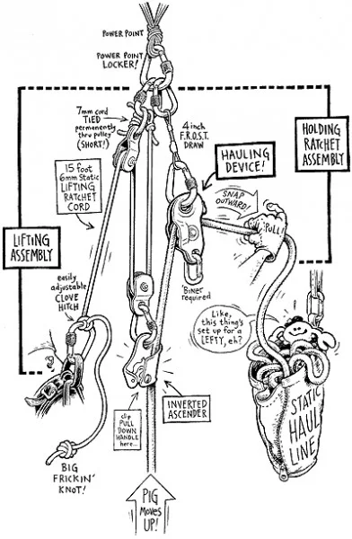
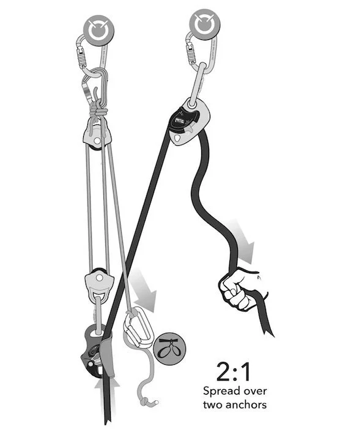
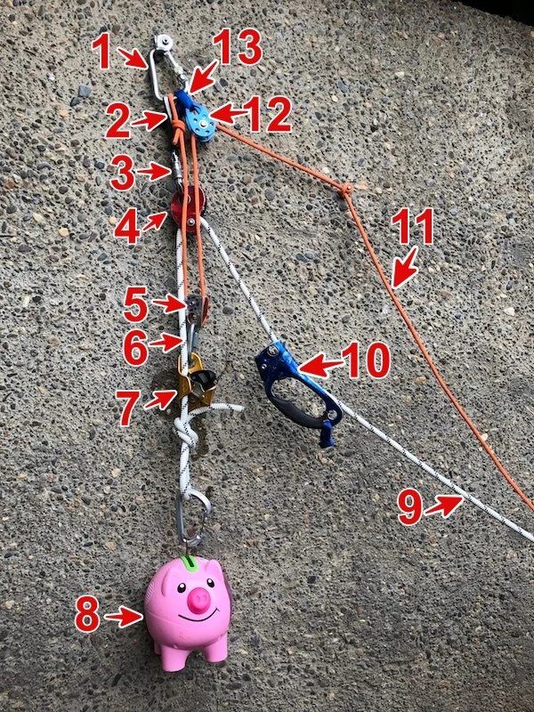
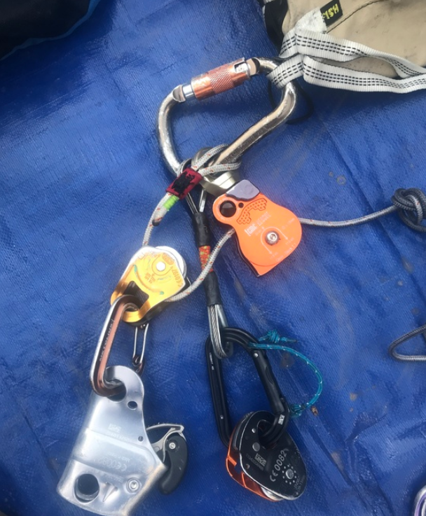
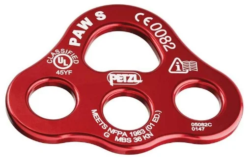
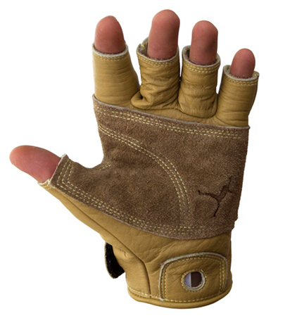

# The 2 to 1 “Z pull” haul, explained

- Author: John Godino
- Published: 2018-12-17
- Source: [AlpineSavvy](https://www.alpinesavvy.com/blog/the-2-to-1-z-pull-haul-explained)

Credits for this idea, as best I can. The 2:1 Z pull haul is generally attributed to Chongo, a legendary Yosemite dirtbag who was famous for extended vertical camping trips on El Capitan with ridiculously large loads. Pete Zabrok, also no stranger to multiple week outings on the captain with huge loads, popularized it via a 2004 Tech Tip in Climbing magazine, and now climbers such as [Mark Hudon](https://hudonpanos.com/) have refined it further.

This technique is explained nicely in the comprehensive aid climbing manual “Hooking Up, by Pete Zabrok and Fabio Elli, highly recommended for all big wall climbers!

A few words on hauling, from the excellent book [“Higher Education” by Andy Kirkpatrick.](https://www.amazon.com/Higher-Education-Big-Wall-Manual/dp/1999700597)

> “Hauling is potentially one of the most dangerous aspects of big wall climbing. This translates to ultra-caution in all parts of your hauling system and interaction with bags, haul lines, docking cords, and pulleys. If you rush and make a mistake, drop a load or have it shift where it's not wanted, you could easily kill someone or yourself. I try and teach climbers to view their bags as dangerous creatures, like a great white shark, rhino, or raptor that is in their charge. The ability to keep them calm and under your control comes down to paranoia, foresight, and heavy respect for the damage they can do.”

Think before you act. Before you connect or disconnect anything, always think a step or two ahead and anticipate what will happen and potential problems. “If I untie this docking cord, then the load is going to go there, and after that happens, I’m going to do this . . . ”

On big wall climbs taking two or three days with a team of two, you can probably use a traditional 1:1 hauling system. However, for climbs much longer than this, or a team of three, or when you or your teammate are significantly lighter than the bags, or if the hauling is on terrain less then vertical, or maybe when you simply want to suffer a lot less, you may well want to add some mechanical advantage. As the saying goes, you can work hard, or you can work smart. For a big load, a 2:1 haul is working smart. (If you’re taking a truly ridiculous amount of stuff and need a 3:1 or 4:1, you're probably an expert enough climber to figure that out on your own, so I'm not going to cover that here.)

Say you have a pair of haul bags that together weigh 200 pounds. If you rig a 2:1 haul, you (theoretically) can lift this load with only 100 pounds of force. The catch is, you have to pull twice as much rope in order to get the load to the anchor, but for many people that’s a fine trade off to make. Think of it this way: do you want to lift 200 pounds once, or 100 pounds twice?

Now, there is Google-load of information out there about 2:1 haul systems. But like most things on the interweb, especially discussion forums, the signal to noise ratio is not so great; you’ll have to wade through pages of the usual randomness to get anything worthwhile.

Well, good news you you, I’ve taken care of the sorting and sifting. This post is a summary of current (2020) best practices, clear photos, and some specific gear reccos for the 2:1 big wall haul.

I’ll be honest, the first time I saw this I found it pretty darn confusing, and wondered if it was really worth it. But once you get the components arranged correctly, and give a little thought to what is happening, and try some real world testing, you’ll get the hang of it. And, hopefully you will never have to use that all too common excuse for bailing, “The bags were too heavy . . .”

One of the best climbing diagrams ever made, IMHO. Drawing by Mike Clelland, first published in [Climbing magazine (March 2004)](https://www.climbing.com/skills/tech-tip-aid-21-hauling-ratchet/) article written by Pete Zabrok. Note, while the system has been refined in several areas since it was first published, this is still the core idea.

image credit: Mike Clelland

## Big picture concepts:

- Minimize stretch wherever possible
- Use high quality/efficiency pulleys
- Lift the load by doing squats using your body weight or pushing down with your legs, not by pulling with your arms
- Practice a lot with real loads
- Get it set up fast and haul the bags a few meters off the lower anchor ASAP so your follower can get to work

The basic set up is a 1:1 haul through a progress capturing pulley, such a Petzl Traxion. (This is a pulley that has a one-way rope grab on it like an ascender, that let you pull the rope through one direction but prevents it from sliding back.) Yes, these little suckers are expen$ive!

On the load strand of the haul line, you add on an entirely separate 2:1 lifting system. You raise the load with the 2:1 lifting system, and then pull the slack rope through the progress capture pulley.

In the rigging world, this is sometimes referred to as a “pig rig”, because you are “piggybacking” a 2-1 system on top of the main loaded rope. (And, that’s an entirely appropriate name for big wall climbing, because haul bags are affectionately known as “pigs”.)

One nice benefit to this system: you can add or remove the “pig rig” from either a slack or tensioned rope, which lets you switch as needed in the middle of a haul.

General diagram of a 2:1 “pig rig”. (The black rope is the main static haul line. The gray cord is the 2-1 “Z cord.” Tilt your head to the left; it looks like a letter Z, get it?)

In the diagram below, the system is spread out over two anchors. It also works fine on one.

(Note: if you've taken a crevasse rescue or rope rescue class, you might think of a “Z drag” as being a 3:1 mechanical advantage. That is correct. However, in this case, the “Z” is a 2:1 system, with a change of direction pulley, as you can see below. Trust me, it's 2:1, don't let the “Z” in the name confuse you.)

Here's how it works.

1. The hauler pulls down on the gray cord, maybe by squatting in the harness.
2. This lifts the black rope, creating slack.
3. Pull that slack through with your hand, capturing the progress with the pulley on the right anchor.
4. Repeat!

Image credit: Andy Kirkpatrick, from his excellent book “Higher Education”, used with permission

There are various ways to rig a 2-1 haul. Here's one.

## Components

All parts live in a designated small stuff sack and stay clipped together between hauls, ready to deploy.

1. Large HMS locking “master point” carabiner
2. Short Dyneema dogbone quickdraw runner (hard to see in the photo, sorry.) Zero stretch, important! This could also be a large stopper or custom made metal quickdraw. This allows the carabiner and progress capture pulley below it (3 & 4) to rotate and align when pulling.
3. Locking carabiner
4. Progress capture pulley, here a Petzl Mini Traxion
5. The “tractor” pulley, so called because it’s doing the work
6. Quicklink, I think 8mm
7. Inverted ascender, here a Petzl Croll. Could be a Petzl Basic or similar small ascender without a handle.
8. The haulbag(s), aka “the pig”
9. Haul line, typically 70 meter, 10 mm, static rope
10. Handled ascender. Add this to the “pulldown” side of the haul line to make it easier on your tired wall hands. But remember, you want to be doing most of the hauling with your bodyweight and not your arms.
11. The Z cord - 7 mm cord, start with about 5 meters. If you find you have too much extra cord, trim some off. Could be a thinner 5.5 mm static spectra cord for a slightly more efficient pull. Be sure and tie a large stopper knot on the end to prevent your hardware from sliding off accidentally. (Pro tip, bring a second spare Z cord, in case the first one gets trashed.)
12. The “redirect” pulley, so called because redirects the Z cord downwards so you can use your body weight to lift. This pulley does not add any mechanical advantage. This should be a high quality pulley, see examples below.
13. Small loop of 11/16” webbing tied through the pulley. This webbing connection, rather than a carabiner, allows the redirect pulley to freely rotate and give a more efficient pull. It’s important to have this webbing loop small so the redirect carabiner is high, which gives you a longer, more efficient pulling stroke.
14. Not shown: Two carabiners with rounded cross sections on your belay loop. When you’re hauling, you can clove hitch the orange Z cord to both of these carabiners. Having two of them makes untying the loaded clove hitch easier. Old school oval carabiners work fine.

Another option is to clip an ascender with a stirrup of webbing or an aid ladder onto the Z cord, and pump down on the Z cord with your leg.

Here’s another way to rig this. Note the redirect pulley (orange) with an integrated swivel, smaller diameter static Z cord, a cable quick draw (zero stretch) and a Petzl Basic ascender. This looks a little simpler without the haul rope, but it's the same basic idea.

image: https://www.mountainproject.com/forum/topic/115790897/the-latest-greatest-21-hauling-kit

Side note: You might be tempted to use a rigging plate clipped to the master carabiner, because it has three things clipped to it and it's getting kind of busy. This would be a mistake. Reason being, that rigging plate is going to rock back-and-forth as it's loaded and unloaded on different sides, which will decrease your hauling efficiency.

Rigging plate - Do NOT use it in your 2-1 hauling system.

One of the beauties of the 2 to 1 haul kit is that you can set it up pretty much once, keep most of the components clipped together in the correct order, and leave it that way. It has its own small designated sturdy stuff sack (medium sized Fish “Beef Bag” works great). The haul kit is never taken apart, and is either being used or in the storage bag. Note that the hauling system hardware always stays clipped to the storage bag; can’t drop the bag if you do this.

Note that the leader does not have to take the haul kit up with them on lead. The leader can trail a tagline, and bring up the haul kit once they arrive at the anchor. Doing this saves weight and cluster on your harness. More on [using taglines here.](https://www.alpinesavvy.com/blog/use-a-tagline)

## At the belay, here’s what you do:

1. Build an equalized master point anchor from 2 bolts. (If the bolts look newish and extra stout, you can haul off just one, but I’ll leave that choice to you. Me, I like 2 bolts.) Use an “anchor kit” of several large locking carabiners, and maybe a pre-tied quad anchor or PAS that you and your partner can set up fast and the same way pretty much every time.
2. Clip the master point carabiner for the Z haul system to the anchor master point (or lone hauling bolt).
3. Run the haul rope through the progress capture pulley, engage the cam, and pull all the slack through the pulley. Then clip on the inverted ascender. Hopefully you have a rope bag; now would be a good time to start using it to stack the haul rope.
4. Extend your daisies or connection to the anchor so you are free to move. Find yourself a good stance and adjust the Z cord with the clove hitch on your harness. (Altenatively, clip an ascender to the Z cord, clip on an aid ladder, and press down with your leg.)
5. Start lifting your bags a few meters, so your partner below can get busy breaking down the anchor. (Once the bags have been lifted off the lower anchor, ONLY THEN you can take a break for a minute or two before you start the real hauling.)

## A few notes . . .

As pointed out to me by wall ace Mark Hudon: Yes, you may be theoretically 2:1 efficient, but that can also mean 2:1 inefficient. Meaning, if you have 1 inch of slack in your lifting system, you’re actually losing 2 inches of lift with every stroke. When you push the lifting ascender down, be sure to Z cord comes tight to the clove hitch to your harness so there is no slack. Squat with your body weight. If you doing it right, there should be no pulling or lifting with your arms at all.

Practice, practice, practice with this system. Go find a retaining wall, a tree, a fire escape, an outside staircase, whatever, and load up a haul bag with water bottles or bricks or rocks, and really give it a work out. Which way should the master carabiner face (left or right off the bolt hanger) to be most efficient for you? Do you want to have the inverted ascender by your dominant hand or your weaker hand? How long exactly should the Z cord be? (This changes depending on your stance.) These are some subtle yet important adjustments that can only be found with practice. Taking the time to dial in your system will pay big dividends on the wall.

It's usually less energy to do more small squats than fewer big ones. Doing short little strokes might seem like it's gonna take forever, but you're probably going to expand less energy in the long run.

Ideally, you want your strong/dominant hand on the inverted ascender, and your weaker/non-dominant hand pulling the slack rope through the progress capture pulley. So, in the cartoon diagram at the top, and the labeled photo, this is set up for a left handed person. Experiment with this and see what work for you.

Ideally, both pulleys should be high efficiency, with sealed ball bearings with 1.5 to 2 inch aluminum sheaves/wheels. These will cost about $40 each, don’t skimp on these. If you have one pulley that’s better quality and/or has a larger diameter wheel, [use this as as redirect pulley](https://www.alpinesavvy.com/blog/where-to-put-the-pulley), and use the smaller or lower quality pulley on the tractor. The reasons for this get into some engi-nerd territory, but trust me, this is the best way to rig it. (But, don’t be a cheapskate, just spend an extra 10 bucks or so, get two high quality pulleys, and then it’s not an issue at all.)

When shopping for pulleys, go for quality from major manufacturers such as SMC, Petzl or CMI; they are used a lot by professional riggers and rescue teams. Look at the technical specifications. Stay away from cheaper pulleys that have plastic wheels (aka sheave) or bronze or nylon bushings. You want an aluminium sheave and sealed ball bearings. A small inefficiency in a pulley is magnified many thousands of hauling strokes over a single route, so the difference between say 70% and 80% efficient is significant. Fortunately you can have lightweight, high efficiency pulleys, you just need to buy the right ones.

Mark Hudon likes the [2" Single PMP](https://smcgear.com/2-single-pmp-black-green.html) and the [Micro Single PMP](https://smcgear.com/micro-single-pmp-red.html), both made by SMC (Seattle Manufacturing Company). Some other good options would be the [Petzl Rescue pulley](https://www.mtntools.com/cat/bigwall/pulley/petzlrescuepulley.htm) or the [CMI RP102](https://www.mtntools.com/cat/bigwall/pulley/cmirp102pulley.htm).

Prusik minding pulleys (also known by the acronym of PMP) tend to be more expensive that regular pulleys. You don’t need a PMP in this system, because there are no prusiks.

When hauling, remove everything from your harness gear loops. You want to minimize extra weight when you’re repeatedly squatting and standing.

Bring a spare Z cord. If you're doing this over a ledge, the cord might get damaged. Bring a spare.

Practice will not only help you haul more efficiently, but it will help you get set up faster. This is important, because your partner can’t start to break down the anchor and begin cleaning until you haul the bags at least a meter or two and get them off the previous anchor.

If the leader wants to be extra courteous and helpful, they can break down the hauling kit when the bags are safely docked, package it back up in its stuff sack, and hang it on the first piece of gear for the next pitch, so the new leader can be sure and grab it. (If the second is using a tagline to pull up the kit when they need it, then no need to hang it on gear for the next pitch.)

Just like with any hauling system, you want to minimize friction in any way you can. If you have the option, build your hauling anchor as high up as possible, and try to eliminate or minimize the angle at which the rope may run over any rock edges. If the pitch is overhanging, lucky you. If you're pulling the bags up a slab, then you're theoretical 2:1 is going to act more like a 1:1. Prepare to suffer.

Wear gloves for big wall hauling. The Metolius 3/4 finger climbing gloves are great.

[get it here](https://amzn.to/2WK591R)

Here’s a video of Mark Hudon using this system to haul a big load on the first day on El Cap. Keep in mind Mark weighs about 130 pounds, but look at the great rhythm he has with the pull.

Video: [Mark Hudon 2:1 hauling on El Cap (YouTube)](https://www.youtube.com/watch?v=B74MEcIgU_w)
