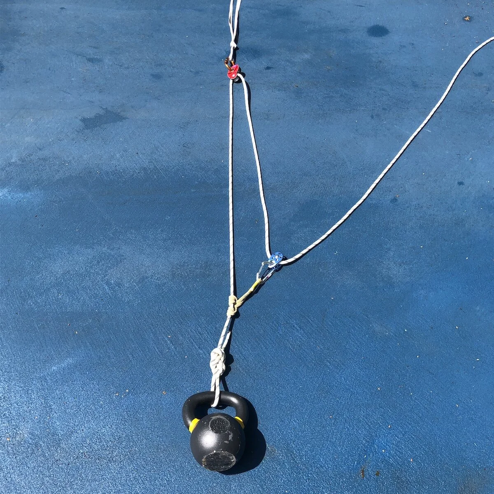
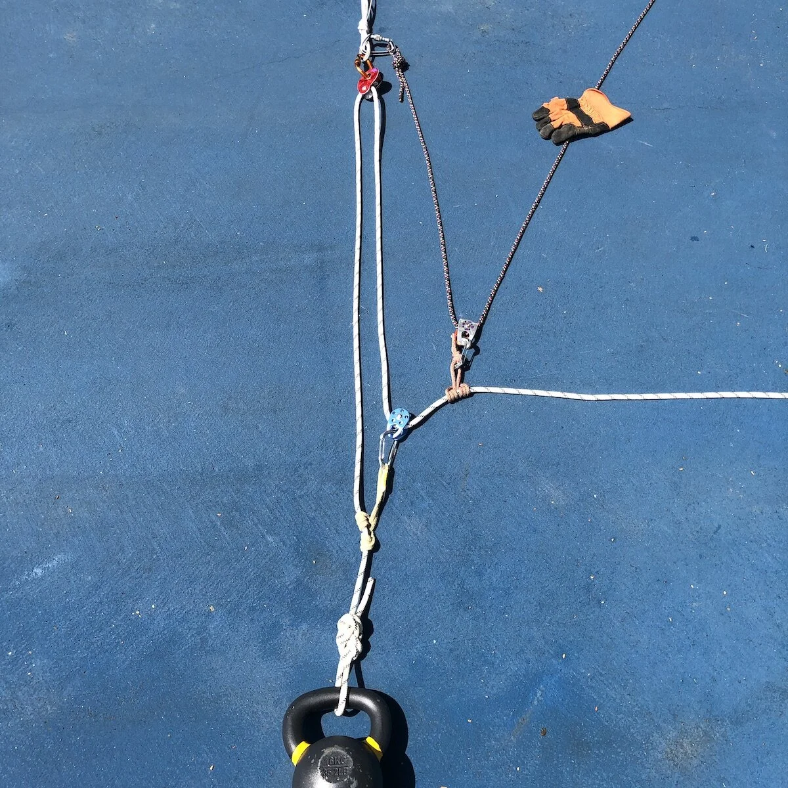
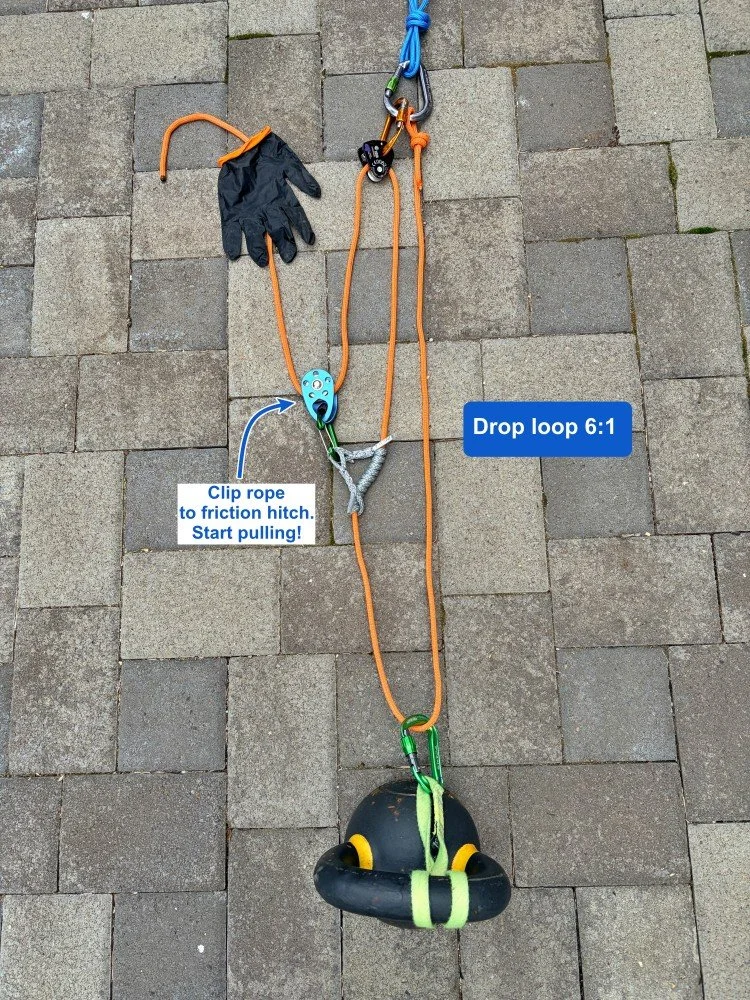
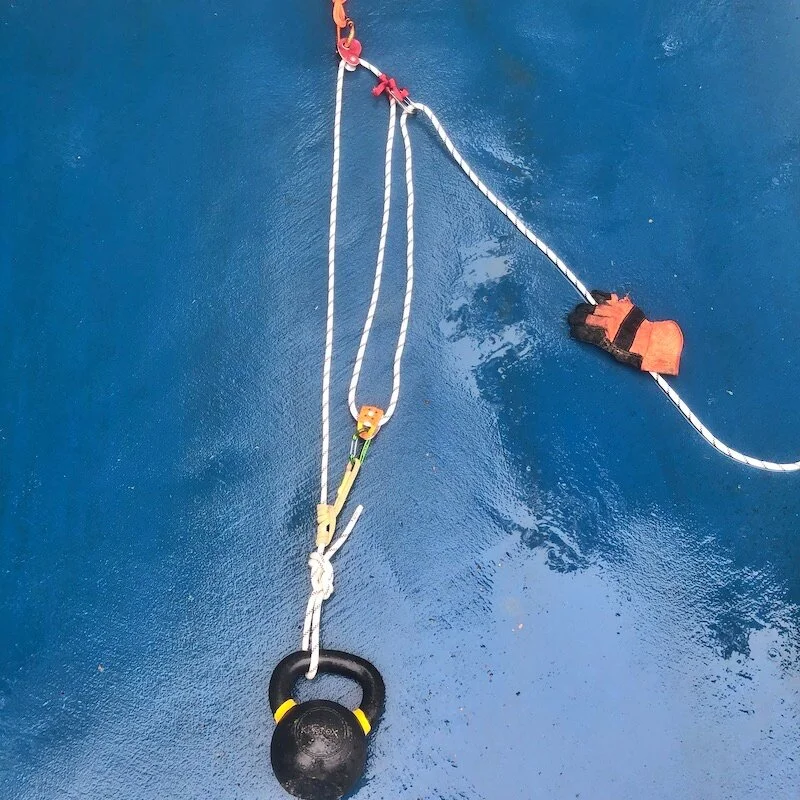

# 滑轮系统的三种类型

- 作者：Alpinesavvy
- 发布日期：2019-02-03
- 原文：[AlpineSavvy](https://www.alpinesavvy.com/blog/the-3-kinds-of-pulley-systems)

我在查阅滑轮系统的资料时，不断听到"简单""复合"和"复杂"这些术语。它们到底是什么意思？我该用哪一种？

这已经算是稍微进阶一点的内容了，不过既然你读到了这里，想必对这类稍显冷门的知识仍然有兴趣。 :-) 至于该用哪种系统，并没有一个简单明了的答案。

复合系统和复杂系统有一个共同的问题：拉动绳索时，滑轮会"收拢"（即被相互拉近），因此你通常需要更频繁地复位系统。如果你有很大的操作空间，比如裂缝顶端，这倒不是什么大问题。但如果操作空间很小，比如一个悬挂式岩石保护站，那就会比较麻烦。

如果你想深入研究，可以看看本页底部关于复合滑轮的 YouTube 视频链接，然后在客厅地板上动手摆弄起来。这是学习滑轮系统最好的方式。用一些伞绳和几把锁扣就能练习，不需要滑轮，甚至不需要真正的攀登绳。

## 1 - 简单系统

拉动绳索时，滑轮以相同的方向和相同的速度朝向锚点移动。

拉动绳索时，滑轮以恒定速度向锚点靠近。从负载和负载侧绳股出发，共有三股绳索来回穿绕，因此这是一个 3:1 机械增益系统。它也被称为"Z 拖"，因为绳索的形状像一个字母"Z"。（把头向左歪一下就能看出来了……）

- 在简单滑轮系统中，如果绳端终止并固定在锚点上，机械增益为偶数（如 2:1、4:1、6:1 等）。
- 如果绳端终止并固定在负载上，机械增益为奇数（如 3:1、5:1 等）。

在下方的照片中，绳端固定在负载上，因此得到的是奇数机械增益：3:1。

3:1 简单系统。滑轮以恒定速度向锚点移动。

---

## 2 - 复合系统

拉动绳索时，滑轮以相同的方向但不同的速度朝向锚点移动。

复合系统可以通过搭建一个 3:1 Z 拖，再在你拉的那股绳上叠加一个 2:1 来实现。在复合系统中，各独立牵引系统的机械增益相乘。

在下图中，白色绳索构成 3:1，黑色绳索构成 2:1。两个系统相乘，得到 6:1。注意，白色绳索每拉 3 英尺，负载移动 1 英尺；而黑色绳索每拉 2 英尺，向上移动 1 英尺。因此，黑色绳索会比白色绳索先到达锚点，这意味着你需要更频繁地复位系统。

补充——如果你已经搭好了 3:1 但需要更大的拉力，像下图那样搭一个 6:1 复合系统通常是个好主意。例如两人团队的裂缝救援，上方的人可能需要独自完成所有牵引工作。如果绳索在雪中穿行产生大量摩擦，或者你的搭档在裂缝中无法协助你，3:1 很可能不够用。这时，6:1 就是你最好的朋友。增加 2:1 只需要额外一把滑轮和一把锁扣。太棒了！

补充：对于复合滑轮系统，你还可以用一个非常巧妙的绳索技巧（CRT，Crafty Rope Trick）——设置一个更远的第二锚点。这样可以让 3:1 系统完全收拢之后，2:1 系统才开始收拢，从而减少复位次数。诚然，这个技巧可能更适合专业绳索作业员或搜救队，对攀登者来说不太实用，但仍然是一个非常酷的花招。

6:1 复合系统，3:1 上叠加 2:1。两个不同的滑轮以不同的速度向同一方向移动。

下面是复合系统的另一个例子：2:1 上叠加 3:1。

这叫做下坠环 6:1（drop loop 6:1），是裂缝救援的绝佳选择。

首先在负载上放置一个绳环，构成 2:1。然后在这个 2:1 的基础上搭建一个 3:1。3 乘以 2 等于 6。

与前一个例子相比，它的优势在于复位次数更少。

---

## 3 - 复杂系统

复杂滑轮系统是指不完全符合简单系统或复合系统定义的系统。

复杂系统中，有滑轮朝着与负载相反的方向移动。

复杂机械增益系统也不是不行，但简单系统或复合系统通常是更好的选择，因为它们一般更容易搭建，复位次数也更少。

下图是一个 3:1 简单系统。加上一个摩擦结（红色）和一把锁扣后，现在有一个 2:1 在拉这个 3:1。由于这是一个复杂系统，两个组件的机械增益相加，得到 5:1。

现在这是一个 5:1 复杂系统。拉动绳索时，两个滑轮相互靠近。当滑轮碰到一起（即"收拢"）时，你需要复位系统。如果操作空间大，这可能不是问题。但如果你站在一个很小的岩石平台上，只能拉一英尺左右滑轮就会收拢，那可就麻烦了。

把它与上方的 6:1 复合系统图比较一下。6:1 的机械增益稍大一些，还避免了滑轮收拢的问题——这就是为什么复杂系统通常不是首选。

5:1 复杂系统。在一个基础 3:1 上增加了一个红色摩擦结，牵引绳股经其换向。两个不同的滑轮以不同的速度相互靠近。
