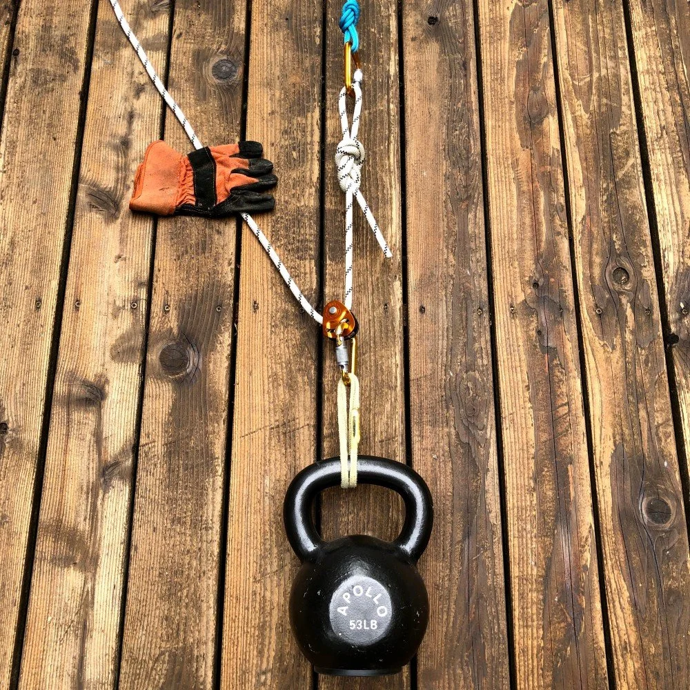
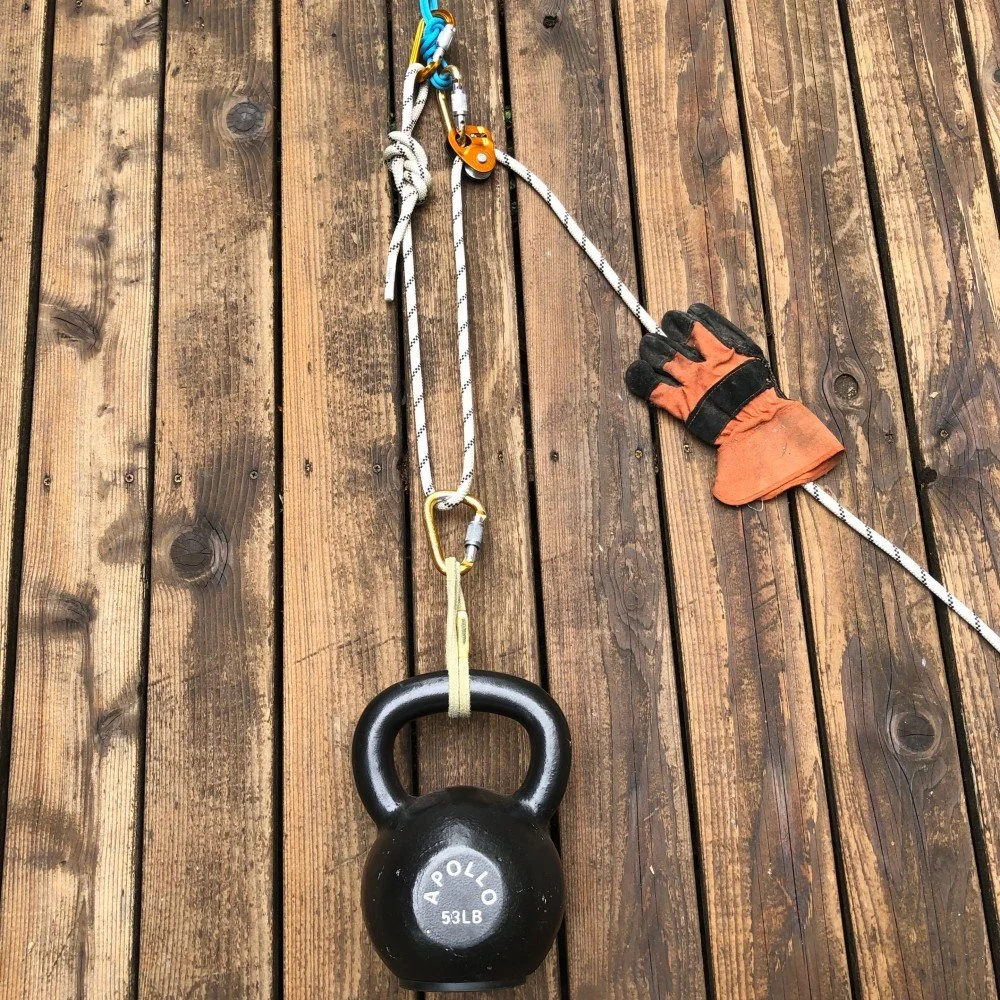

# Two ways to rig a 2:1 "C" haul

- Author: Alpinesavvy
- Published: 2019-10-16
- Source: [AlpineSavvy](https://www.alpinesavvy.com/blog/two-ways-to-rig-a-21-c-haul)

> Note: This is a premium member article. Only the publicly visible portion is archived here.

A 2:1 haul is a fundamental mechanical advantage system for climbing self rescue.

- To move your load 1 meter, you must pull 2 meters of rope through the system.
- In a (theoretically frictionless) world, you could lift a 100 kg load by applying about 50 kg of pulling force.
- It's called a "C" because if you turn your head sideways, it kind of looks like the letter. =^)

It's common to rig this for crevasse rescue by using a progress capture pulley (PCP), such as the Petzl Micro Traxion.

## With a 2:1 haul: the progress capture can go in one of two places:

- On the load
- On the anchor

Here are the two different setups.

## 1 - Progress capture on the LOAD

## 2 - Progress capture on the ANCHOR

## Questions for further thought (premium content):

- What are the forces on the anchor for each of these systems?
- If you do have a redirect like in the second photo, what's something you can do to reduce the load on the anchor?
- For crevasse rescue, what are pros and cons of these two methods? (Author's opinion: prefers to keep it on the anchor.)
