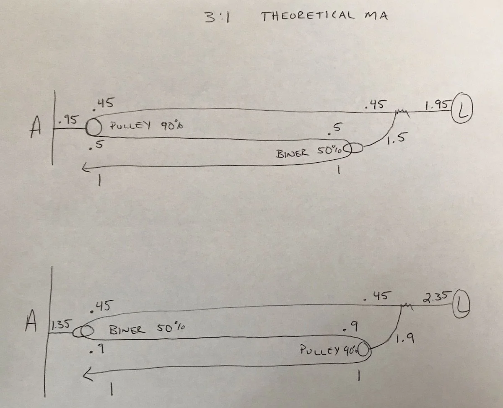
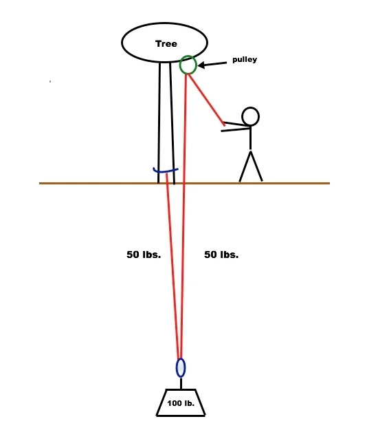

# 滑轮该放在哪里？

- 作者：John Godino
- 发布日期：2019-02-03
- 原文：[AlpineSavvy](https://www.alpinesavvy.com/blog/where-to-put-the-pulley)

## 我只有一个滑轮。该把它放在哪里，才能最省力地拉？

问得好！我们经常需要利用有限器材临时架设系统，而滑轮的位置会影响拖拽系统的效率。

应当把性能较好的滑轮放在绳路中最靠近施力端的位置，也就是最靠近双手的位置。

用绳索架设专家 [Richard Delaney](http://www.ropelab.com.au) 的话来简单解释：“……最佳位置是最靠近施力点的地方，因为这样能让尽可能多的输入力传入系统，而不是在绳索第一次弯折时就损耗掉。”

换句话说，第一个滑轮产生的任何效率损失都会在系统后续部分累积，因此应将效率最高的滑轮放在最靠近施力端的位置，也就是最靠近你的地方。

在下图所示的 3:1 系统中，施力端最靠近移动滑轮（travelling pulley，也称牵引滑轮），因此性能较好的滑轮应当放在这里。

对于工程师和物理爱好者们，一位 Alpinesavvy 的 Instagram 粉丝（[@jared_vilhauer](https://www.instagram.com/jared_vilhauer/?hl=en)，在这些方面比我厉害多了）计算得出：

- 如果在“牵引”（tractor）滑轮位置使用效率为 50% 的锁扣，实际机械增益为 1.95:1。
- 如果在“牵引”（tractor）滑轮位置使用效率为 90% 的滑轮，实际机械增益为 2.35:1。

如果想深入了解，可以观看 [The Rope Access Channel](https://www.youtube.com/watch?v=sIMFvf_E5Y8) 的这段视频，其中逐步演示了计算过程。示例让绳索经锚点换向；如果需要垂直提升负载，而不是沿水平方向牵引，这样做很合适。原理仍然相同：从施力端（也就是你）沿绳路看，应将性能较好的滑轮放在最先经过的滑轮位置。

图片来源：The Rope Access Channel 视频截图，来自 https://www.youtube.com/watch?v=sIMFvf_E5Y8

很多人认为，要想最省力，滑轮就应始终装在与负载一起移动的位置，但事实并非总是如此。在下面这套带换向的 2:1 系统中，滑轮应当装在锚点上。原因仍然是锚点最靠近实际施力的位置。

这可能有些违背直觉（我当时也这么觉得！），但很容易通过测试亲自验证。准备一个滑轮、一把锁扣、一根绳索、一件重物和一个锚点，分别按照两种方式架设，再比较各自所需的拉力。在这个例子中，将滑轮装在锚点上效果更好。

坦白说，这个结论当时并不符合我的直觉，所以我做了一次简单的观察实验来亲自验证。

我按照上图架设了一套 2:1 系统，让绳索经顶部锚点换向。我使用一个重 10 磅（约 4.5 公斤）的杠铃片，并在牵引侧绳股上连接一只廉价弹簧秤。我缓慢、匀速地拉绳，并记录牵引过程中秤上最常出现的整数读数。

## 2:1——滑轮在锚点、锁扣在负载上：需要 8.5 磅力

## 2:1——滑轮在负载上、锁扣在锚点：需要 11.3 磅力

## 2:1——锚点和负载上都使用滑轮：需要 8.2 磅力

显然，将滑轮装在锚点上是最佳做法。负载处几乎不需要再使用滑轮，因为在那里使用滑轮或锁扣，所需拉力几乎相同。
