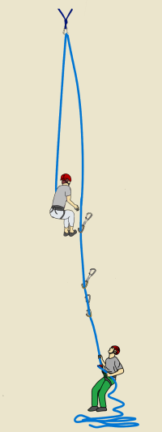
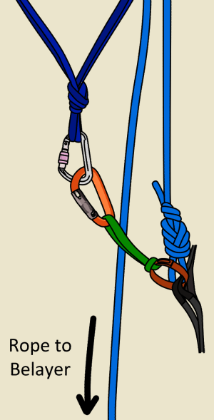
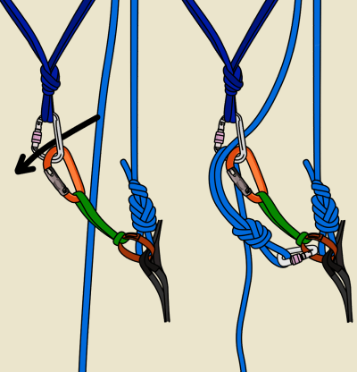
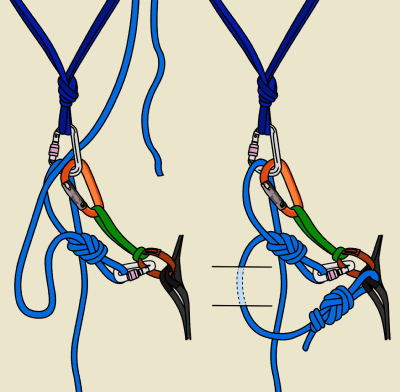
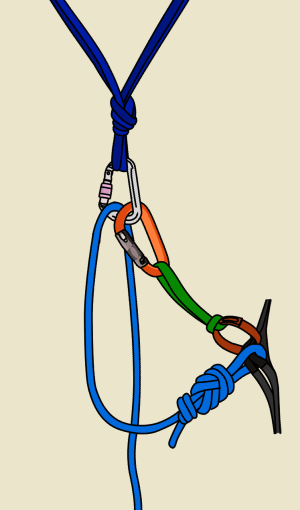
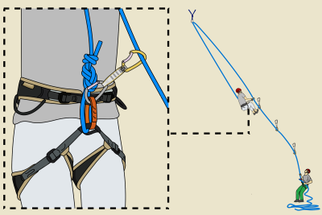
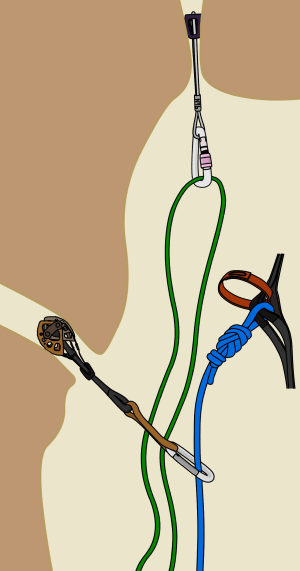
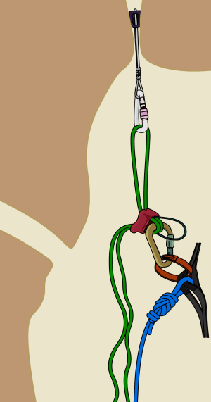

# Self Rescue: Mid-Pitch Retreat

- Author: VDiff
- Published: December 28, 2025
- Updated: June 7, 2026
- Source: [VDiff Climbing](https://www.vdiffclimbing.com/leader-retreat/)

[Watch the mid-pitch retreat video](https://vimeo.com/822586589)

Sometimes, a climb may prove to be too difficult, forcing you into a mid-pitch retreat. This is fairly straightforward if you:

- Can downclimb.
- Are less than half a rope length up a pitch.
- Can reach an anchor by [french-freeing](https://www.vdiffclimbing.com/basic-aid/#french-free), [aiding](https://www.vdiffclimbing.com/basic-aid/) or [penduluming](https://www.vdiffclimbing.com/pendulum-tension-traverse/).

However, if you are more than half a rope length up a pitch, cannot downclimb or make a belay, you can still get down.

## Mid-Pitch Retreat with a Single Rope

This method assumes that the gear you lower from is very reliable. It is recommended that you back up the lower-off piece either by [equalizing](https://www.vdiffclimbing.com/anchors-equalize/) it with another or by leaving a couple of protection pieces below the top piece.

### Step 1

Get lowered to a place where you can make an anchor.

### Step 2

Attach to the anchor with a sling.

### Step 3

Pull a bight of rope through the anchor, tie a [figure 8](https://www.vdiffclimbing.com/figure-eight-bight/) and attach it to your belay loop.

### Step 4

Untie from the end of the rope, pull the rope through and re-tie back into the end.

### Step 5

Remove the figure 8 on a bight and ask the belayer to take in the slack. If there is a huge amount of slack, consider tying intermediate knots while the slack is being taken in.

### Step 6

Once the slack has been taken in, you can unclip your sling attachment and lower down to the belayer, or to another anchor to repeat the process.

If the route traverses or overhangs, make sure to lower down with a sling attaching you to the rope. This prevents you from getting stranded.

You’ll have to clip past any gear that you are leaving.

## Mid-Pitch Retreat with Two Ropes

If you are climbing with a lead rope and trailing another rope (e.g. a lightweight “tag” rope for [hauling](https://www.vdiffclimbing.com/basic-hauling/) or adding distance to your abseils), it is possible to use a different technique which is slightly safer (if you protected the pitch well) and means you can leave less gear behind.

### Step 1

Clip the middle of the tag rope (green in this diagram) into your highest good piece of gear.

### Step 2

Abseil on the tag rope while getting belayed down on the lead rope. Remove protection as you descend.

### Step 3

This technique allows you to descend up to half the length of the tag rope. At this point, you will need to create an anchor and repeat the process.

## The Cost of Leaving Gear Behind

These methods involve leaving gear behind. When deciding on which pieces or how many to leave behind, remember that the cost of climbing gear is far less than the cost of being seriously injured. It is obviously very dangerous if the lower-off piece fails. Leave behind solid gear and worry about replacing it later.

Depending on the location, it may also be possible to retrieve your gear later by abseiling in from the top on a fixed rope and then [prusiking out](https://www.vdiffclimbing.com/prusik-rope/).
