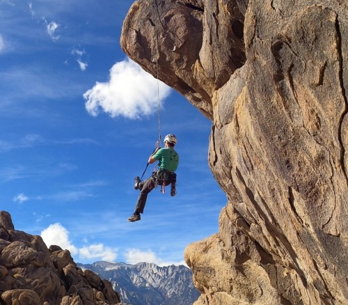
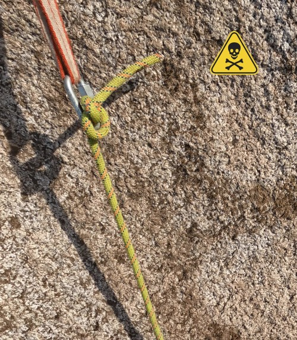
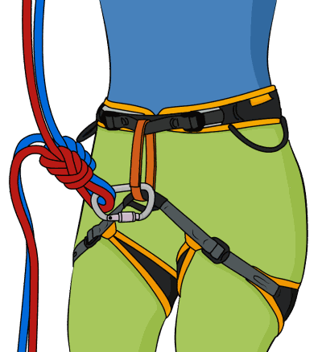
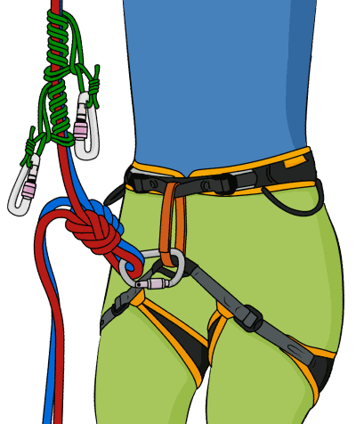
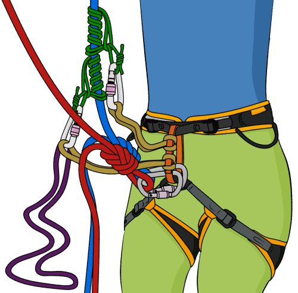
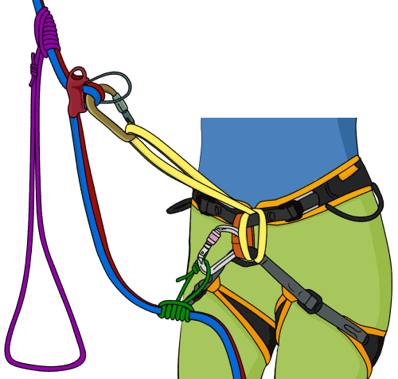
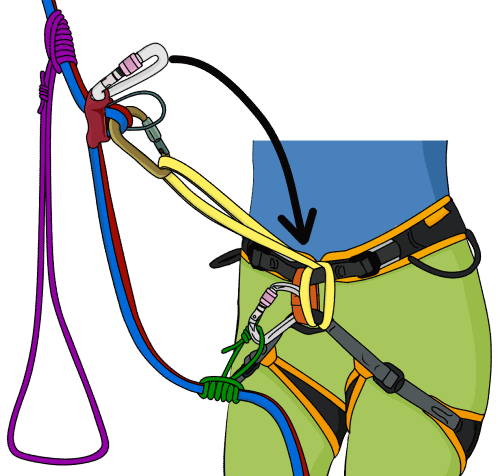
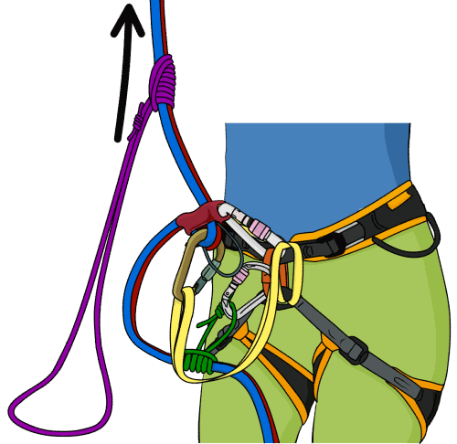
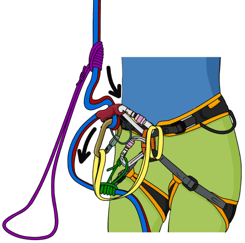
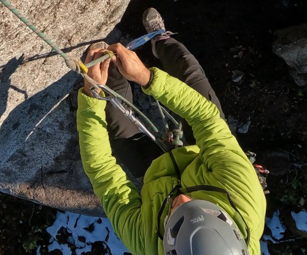

# 自救：用普鲁士结沿绳上升

- 作者：VDiff
- 发布日期：2025 年 12 月 28 日
- 更新日期：2026 年 6 月 7 日
- 原文：[VDiff Climbing](https://www.vdiffclimbing.com/prusik-rope/)

[观看普鲁士结沿绳上升视频](https://vimeo.com/822596951)

掌握用普鲁士结沿绳上升，可以把一场可能演变成严重困境的事故化为一次麻烦。

本文介绍如何使用普鲁士结沿绳上升，并假定你已经会打这种绳结。如果还不会，可以先[学习普鲁士结打法](https://www.vdiffclimbing.com/prusik-types)。

最常需要用普鲁士结沿绳上升的情形包括：

- 绳降过头。
- 绳降方向错误。
- 绳降后[绳索被卡住](https://www.vdiffclimbing.com/stuck-ropes/)。
- 在陡峭绳距先锋攀或跟攀时坠落并悬空。

## 沿绳上升前的准备

### 只能沿正确连接至锚点的绳索上升

这听起来理所当然，但已经发生过多起事故：攀登者沿一条看似“卡住”的绳索上升，绳索随后却突然松脱。

另一种可能致命的错误，是双绳绳降后只沿其中一股绳索上升，并指望接绳结一直卡在锚点中。**绝不可这样做！** 系统承重时，即使很大的绳结也可能挤过锁扣或某些链条、圆环。如果下降时使用了两股绳索，上升时也必须同时沿两股上升。普鲁士结既可以作用于一股绳索，也可以作用于两股绳索。

### 始终为普鲁士结上升系统设置备份

普鲁士结不是全强度连接点。应在正在沿其上升的每股绳索上打备份结，并将备份结扣入安全带保护环；上升过程中应频繁重打备份结。重打时，务必先完成新的备份结，再拆除旧备份结。

## 标准普鲁士结上升法

**优点**

- 在几乎任何沿绳上升情形下都可安全使用。

**缺点**

- 通常比[弹弓式上升法](#弹弓式普鲁士结上升法)等其他方法更费力。

### 步骤 1

在身体下方的余绳上打备份结；[双套结](https://www.vdiffclimbing.com/clovehitch)、[单结](https://www.vdiffclimbing.com/overhand-knot/)或[绳中八字结](https://www.vdiffclimbing.com/figure-eight-bight/)均适用。用一把丝扣锁扣将备份结扣入安全带保护环。如果沿两股绳索上升，务必分别为两股绳索设置备份。

如果正处于绳降途中，只需让普鲁士结承重，然后打好备份结。

如果绳降时没有安装普鲁士结，并且已经悬空，可以先让绳索在腿上至少缠绕三圈，再打普鲁士结；随后解开腿部缠绕，让普鲁士结承重，然后打好备份结。无论如何，在备份结完成之前，必须始终握住制动侧绳索。

### 步骤 2

在身体上方的绳索上安装两个普鲁士结；[经典普鲁士结](https://www.vdiffclimbing.com/prusik-types/#classic)或[克氏结](https://www.vdiffclimbing.com/prusik-types/#klemheist)均适用。

### 步骤 3

用[雀头结](https://www.vdiffclimbing.com/girth-hitch/)将一条 60 厘米扁带环连接到安全带保护环，再将其扣入上方普鲁士结。如果扁带过长，可以打结缩短。

所有连接均应使用丝扣锁扣。如果丝扣锁扣数量不足，可以用两把反向放置的无锁锁扣替代一把丝扣锁扣，使锁门朝向相反、开口分处两侧（opposite and opposed）。

### 步骤 4

用雀头结将另一条扁带环连接到安全带保护环，再将其扣入下方普鲁士结。

### 步骤 5

将一条长扁带环或一段辅绳扣入下方普鲁士结，形成脚环。

### 步骤 6

接下来开始上升。尽可能向上推动上方普鲁士结，然后向后坐入安全带，让该结承担体重。

### 步骤 7

向上推动未承重的下方普鲁士结，然后踩脚环站起。站起的同时，继续向上推动此时已经卸载的上方普鲁士结。

### 步骤 8

重复上述过程，并随着上升不断调整备份结。

## 弹弓式普鲁士结上升法

“弹弓式”方法类似于在陡峭运动攀线路上坠落后，把自己拉回坠落前最高点的技术。

**优点**

- 比[标准上升法](#标准普鲁士结上升法)省力。

**缺点**

- 只能用于绳降场景。先锋攀或跟攀陡峭绳距时坠入悬空位置后，不能用此方法返回坠落前的最高点。
- 如果无法让绳索卸载，系统很难架设。
- 绳索会在主锚点上摩擦。如果绳索穿过织带、扁带环或任何磨损较重的锚点，**绝不可使用此方法**。这种往复锯切动作可能使绳索割断扁带！

### 步骤 1

如果尚未站在地面，应先建立一条独立于绳降绳索的锚点连接，然后拆除保护器。

### 步骤 2

分别在两股绳索上打一个绳中八字结，并各用一把丝扣锁扣将其扣入安全带保护环。上升过程中，一个绳结始终承重，另一个作为备份结。

### 步骤 3

在带有两绳接绳结的那一侧绳索上安装两个普鲁士结。按照[前述标准方法](#标准普鲁士结上升法)将自己连接到两个普鲁士结，并设置脚环。

如果此前建立了独立于绳降绳索的锚点连接，此时需要解除该连接。

### 步骤 4

使用前述动作沿绳上升。在锚点摩擦不大的情况下，向下拉动一侧绳索时，另一侧绳索会向上移动。因此，这种方法比标准方法省力，但速度更慢。

上升过程中，应在图中的蓝色绳索上重打备份结。务必辨认正确的绳结，**绝不可解开正在承重的绳结！**

### 步骤 5

多数情况下需要上升越过两绳接绳结。一次只移动一个普鲁士结，将其重新打到接绳结上方。

## 使用延长连接的保护器沿绳上升

**优点**

- 架设较快。
- 适合短距离上升，例如绳降时下降超过了锚点。

**缺点**

- 只适用于正在使用具有[导向模式](https://www.vdiffclimbing.com/guide-mode/)功能的[延长连接保护器](https://www.vdiffclimbing.com/extend-atc/)进行绳降时。

### 步骤 1

用一段较长的 5 毫米或 6 毫米辅绳，在保护器上方环绕两股绳索打一个普鲁士结；[克氏结](https://www.vdiffclimbing.com/prusik-types/#klemheist)适用于此处。这段辅绳同时构成脚环。

### 步骤 2

踩入脚环并站起，使保护器卸载。完成这一动作时，务必始终握住两股制动侧绳索。

### 步骤 3

用一把丝扣锁扣将安全带保护环连接到保护器的自锁连接孔（auto-block hole）。

### 步骤 4

坐下，把体重转移到此时处于自锁状态的保护器上。

### 步骤 5

向上推动上方普鲁士结，再踩脚环站起。这样会使保护器卸载，从而可以将余绳拉过保护器。

### 步骤 6

重复步骤 4 和步骤 5，直至到达锚点。

## 总结

掌握用普鲁士结沿绳上升，是传统攀登者必备的技能。

刚开始练习时，这项技术既费力又别扭，也可能需要一段时间才能确定所需辅绳的合适长度。但经过一些练习，很快就能熟练掌握。

> **译注｜系统限制：** “几乎适用于任何情形”“不是全强度连接点”和保护器“处于自锁状态”均为 VDiff 的原文表述，不代表器材制造商认证或量化保证。原文仅为延长连接保护器方法的脚环指定 5 毫米或 6 毫米辅绳，没有给出其他方法所用主绳与辅绳的直径、材质兼容范围，也没有给出锚点强度标准、摩擦结绕圈数、保护器型号兼容性，以及到达锚点后的系统转换、重新连接与完整承重转移检查流程。实际使用前应接受专业训练，并核对绳索、辅绳、锁扣和保护器的制造商说明。
