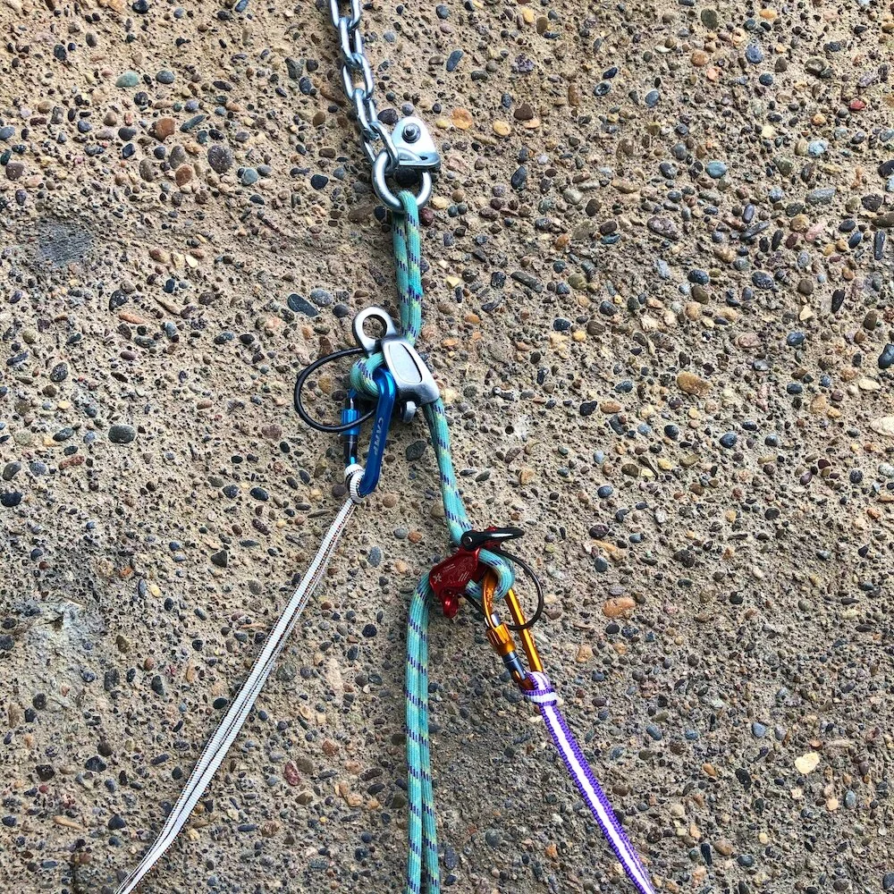
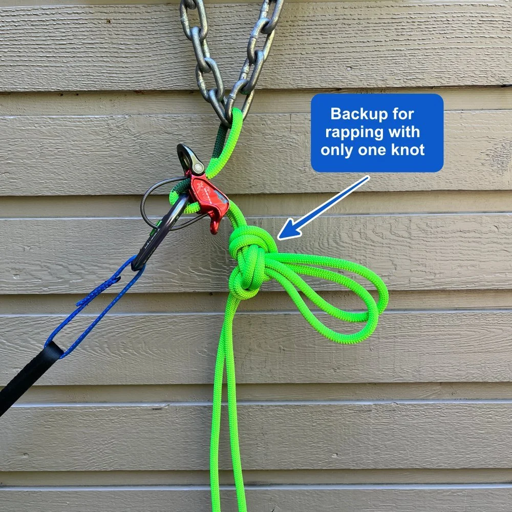
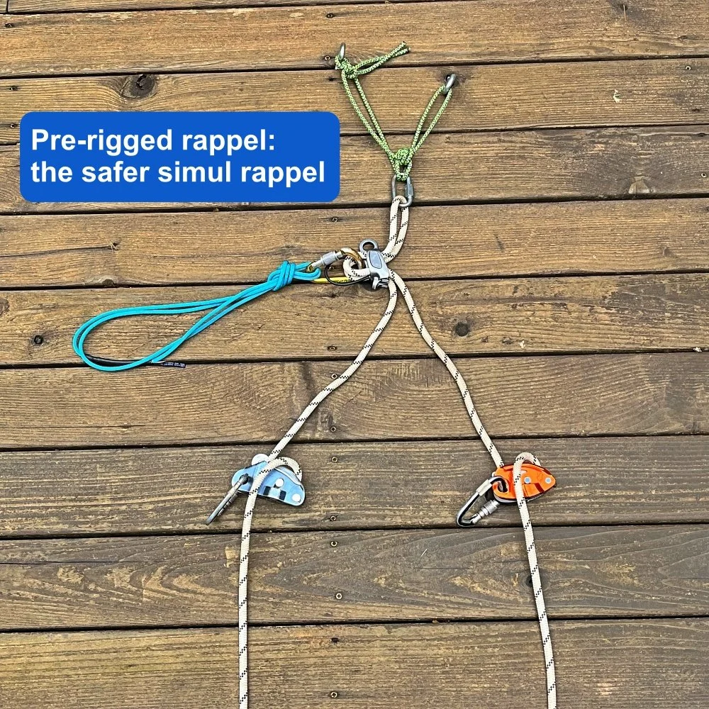
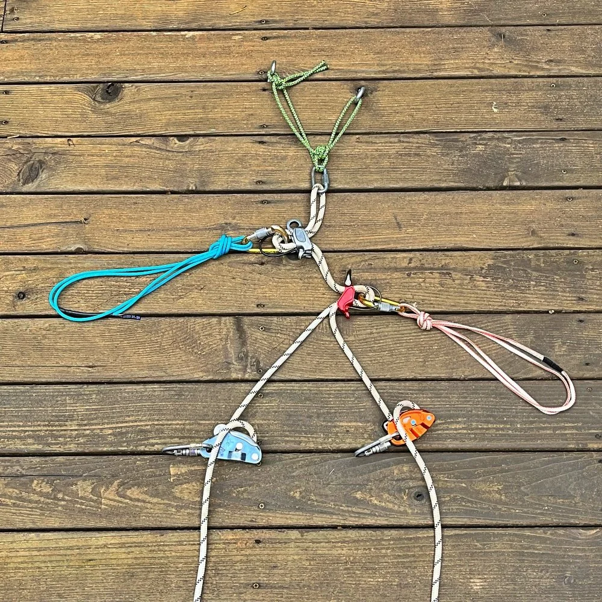
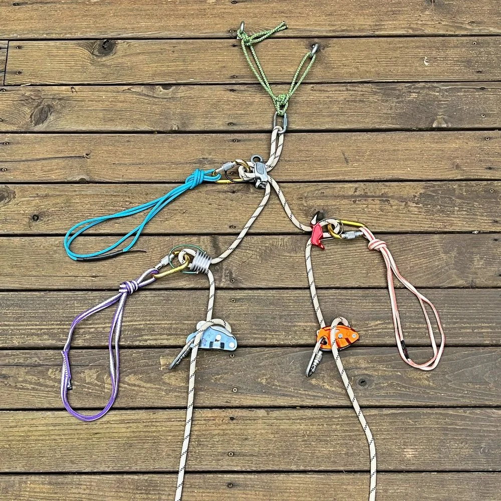
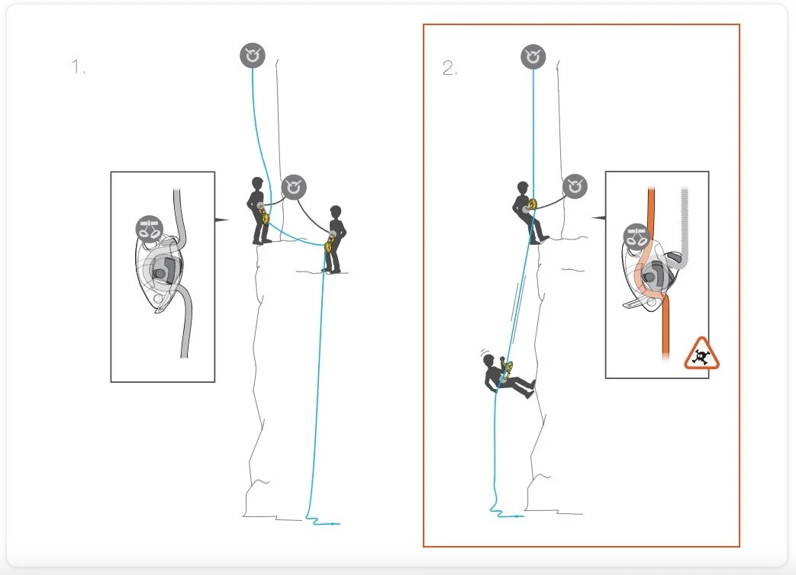
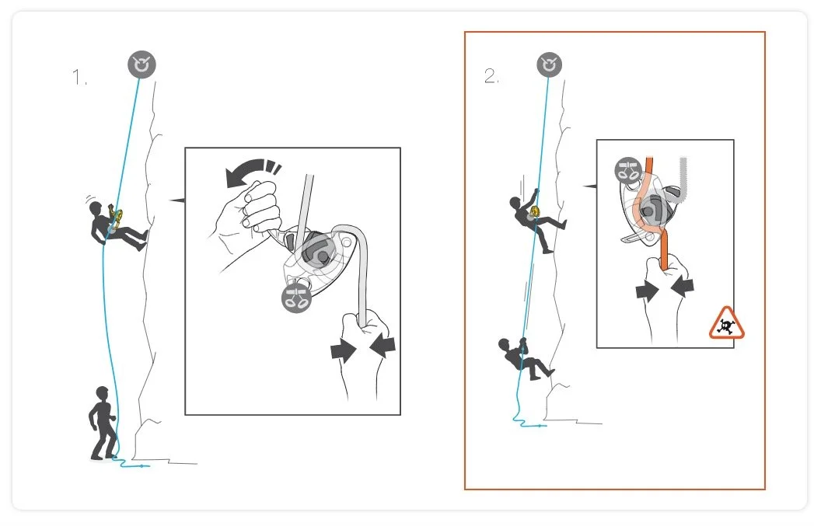
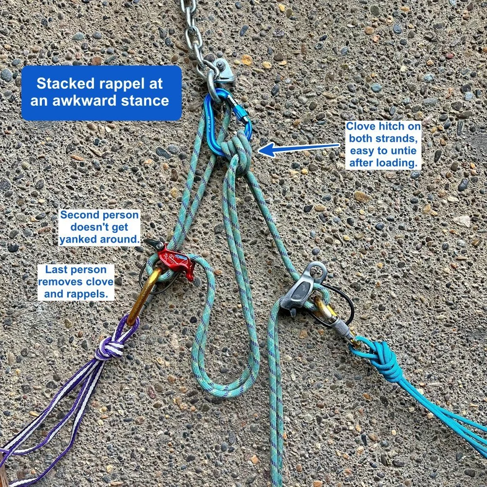
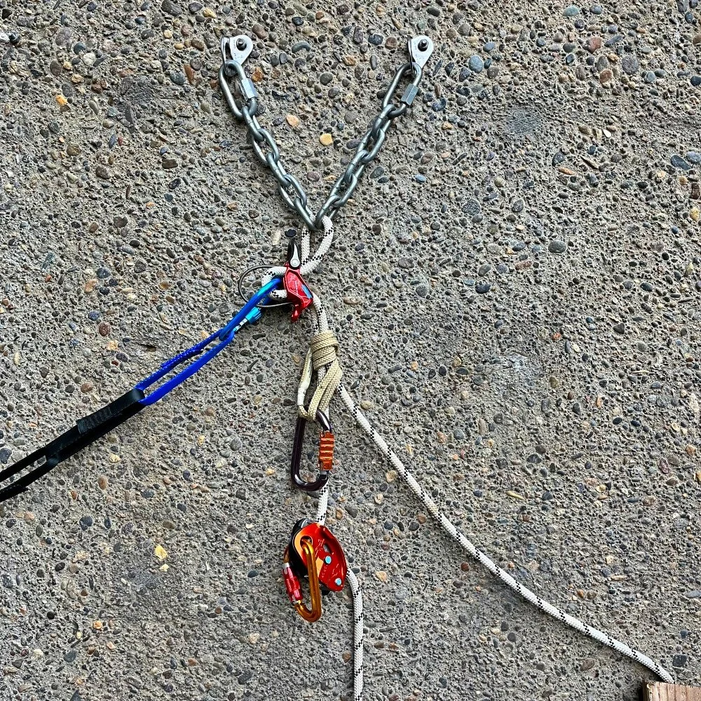

# 预挂下降（pre-rigged rappel）的好处

- 作者：John Godino
- 发布日期：2019-01-10
- 原文：[AlpineSavvy](https://www.alpinesavvy.com/blog/the-benefits-of-the-pre-rigged-rappel)

预挂下降（pre-rigged rappel，也有人称为“堆叠式下降”，stacked rappel）是向导带领客户时常用的技术，不过它的诸多优点也同样适用于普通攀登者。

什么是预挂下降？就是队伍中的所有人（或者能舒适地待在下降锚点附近的人）同时用延长下降（extended rappel）的方式连接到绳索上。[点这里详细了解延长下降。](https://www.alpinesavvy.com/blog/the-extended-rappel-explained) 延长连接带让等候下降的人保持与绳索连接，又不会因正在下降者使绳索受力而被拽来拽去。

一套预挂下降系统。连接右侧橙色锁扣的下降者先降；连接左侧蓝色锁扣的下降者已预挂就绪，前一人下降结束后便可立即开始。（为清晰起见，图中省略了推荐使用的第三手备份——autoblock 自锁抓结。）

## 好，明白了。那么……为什么要这么做？

## 预挂下降降低风险。

1 - 向上攀登时，我们总会给搭档做安全检查。那为什么下降时不也这么做呢？所有人同时预挂好之后，队友可以互相做一次完整的 [BRAKES](https://www.alpinesavvy.com/blog//a-great-rappel-check-acronym-brakes) 安全检查：Belay device（下降器）、Rope（绳索）、Anchor（锚点）、Knot（绳结）、Extension（延长连接）和 Safety backup（安全备份）。反观传统下降方式，最后一名下降者得独自安装整套系统，身边无人复查。在两人小队中，最后下降的往往是经验较少的人，风险会进一步增大——经验丰富者通常先下，以便整理绳索、寻找并架设下一个下降锚点，或从下方为第二人提供消防员保护（firefighter belay）。这正是向导偏爱预挂下降的原因之一。

2 - 只需一个“保险”绳尾结。这里还有一项值得注意的安全优势：如果第一名下降者在任意一股绳的末端打一个绳尾结（stopper knot），或者把任意一侧绳尾连接到自己的安全带保护环（belay loop），他就不可能从绳端滑脱。原因是，第二名下降者已预挂在绳上，他的下降器实际上限制了绳索的滑动。如果第一人降到绳尾结处，或降到连接在自己身上的绳尾处，两股绳不会像普通下降时那样立即滑过锚点。

注意：仅仅预挂下降器、却没有在绳上安装 autoblock 自锁抓结，并不一定能阻止绳索滑动。绳索较细、下降路线悬空、搭档较重，或这些因素同时存在时，如果全部负荷落到一股绳上，绳索仍可能滑过下降器。因此，如果只在一侧绳尾打结，最好再加一道备份，确保绳索不会移动。一个简单办法是在第二人的下降器下方，将两股绳合在一起打一个绳耳结（如八字结或蝴蝶结）。见下图。

3 - 此外，在进行连续多段双股绳下降时，这项技术也能降低风险。长距离多段下降中，人们有时不愿落实“[闭合系统](https://www.alpinesavvy.com/blog/what-is-a-closed-rope-system)”这一基本安全措施，也就是在两侧绳尾都打结。常见原因是：第一人把绳索穿过下一个下降锚点并开始抽绳时，其中一股绳要被拉回上一个锚点，再从那里落下，它的绳尾显然不能留着绳尾结。把这股绳重新拉上来、打好绳尾结、再抛下去很费时间，因此有人会省略这一步。采用预挂下降时，只需在一侧绳尾设置“保险”（打绳尾结或将其直接连接到下降者身上）。第一人到达下方锚点后，可以先将绳索穿过该锚点，在所需的一侧绳尾打好保险结，再拉动另一股绳，使绳索抽过上方锚点。这样既能提高连续下降的速度和效率，又能确保不会从绳端滑脱。

4 - 最后，如果你不得不在黑暗中下降，却只有一盏头灯（糟糕！），这项技术能让两个人借助同一盏灯安装下降系统。（嘿，你应该始终随身带一盏头灯！）

## 预挂下降提升速度。

我读过不少讨论预挂下降的文章和网帖，奇怪的是似乎没人提到这个优点：它能让整队人更快地完成下降。因为几个人可以同时安装下降系统，不必再等大家逐个操作。安装完毕后，只要有一块足以站立的平台，所有人都可以让下降器挂在受力的绳索上；延长连接能避免他们被绳索拽动。1 号下降者一脱离下降系统，迅速从下降器中送出几米绳，2 号下降者就能立即出发。队员沿绳下降的过程几乎可以连续不断，不必停下来等下一人安装设备。（对于熟练的攀登者，这段空档当然短得多；但面对人数较多的新手队伍，它可能会显得无比漫长。）

公平起见，我们再看看预挂下降的一些潜在缺点。

第一名下降者无法试拉绳索，以确认之后能否顺利抽绳，因为上方预挂的人实际上限制了绳索移动。如果你对能否顺利[抽绳](https://www.alpinesavvy.com/blog//a-better-and-silent-way-to-signal-off-rappel)有任何疑虑，最好不要采用这种方法；确保顺利收回绳索，比预挂带来的少许提速和风险降低更重要。

如果必须用足绳索的全部长度，绳索中点却没有置于锚点处，而且你还依赖“让绳尾结顶住下降器，从而在下降途中移动两侧绳尾”这种不严谨的做法，最终可能会够不到下一个锚点。（这种情况并不常见；只要规范操作，将绳索中点置于锚点处就能避免。不过我听说有人遇到过，所以还是在此提醒。）

如果第二名下降者装好了延长下降系统，同时也把第三手 autoblock 自锁抓结装在绳上并连接到安全带，他通常会被受力的绳索拽来拽去。解决办法很简单：第二人先把 autoblock 自锁抓结装到绳上，并将锁扣扣入抓结，但暂时不要把锁扣连接到安全带；等第一人结束下降并送出一些松绳后再连接。

是不是每次下降都该用预挂下降？这个选择留给你自己。但如果你掂量一下可观的好处和那一点点缺点，你很可能会觉得这是个好主意。很多非常有经验的向导都把它当作常规做法，所以你也许可以考虑一下。

## 额外的提速技巧：更安全的同步下降（simul rappel）

有 3 个人（或更多）时，预挂下降可以让两个人同时下降，各自降在一根固定的单股绳上。这几乎能获得经典同步下降（simul rappel）的全部好处，而风险大大降低。（这个巧妙的办法我是从 IFMGA 认证向导 Rob Coppolillo 那里学到的。）

（一般来说，由于多方面的原因，并不推荐采用传统同步下降；[这篇文章有详细说明。](https://www.alpinesavvy.com/blog/-4-reasons-not-to-simul-rappel)）

设想一个三人（或更多人）小队到达线路顶端，想让所有人尽快下到地面。（这里假设下降锚点非常牢固，足以轻松承受两个人的重量。）所有人同时预挂好自己的下降系统。

最后下降的人安装带延长连接的标准双股绳下降系统。

另外两人（图中使用 GRIGRI，也可以使用其他合适的器械）各自连接到不同的一股绳上，同时下降。最后一人的预挂系统固定了两股绳索，因此传统同步下降的风险基本得以消除。

这是四个人的一种挂法。

这是五个人可能的样子。我想你明白这个思路了。

当然，常规安全措施一项也不能少：在两侧绳尾打结以闭合系统；尤其要确保锚点毫无疑问能承受两名攀登者的重量。请注意，这是进阶技术。实际使用前，务必先和搭档在平地上反复试验、练习。

## 注意：用 GRIGRI 做堆叠式下降

Petzl 官网[警告](https://www.petzl.com/US/en/Sport/Rappelling-with-the-GRIGRI?ProductName=GRIGRI-PLUS)，不要使用 GRIGRI 进行堆叠式下降。官网原文如下：

> “使用 2017 年及以后的 GRIGRI +、以及 2019 年及以后的 GRIGRI 时，如果使用者下方的绳子受到较大负荷，可能发生解锁（unblocking）并导致坠落。当绳上承受的重量等于或大于正在用 GRIGRI 下降者的体重时，就可能发生解锁。
>
> 危险情形举例：
>
> 多人依次下降、GRIGRI 预装在绳上。如果排队等待的人已经把 GRIGRI 预装在绳上，它可能被下方下降者的体重翻转（从而解锁）。这样当第二个人要开始下降时，器材已经无法正常工作了。
>
> 底部保护（bottom belay）：做保护动作的人绝不能悬挂在绳上。
>
> 从下方救援：救援者绝不能沿着被卡住下降者的绳子上升。”

下图是使用 GRIGRI 的堆叠式下降。第一名下降者开始让绳索受力时，（显然在某些情况下）可能使上方人员的 GRIGRI 翻转并解锁。（我做过简单测试，没能复现这种失效，但我当然相信 Petzl 工程师的判断，所以不要这样做！）

图片来源：https://www.petzl.com/US/en/Sport/Rappelling-with-the-GRIGRI?ProductName=GRIGRI-PLUS

与此相关，Petzl 还警告：当上方的人使用 GRIGRI 时，下方人员不得悬挂在绳上做消防员保护，也不得沿该绳上升。

图片来源：https://www.petzl.com/US/en/Sport/Rappelling-with-the-GRIGRI?ProductName=GRIGRI-PLUS

## 锚点位置不理想时的替代挂法

堆叠式下降最适合这样的环境：锚点牢固、高度约在胸口位置，旁边还有一块不错的平台可供站立。但如果锚点位置不理想，甚至贴近地面（例如设在树干基部），可以采用下面的替代挂法，避免第二人被拽来拽去。

在一些圈子里，这被称为 “J-rig”。

第二人（上方）先安装好自己的下降系统。

第一人（下方）拉出约 2 米松绳，将两股绳合在一起打一个双套结（clove hitch），再用一把锁扣将它连接到锚点。图中使用的是蓝色宽口 HMS 丝扣锁，但此处不一定非要使用带锁锁扣。（也可以将两股绳合在一起打绳耳结，例如单结或八字结，不过这些结受力后，第二人解起来会更费劲。）

这样便形成一个与下方受力段隔离的双股绳环，第二人不会再被拽来拽去。

第一人到达下方锚点后，第二人解开双套结，再按正常方式下降。

## 可以使用 GRIGRI 单股下降

上文简要提过这一点，这里再仔细说明。预挂下降实际上形成了两股彼此独立的固定绳。因此，第一名下降者可以使用 GRIGRI 沿其中一股绳下降。（注意：为清晰起见，图中省略了通常用于上方下降器的延长连接。）

很多人认为，仅靠下降器就足以固定绳索，但事实并非总是如此。如果绳索较新、较细或绳皮较滑，第一人的体重可能会使绳索缓慢滑过上方的下降器。autoblock 自锁抓结很重要，它能防止绳索蠕滑。（也可以像上图那样打一个双股绳耳结，即 BHK，同样能可靠固定绳索。）

这种设置方式不太常见；实际使用前，一定要先和搭档在地面上练习。

下面是西雅图登山者协会（Seattle Mountaineers）的一段优秀教学视频，介绍了延长下降的一种安装方法。从 4:50 开始，可以看到两人如何设置预挂下降。

视频：[Seattle Mountaineers - 延长下降 / 预挂下降（Vimeo）](https://player.vimeo.com/video/113362076)
