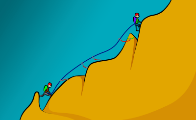
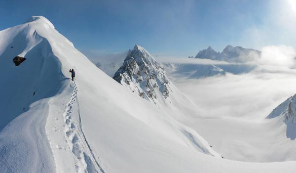
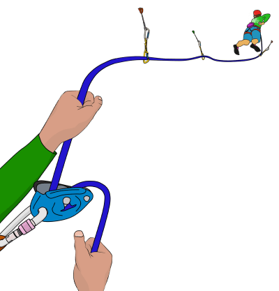
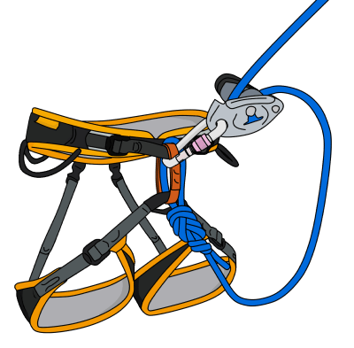
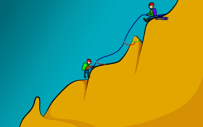
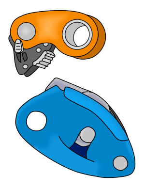
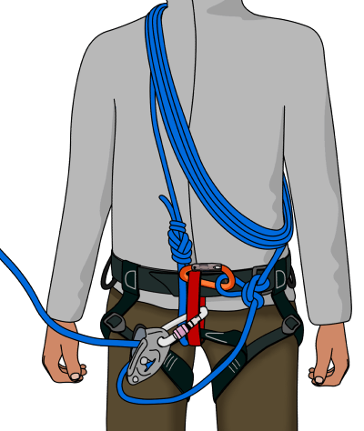
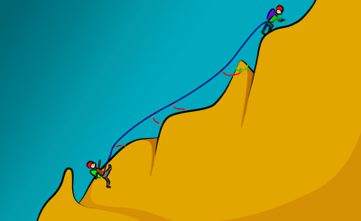
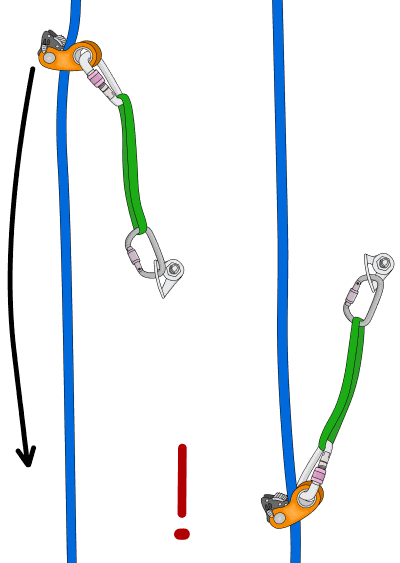
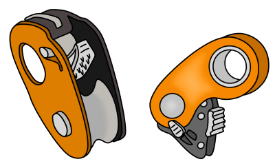

# 安全的simul攀登（Simul Climbing）

- 作者：VDiff Climbing
- 原文：[VDiff Climbing](https://www.vdiffclimbing.com/simul-climbing/)

## 什么是 simul 攀登？

Simul 攀登是一种所有攀登者同时移动、系在同一根绳索上的技术。保护由第一位攀登者放置，由最后一位攀登者拆除。

这种技术允许攀登者在不增加绳索长度的情况下延长每个绳距的距离。有了经验，一个 simul 绳距可以延伸到 300 米甚至更长，而有保护的绳距则受限于绳索的长度。

优点——比有保护的攀登快得多。

缺点——比有保护的攀登危险得多。如果跟攀者坠落，可能会把领攀者也拉下去。

### simul 攀登最适用于：

- 在长而简单的路线上，快速移动更安全时（例如：逐段攀登会导致遭遇风暴或被迫过夜）。
- 在长而暴露的接近或下撤路线上，坠落可能性极低但后果严重时。
- 当一个绳距略长于绳索长度时。短距离的 simul 攀登可以让领攀者到达更稳固的保护站。

### simul 攀登在以下情况很危险：

- 队伍中任何成员可能觉得路线困难时（尤其是跟攀者）
- 在松动的岩石上
- 在缺少保护的路线上（几乎无法放置保护的攀登）
- 对于缺乏经验的攀登者

### 前置技能

Simul 攀登引入了对初学者完全不合适的风险等级。本节内容面向经验丰富的传统攀登者，他们应熟练掌握：

- 放置传统保护装备和搭建锚点
- 在复杂地形中辨别路线
- 领攀长距离多段路线
- 自救技术
- 分析和风险管理

## 基本 simul 攀登系统

**第 1 步**
领攀者开始攀登。他们放置保护，并由保护员用 GriGri 保护。

**第 2 步**
当领攀者爬完可用绳索的全长后，保护员直接开始攀登（GriGri 保持连接在安全带上）。

**第 3 步**
两位攀登者继续向上，以完全相同的速度移动，并保持两人之间的绳索上有保护。

**第 4 步**
当领攀者到达合适的锚点时，他们停止攀登并将跟攀者保护上来。

## simul 攀登装备

### 携带什么

由于两位攀登者持续移动，更容易保持体温，因此可以不带保护站羽绒服。更快的攀登风格意味着可以少带食物和水。

带的东西越少，攀登感觉越轻松，在长路线上精疲力竭或被迫过夜的几率也越小。然而，决定是否留下关键物品必须基于丰富的经验。

根据你计划将 simul 绳距拉多长，可能需要带更多的装备。更多的装备意味着可以用更少的绳距完成路线，从而减少在保护站换保护的时间。

### 装备分配

最好在领攀者和跟攀者之间 fairly 均匀地分配装备，这样两位攀登者都不会背负过重的负荷。通常，领攀者会多带一些重量，以便跟攀者能够尽可能轻装灵活。记住，领攀者在 simul 绳距开始时会携带全部装备，但到结束时跟攀者会拥有全部装备。

### simul 攀登装置

除了多段攀登通常需要携带的装备外，这两种装置可以为 simul 攀登提供更多选择：

- 进度捕获装置（如 RollNLock 或 Tibloc）
- 辅助制动保护器（如 GriGri）

## simul 攀登设置

对于大多数情况，simul 攀登时两位攀登者之间的最佳距离约为 30 米。这个距离足够近，可以良好沟通并管理绳索拖拽，同时又足够长，可以确保两人之间有足够的保护。

直接使用 30 米绳索有缺点，尤其是当路线有复杂的下撤时。用绳圈缩短整根绳索可以为你在路线上提供更多选择。有几种方法可以做到这一点。下面描述一种简单的设置。

### 跟攀者：

- 用 8 字结系在绳索末端。
- 20-30 米的绳索整齐地盘在肩上，然后用阿尔卑斯蝴蝶结拉紧连接到保护环。
- GriGri 预先连接到保护环上，绳索中留有少量余量。

### 领攀者：

- 用 8 字结系在绳索末端。
- GriGri 预先连接到保护环上（这样可以在需要时快速切换到保护模式）。

#### 可选绳圈

领攀者也可以用与跟攀者相同的方式用绳圈连接到绳索。每位攀登者盘一半数量的绳圈，这样两人之间的绳索长度保持不变。这使领攀者能够快速放出一些额外的绳索，而不需要通知跟攀者。

确保绳圈盘紧，这样在攀登时不太可能被岩石特征挂住。每次放出绳圈时，始终用手握住制动端绳索，直到你重新盘好绳圈或到达绳索末端——GriGri 不是设计为可以脱手使用的。

## simul 攀登的危险

### 坠落

Simul 攀登的主要危险是坠落。如果领攀者坠落，这通常不是大问题（假设他们保护放置良好，且跟攀者没有让系统中有松驰）。然而，如果跟攀者坠落，他们很可能会把领攀者也拉下去。领攀者then会被以裆部为先撞到他们最后一个保护装备上。

那个保护装备承受的力远大于正常攀登情况。这是因为：

- 有两倍的重量落在保护上。
- 跟攀者无法提供动态保护，因为他们也在坠落。

产生的力更可能将保护从岩石中炸出。因此，在松动、缺少保护、或队伍中任何成员可能觉得困难的路线上进行 simul 攀登是不安全的。使用进度捕获装置可以降低这类坠落的可能性。

### 意识

在长距离 simul 领攀的流畅感中很容易忘乎所以，冒不必要的风险。保持专注，意识到危险。

### 解绳

可能有些路段解绳分别攀登更安全（例如：困难的下攀）。确保你们之后能安全地重新连接。

### 速度不同——手风琴效应

始终保持完全相同的速度极其困难。然而，使用绳圈可以使这变得容易得多。

例如，领攀者可能停下来放置保护，而跟攀者正处于费力或别扭的位置。跟攀者不必待在那里，可以移动到舒适的位置，同时通过 GriGri 拉入多余的松驰。从休息位置，跟攀者then可以在领攀者向上攀登时将松驰的绳索保护回去。

此外，如果跟攀者希望在困难路段有真正的保护，但领攀者需要更多绳索才能到达稳固锚点，跟攀者可以放出一些绳圈并保护领攀者，直到他们找到锚点。

一旦领攀者建好合适的锚点，跟攀者可以重新盘好绳圈，或者在领攀者收绳的同时继续放出剩余的绳圈。这确保系统中永远不会有不必要的松驰。一旦所有松驰被收完，领攀者可以继续将跟攀者保护到锚点。

同样，如果领攀者遇到更困难的地形，跟攀者可以停在好的站位和/或建一个锚点。跟攀者then可以放出绳圈并保护领攀者。能够在 simul 攀登和有保护攀登之间快速切换，使你能够在轻松地形上快速通过的同时安全地通过难点路段。

## 使用进度捕获装置

使用进度捕获装置（如 RollNLock 或 Tibloc）可以保护领攀者在跟攀者坠落时不会受到过大的拉力。

领攀者只需将 PCD 连接到保护装备上，如图所示。理论上，如果跟攀者坠落，装置会锁住绳索并承受坠落，而不影响领攀者。

实际上，如果不完全理解系统，存在严重的缺点，可能使情况更加危险。

PCD 应连接到坚固的多方向保护装备上，并尽量减少延伸。直接扣入螺栓是最佳选择，但如果使用一些巧妙的扁带技巧，它们也可以与传统保护装备配合良好。确保你的绳索能够在装置中自由运行。

装置上下移动的幅度越大，跟攀者坠落时领攀者越能"感觉到"拉扯，因此被拉掉的可能性越大。这也会对绳索施加更大的力，增加损坏绳皮的可能性。不要延伸 PCD。

领攀者应该在跟攀者拆除前一个进度捕获装置之前放置另一个，这样系统中始终有一个。

### 进度捕获装置的危险

- 高冲击力（例如系统中有松驰时跟攀者坠落，或在山脊横切时坠落）可能会切断绳皮。
- 在曲折的路线上，PCD 可能被拉到一侧，导致其（取决于装置类型）脱离或增加绳索拖拽。
- 许多类型的 PCD 在湿或结冰的绳索上效果很差。
- 如果领攀者需要下攀，跟攀者无法收进产生的任何松驰。在这种情况下，领攀者必须用 GriGri 自我保护下降。
- 如果跟攀者需要下攀，他们必须拆掉绳圈并自我保护下降。

### 进度捕获装置的类型

有许多 PCD 可供选择，但有些更适合 simul 攀登。

带肋状凸轮的装置比带齿的装置对绳皮更温和。带轴承滑轮的 PCD 比不带轴承的滑轮送绳更顺畅。

一个好的选择是 Climbing Technology RollNLock，它具有肋状凸轮和轴承滑轮。

另一个常用的带轴承滑轮的装置是 Petzl Micro Traxion。然而，这是一个带齿的装置，因此更可能损坏绳皮。

其他肋状装置包括 Kong Duck 和 Wild Country Ropeman。它们没有滑轮，所以送绳不如 RollNLock 顺畅。一个更简单的装置是 Petzl Tibloc，它比其他装置更便宜、更轻，但带齿且没有滑轮。

## simul 攀登总结

Simul 攀登不必是史诗级的。例如，如果爬完一整根绳索长度后，领攀者距离保护站还有 3 米，跟攀者可能能够通过拆除保护并走过岩脊 3 米来安全地提供足够的绳索。这可能比领攀者试图绝望地下攀要安全得多。

本节讨论的技术面向寻找创造性方法解决问题和更快攀登的高级、经验丰富的攀登者。确保你完全理解危险，并只在安全的情况下应用 simul 攀登技术。
